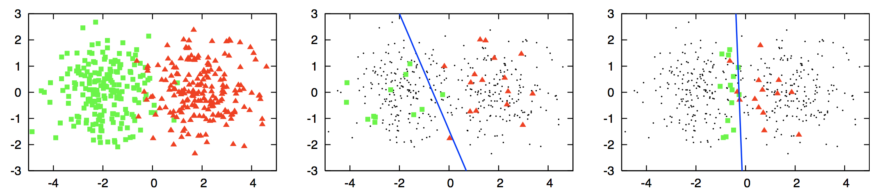

Active Learning
================

Introduction
--------------
Getting labeled data is a huge and often prohibitive cost for a lot of machine learning projects.
Active Learning is a methodology that can sometimes greatly reduce the amount of labeled data required to train a model
with higher accuracy if it is allowed to choose which data to label. 
It does this by prioritizing the labeling work for the experts (oracles).

Active Learning prioritizes which data the model is most confused about and requests labels for just those.
This helps the model learn faster, and lets the experts skip labeling data that wouldn’t be very helpful to the model.

    Training samples near the decision boundary allows a more accurate hyperplane being drawn.

Sampling Methods
-----------------

1. **Membership Query Synthesis**: a synethsized sample is sent to an oracle for labeling.

2. **Stream-Based Selective Sampling**: each sample is presented one at a time to a predictive model to be decided whether or not to be labeled or not. There are no assumptions on data distribution, and therefore it is adaptive to change.

3. **Pool-Based Sampling**: This is similar to stream-based, except that it starts a large pool of unlabelled data.

The main difference between stream-based and pool-based active learning is that the former scans 
through the data sequentially and makes query decisions individually, 
whereas the latter evaluates and ranks the entire collection before selecting the best query.

Query Strategies
----------------

1. **Uncertainiy Sampling**: Learner will choose instances which it is least certain how to label. There are 3 methods in this sampling, i.e., Least Confidence, Margin Sampling, and Entropy Sampling, with the latter being the best among the 3 due to its consideration of utilizing all the possible label probabilities for the selection process.

2. **Query by Committee**: Using an ensemble of models to vote on which candidates to label.

Stop Criteria
--------------
We can use a performance metric, e.g. accuracy to determine when to stop further querying.
Ideally it should be when any further labelling and retraining of the model does not improve the performance metric significantly, i.e.,
the performance has reached plateau. This means that the slope of the graph (y2-y1/x2-x1) per time-step has neared 0.

Of course, plateauing is determined on a good query strategy together with an appropriate model.

https://modal-python.readthedocs.io/en/latest/index.html

Resources
----------
 * Active Learning Literature Survey: http://burrsettles.com/pub/settles.activelearning.pdf
 * Uncertainiy Sampling: https://towardsdatascience.com/uncertainty-sampling-cheatsheet-ec57bc067c0b
 * Class Imbalance & Active Learning: https://pdfs.semanticscholar.org/7437/aae9bf347ab4ba4057f28df5f2eaf64d8fdc.pdf
 * Clustering: https://medium.com/towards-artificial-intelligence/how-to-use-active-learning-to-iteratively-improve-your-machine-learning-models-1c6164bdab99