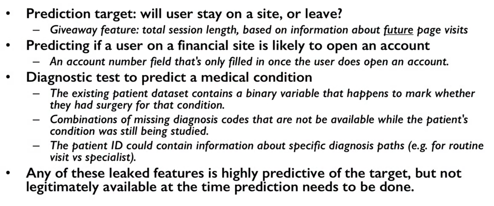
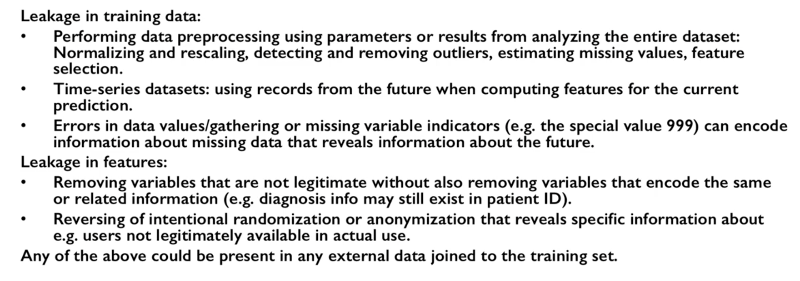
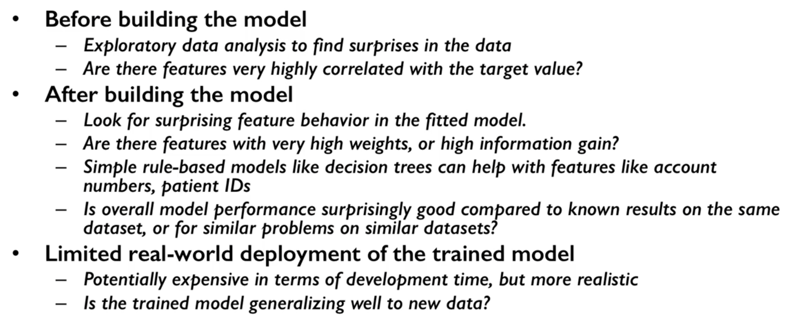

Data Leakage
============

Examples
--------
Some subtle examples of data leakages.

    University of Michigan: Coursera Data Science in Python
    
Types of Leakages
------------------
Data Leakages can be classified into two.

    University of Michigan: Coursera Data Science in Python
    
Detecting Leakages
-------------------

    University of Michigan: Coursera Data Science in Python