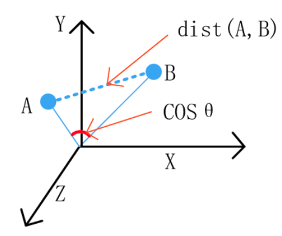

Distance Measure
================

Euclidean Distance & Cosine Similarity
--------------------

Euclidean distance is the straight line distance between points, while cosine distance is the cosine of the angle
between these two points.

.. code:: python

    from scipy.spatial.distance import euclidean

    euclidean([1,2],[1,3])
    # 1
    

.. code:: python
    
    from scipy.spatial.distance import cosine

    cosine([1,2],[1,3])
    # 0.010050506338833642

Mahalanobis Distance
---------------------

.. code:: python

    from scipy.spatial.distance import mahalanobis

Dynamic Time Warping
---------------------

.. code:: python

    import numpy as np
    from scipy.spatial.distance import euclidean
    from fastdtw import fastdtw

    x = np.array([[1,1], [2,2], [3,3], [4,4], [5,5]])
    y = np.array([[2,2], [3,3], [4,4]])
    distance, path = fastdtw(x, y, dist=euclidean)
    print(distance)