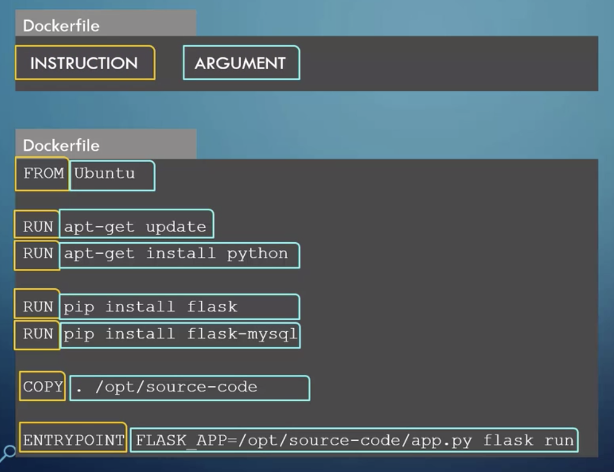
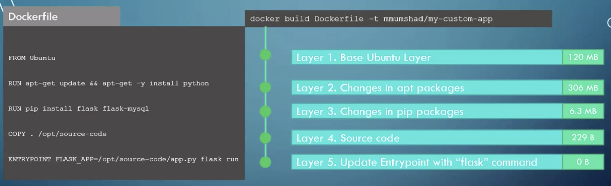
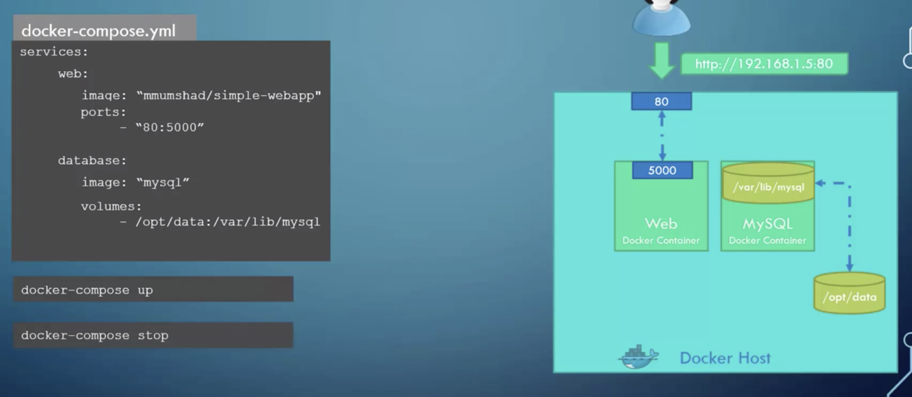
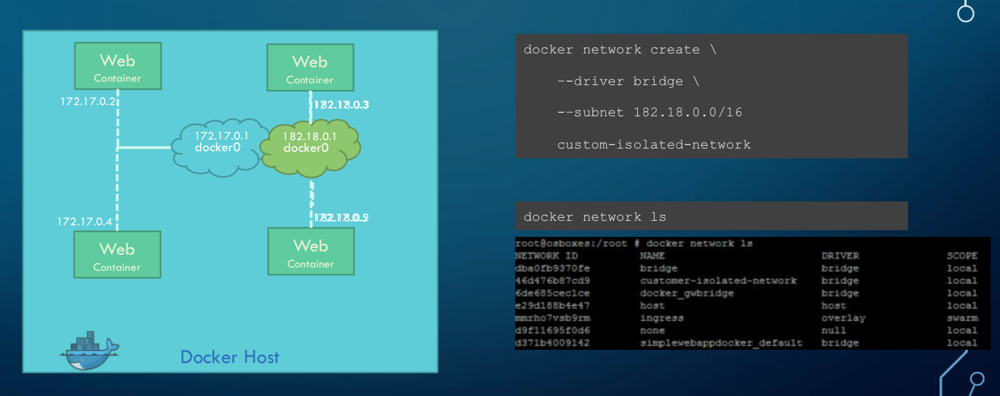
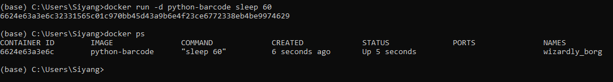

Docker
=================

Containers allow a developer to package up an application with all of the parts it needs, such as libraries and other dependencies, 
and ship it all out as one package. They allow a modular construction of an application, or microservice in short;
and being OS agnostic.
Docker is a popular tool designed to make it easier to create, deploy, and run applications by using containers.
The image is developed using Linux.

Preprocessing scripts and models can be created as a docker **image** snapshot, and launched as one or multiple **containers** in production.
For models that require to be consistently updated, we need to use volume mapping such that it is not removed when the container stops
running.

A connection to read features and output prediction needs to be done. This can be done via a REST API using Flask
web server, or through a messenger application like RabbitMQ or Kafka.

Creating Images
--------------------
To start of a new project, create a new folder. This should only contain your docker file and related python files.

Dockerfile
***********

    from Udemy's Docker for the Absolute Beginner - Hands On

A ``Dockerfile`` named as such, is a file without extension type. It contains commands to tell docker what are the steps to do to
create an image. It consists of instructions & arguments.

    from Udemy's Docker for the Absolute Beginner - Hands On

The commands run sequentially when building the image, also known as a layered architecture. 
Each layer is cached, such that when any layer fails and is fixed, rebuilding it will start from the last built layer.
This is why as you see below, we install the python packages first before copying the local files.
If any of the local files are changed, there is no need to rebuild the python packages again.

 * ``FROM`` tells Docker which image you base your image on (eg, Python 3 or continuumio/miniconda3).
 * ``RUN`` tells Docker which additional commands to execute.
 * ``CMD`` tells Docker to execute the command when the image loads.

.. code::

    # download base image
    FROM continuumio/anaconda3

    # copy and install libraries
    COPY requirements.txt .
    RUN pip install -r requirements.txt

    # copy all local files to docker image
    COPY . /app

    # terminal will start from this default directory
    WORKDIR /app/liftscanner/src

    # expose this port to outside docker for specific application
    EXPOSE 5555

    # run the following command when docker is run
    # -u so prints in code appear in cmd
    CMD python -u server.py

Input Variables
*********************

To pass environment variables from ``docker run`` to the python code, we can use two methods.

**1) Using os.environ.get in python script**

.. code:: python

    import os
    ip_address = os.environ.get('webcam_ip')

Then specify in ``docker run`` the variable for user input, followed by the image name

.. code:: bash

    # in Dockerfile
    CMD python -u main.py

    # in bash
    docker run -e webcam_ip=192.168.133.1 image_name

**2) Using ENTRYPOINT in Dockerfile**

.. code:: python
    
    # in python script
    import sys
    webcam_ip = str(sys.argv[1])

.. code:: bash

    # in Dockerfile
    ENTRYPOINT [ "python", "-u", "main.py" ]

    # in bash
    docker run image_name 192.168.133.1

Ignore file
***********
You do not want to compile any files that is not required in the images to keep the size at a minimium.
A file, ``.dockerignore`` similar in function and syntax to ``.gitignore`` can be used. 
It should be placed at the root, together with the Dockerfile.
Below are some standard files/folders to ignore.

.. code::

    # macos
    **/.DS_Store
    # python cache
    **/__pycache__
    .git

Build the Image
*******************
``docker build -t imageName .`` --(-t = tag the image as) build and name image, "." as current directory to look for Dockerfile

Note that everytime you rebuild an image with the same name, the previous image will have their image name & tag
displayed as `<None>`.

Push to Dockerhub
********************

Dockerhub is similar to Github whereby it is a repository for your images to be shared with the community.
Note that Dockerhub can only allow a single image to be made private for the free account.

``docker login`` --login into dockerhub, before you can push your image to the server

``docker push account/image_name`` --account refers to your dockerhub account name, this tag needs to created during docker build command when building the image

Docker Compose
----------------

In a production environment, a docker compose file can be used to run all separate docker containers 
together. It consists of all necessary configurations that a ``docker run`` command provides in a yaml file.

So, instead of entering multiple ``docker run imageX``, we can just run one docker compose file to start all images.
We also input all the commands like ports, volumes, depends_on

    from Udemy's Docker for the Absolute Beginner - Hands On

Below is an example using wordpress blog, where both the wordpress and mysql database are needed to get it working.

Run ``docker-compose up`` command to launch. 
If there are some images not built yet, we can add another specification in the docker compose file 
e.g., ``build: /directory_name``. 

.. code:: python

    # in ymal file, 
        ":" represents dictionary
        # "-" represents list
        $ the 2nd level definition, e.g. "web:" is just a name, can give it anything
        # note that spaces matter
    # must specify version

    version: 3
    services:
        mysql:
            image: "mysql"
            environment:
                - MYSQL_ROOT_PASSWORD=password 
            volumes:
                - "/data/mysql:/var/lib/mysql"
        web:
            image: "wordpress"
            ports:
                - "8080:80"
            environment:
                - WORDPRESS_DB_PASSWORD=password

Docker Swarm
--------------

Docker Swarm allows management of multiple docker containers as clones in a cluster to ensure high availability in case of failure.
This is similar to Apache Spark whereby there is a Cluster Manager (Swarm Manager), and worker nodes.

.. code:: bash

    web:
        image: "webapp"
        deploy:
            replicas: 5
    database:
        image: "mysql"

Use the command ``docker stack deploy -c docker_compose.yml`` to launch the swarm.

Networking
-------------

The **Bridge Network** is a private internal network created by Docker. All containers are attached to this network by default and 
they get an IP of 172.17.xxx. They are thus able to communicate with each other internally. 
However, to access these networks from the outside world, we need to 
 * map ports of these containers to the docker host.
 * or associate the containers to the network host, meaning the container use the same port as the host network

    from Udemy's Docker for the Absolute Beginner - Hands On

If we want to separate the internal bridge networks, we can create our own internal bridge networks.

Commands
----------

**Help**

+---------------------------+-----------------------------------+
| ``docker --help``         |    list all base commands         |
+---------------------------+-----------------------------------+
| ``docker COMMAND --help`` |    list all options for a command |
+---------------------------+-----------------------------------+

**Create Image**

+----------------------------------------------+----------------------------------------------------------+
| ``docker build -t image_name .``             | (-t = tag the image as) build and name                   |
|                                              | image, "." is the location of the dockerfile             |
+----------------------------------------------+----------------------------------------------------------+

**Get Image from Docker Hub**

+----------------------------------------------+----------------------------------------------------------+
| ``docker pull image_name``                   | pull image from dockerhub into docker                    |
+----------------------------------------------+----------------------------------------------------------+
| ``docker run image_name COMMAND``            | check if image in docker, if not                         |
|                                              | pull & run image from dockerhub into docker.             |
|                                              | If no command is given, the container will stop running. |
+----------------------------------------------+----------------------------------------------------------+
| ``docker run image_name cat /etc/*release*`` | run image and print out the version of image             |
+----------------------------------------------+----------------------------------------------------------+

**Other Run Commands**

+------------------------------------------------------------------+--------------------------------------------------------------------------+
| ``docker run Ubuntu:17.04``                                      | semicolon specifies the version (known as tags                           |
|                                                                  | as listed in Dockerhub), else will pull the latest                       |
+------------------------------------------------------------------+--------------------------------------------------------------------------+
| ``docker run ubuntu`` vs                                         | the first is an official image, the 2nd with the                         |
| ``docker run mmumshad/ubuntu``                                   | "/" is created by the community                                          |
+------------------------------------------------------------------+--------------------------------------------------------------------------+
| ``docker run -d image_name``                                     | (-d = detach) docker runs in background, and you can continue typing     |
|                                                                  | other commands in the bash. Else need to open another terminal.          |
+------------------------------------------------------------------+--------------------------------------------------------------------------+
| ``docker run -v /local/storage/folder:/image/data/folder mysql`` | (-v = volume mapping) all data will be destroyed if container is stopped |
+------------------------------------------------------------------+--------------------------------------------------------------------------+
| ``docker run -p 5000:5000 --restart always comply``              | to auto restart container if it crashes                                  |
+------------------------------------------------------------------+--------------------------------------------------------------------------+
| ``docker run --name containerName imageName``                    | give a name to the container                                             |
+------------------------------------------------------------------+--------------------------------------------------------------------------+

    running docker with a command. each container has a unique container ID, container name, and their base image name

**IPs & Ports**

+--------------------------------------+--------------------------------------------------------------------------+
| ``192.168.1.14``                     | IP address of docker host                                                |
+--------------------------------------+--------------------------------------------------------------------------+
| ``docker inspect container_id``      | dump of container info, as well as at the bottom, under Network, the     |
|                                      | internal IP address. to view server in web browser, enter the ip and the |
|                                      | exposed port. eg. 172.17.0.2:8080                                        |
+--------------------------------------+--------------------------------------------------------------------------+
| ``docker run -p 80:5000 image_name`` | (host_port:container_port) map host service port with the container port |
|                                      | on docker host                                                           |
+--------------------------------------+--------------------------------------------------------------------------+

**See Images & Containers in Docker**

+-------------------+----------------------------------------------------------------------+
| ``docker images`` | see all installed docker images                                      |
+-------------------+----------------------------------------------------------------------+
| ``docker ps``     | (ps = process status) show status of images which are running        |
+-------------------+----------------------------------------------------------------------+
| ``docker ps -a``  | (-a = all) show status of all images including those that had exited |
+-------------------+----------------------------------------------------------------------+

**Remove Intermediate Images/Containers**

+----------------------------+----------------------------------------------------------------------------------------+
| ``docker image prune``     | delete intermediate images tagged as <none> after recreating images from some changes  |
+----------------------------+----------------------------------------------------------------------------------------+
| ``docker container prune`` | delete stopped containers                                                              |
+----------------------------+----------------------------------------------------------------------------------------+

**View Docker Image Directories**

+-----------------------------------+----------------------------------------------------------------------+
| ``docker run -it image_name sh``  | explore directories in a specific image. "exit" to get out of sh     |
+-----------------------------------+----------------------------------------------------------------------+

**Start/Stop Containers**

+-------------------------------------------------+------------------------------------------------------------------------+
| ``docker start container_name``                 | run container                                                          |
+-------------------------------------------------+------------------------------------------------------------------------+
| ``docker stop container_name``                  | stop container from running, but container still lives in the disk     |
+-------------------------------------------------+------------------------------------------------------------------------+
| ``docker stop container_name1 container_name2`` | stop multiple container from running in a single line                  |
+-------------------------------------------------+------------------------------------------------------------------------+
| ``docker stop container_id``                    | stop container using the ID. There is no need to type the id in full,  |
|                                                 | just the first few char suffices.                                      |
+-------------------------------------------------+------------------------------------------------------------------------+

**Remove Containers/Images**

+------------------------------+----------------------------------------------------------------------------+
| ``docker rm container_name`` | remove container from docker                                               |
+------------------------------+----------------------------------------------------------------------------+
| ``docker rmi image_name``    | (rmi = remove image) from docker. must remove container b4 removing image. |
+------------------------------+----------------------------------------------------------------------------+
| ``docker rmi -f image_name`` | (-f = force) force remove image even if container is running               |
+------------------------------+----------------------------------------------------------------------------+

**Execute Commands for Containers**

+---------------------------------------------------+------------------------------------+
| ``docker exec container_nm/id COMMAND``           | execute a command within container |
+---------------------------------------------------+------------------------------------+
| ``docker exec -it <container name/id> bash``      | go into container's bash           |
+---------------------------------------------------+------------------------------------+

Inside the docker container, if there is a need to view any files, we have to install an editor first
``apt-get update`` > ``apt-get install nano``. To exit the container ``exit``.

Tips
*****

https://pythonspeed.com/articles/multi-stage-docker-python/