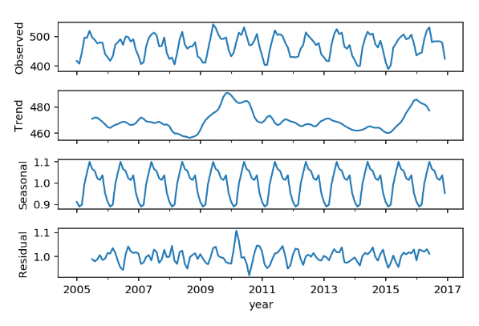

Feature Engineering
=====================
Feature Engineering is one of the most important part of model building.
Collecting and creating of relevant features are most often the determinant of 
a high prediction value.

Manual 
--------

Decomposition
**************

Time-Series
^^^^^^^^^^^^^^
Decomposing a time-series into trend (long-term), seaonality (short-term), residuals (noise).
There are two methods to decompose:
 * Additive—The component is present and is added to the other components to create the overall forecast value.
 * Multiplicative—The component is present and is multiplied by the other components to create the overall forecast value

Usually an additive time-series will be used if there are no seasonal variations over time.

.. code:: python

  import statsmodels.api as sm
  import matplotlib.pyplot as plt
  import seaborn as sns
  %matplotlib inline

  res = sm.tsa.seasonal_decompose(final2['avg_mth_elect'], model='multiplicative')
  res.plot();

.. code:: python

  # set decomposed parts into dataframe
  decomp=pd.concat([res.observed, res.trend, res.seasonal, res.resid], axis=1)
  decomp.columns = ['avg_mth','trend','seasonal','residual']
  decomp.head()

Fourier Transformation
^^^^^^^^^^^^^^^^^^^^^^^
The Fourier transform (FT) decomposes a function of time (a signal) into its constituent frequencies, 
i.e., converts amplitudes into frequencies.

Wavelet Transform
^^^^^^^^^^^^^^^^^^^^^^
Wavelet transforms are time-frequency transforms employing wavelets. 
They are similar to Fourier transforms, the difference being that Fourier transforms 
are localized only in frequency instead of in time and frequency.
There are various considerations for wavelet transform, including:

 * Which wavelet transform will you use, CWT or DWT? 
 * Which wavelet family will you use? 
 * Up to which level of decomposition will you go? 
 * Number of coefficients (vanishing moments)
 * What is the right range of scales to use?

 * http://ataspinar.com/2018/12/21/a-guide-for-using-the-wavelet-transform-in-machine-learning/
 * https://www.kaggle.com/jackvial/dwt-signal-denoising
 * https://www.kaggle.com/tarunpaparaju/lanl-earthquake-prediction-signal-denoising

.. code:: python

    import pywt

    # there are 14 wavelets families
    print(pywt.families(short=False))
    #['Haar', 'Daubechies', 'Symlets', 'Coiflets', 'Biorthogonal', 'Reverse biorthogonal', 
    #'Discrete Meyer (FIR Approximation)', 'Gaussian', 'Mexican hat wavelet', 'Morlet wavelet', 
    #'Complex Gaussian wavelets', 'Shannon wavelets', 'Frequency B-Spline wavelets', 'Complex Morlet wavelets']

    # short form used in pywt
    print(pywt.families())
    #['haar', 'db', 'sym', 'coif', 'bior', 'rbio', 
    #'dmey', 'gaus', 'mexh', 'morl', 
    #'cgau', 'shan', 'fbsp', 'cmor']

    # input wavelet family, coefficient no., level of decompositions
    arrays = pywt.wavedec(array, 'sym5', level=5)
    df3 = pd.DataFrame(arrays).T

    # gives two arrays, decomposed & residuals
    decompose, residual = pywt.dwt(signal,'sym5')

Auto
-----
Automatic generation of new features from existing ones are starting to gain popularity,
as it can save a lot of time. 

tsfresh
********
tsfresh is a feature extraction package for time-series. It can extract more than 1200 different features,
and filter out features that are deemed relevant. In essence, it is a univariate feature extractor.

https://tsfresh.readthedocs.io/en/latest/

.. code:: python

    from tsfresh import extract_relevant_features

    features_filtered_direct = extract_relevant_features(timeseries, y,
                                                        column_id='id', column_sort='time')

FeatureTools
*************
FeatureTools is extremely useful if you have datasets with a base data, with other tables
that have relationships to it.

We first create an **EntitySet**, which is like a database. Then we create **entities**, i.e., individual
tables with a unique id for each table, and showing their **relationships** between each other.

https://github.com/Featuretools/featuretools

.. code:: python

    import featuretools as ft

    def make_entityset(data):
    es = ft.EntitySet('Dataset')
    es.entity_from_dataframe(dataframe=data,
                             entity_id='recordings',
                             index='index',
                             time_index='time')

    es.normalize_entity(base_entity_id='recordings', 
                        new_entity_id='engines',
                        index='engine_no')

    es.normalize_entity(base_entity_id='recordings', 
                        new_entity_id='cycles',
                        index='time_in_cycles')
    return es
    es = make_entityset(data)
    es

We then use something called **Deep Feature Synthesis (dfs)** to generate features automatically.

**Primitives** are the type of new features to be extracted from the datasets. They can be 
**aggregations** (data is combined) or **transformation** (data is changed via a function) type of extractors.
The list can be found via ``ft.primitives.list_primitives()``.
External primitives like tsfresh, or custom calculations can also be input into FeatureTools.

.. code:: python

    feature_matrix, feature_names = ft.dfs(entityset=es, 
                                            target_entity = 'normal',
                                            agg_primitives=['last', 'max', 'min'],
                                            trans_primitives=[], 
                                            max_depth = 2, 
                                            verbose = 1, 
                                            n_jobs = 3)
    # see all old & new features created
    feature_matrix.columns

FeatureTools appears to be a very powerful auto-feature extractor. Some resources to 
read further are as follows:

 * https://brendanhasz.github.io/2018/11/11/featuretools
 * https://towardsdatascience.com/automated-feature-engineering-in-python-99baf11cc219
 * https://medium.com/@rrfd/simple-automatic-feature-engineering-using-featuretools-in-python-for-classification-b1308040e183
