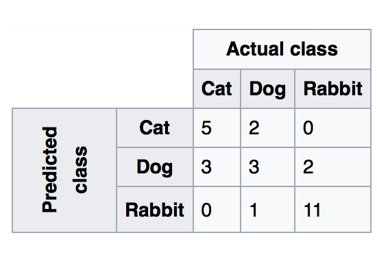
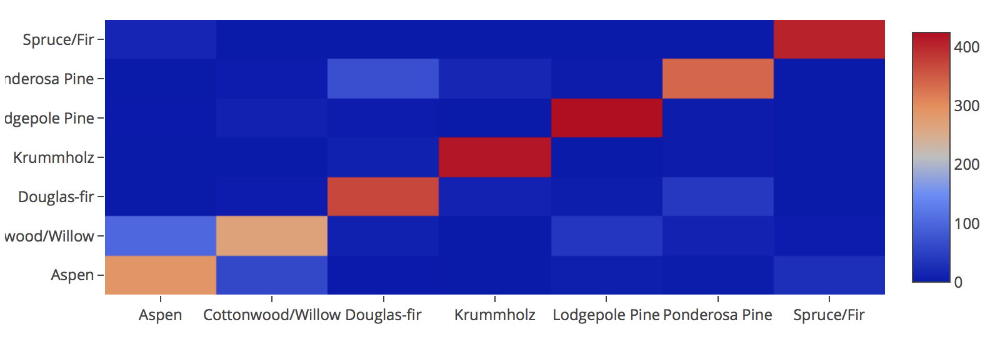
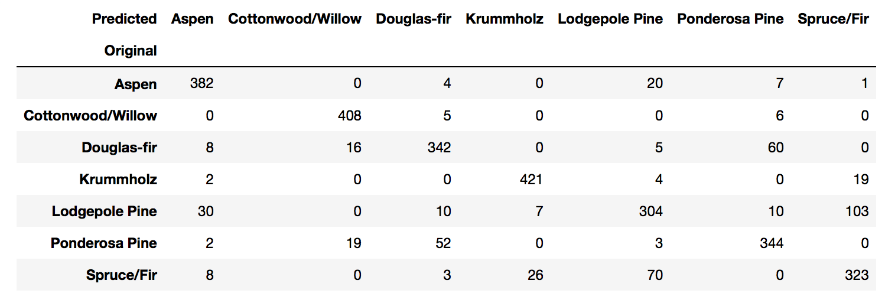
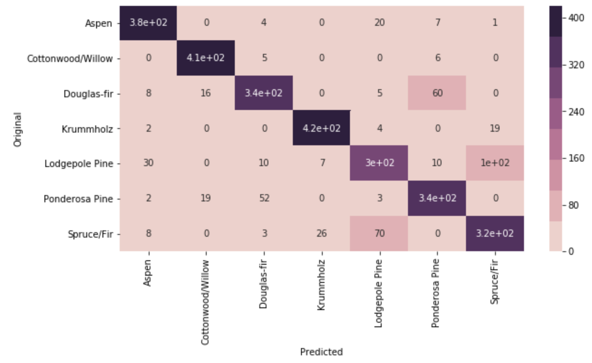
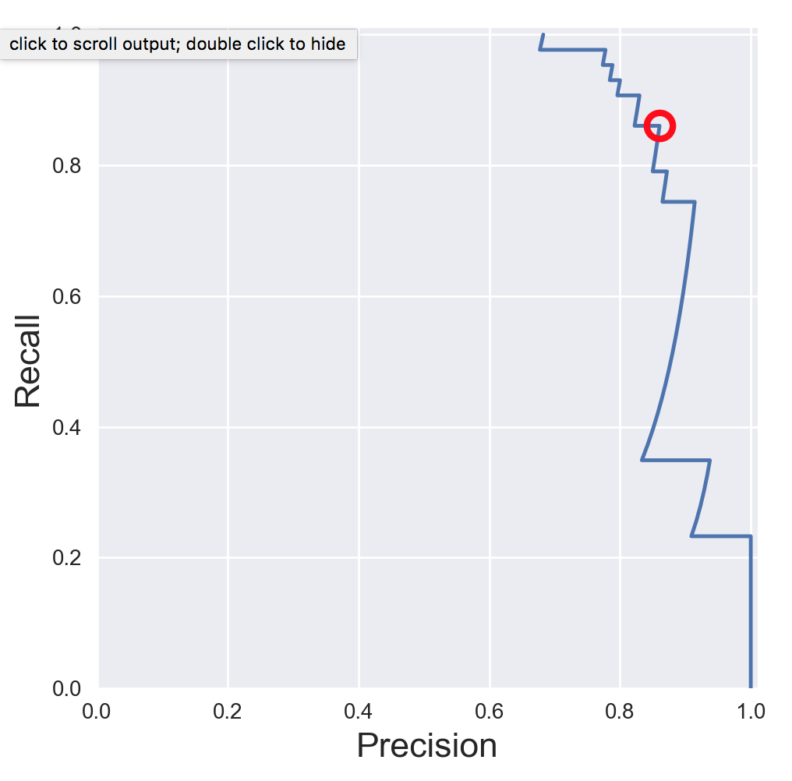
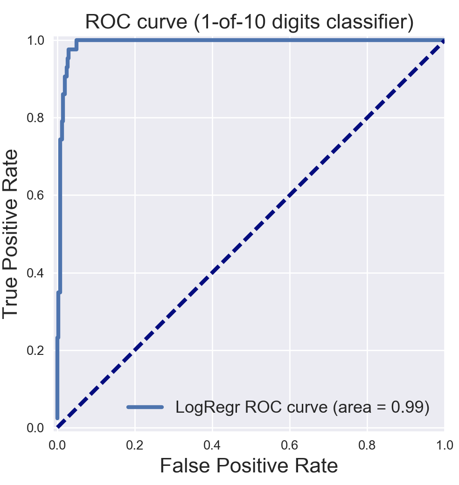
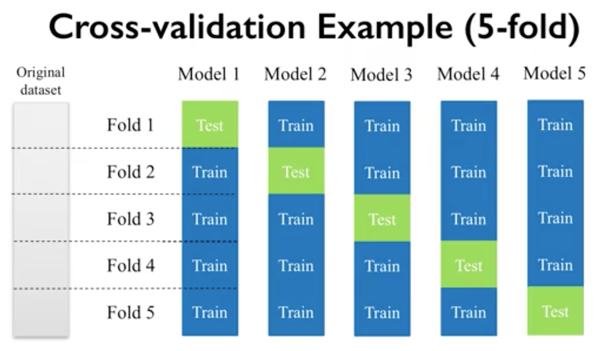

Evaluation
==========

Accuarcy is widely used as a metric for evalution, but others like precision, recall, etc. are important for 
different use cases.

Confusion Matrix
-----------------

    Wikipedia

.. figure:: images/confusion2.png
    :width: 400px
    :align: center

    Wikipedia
        
**Recall|Sensitivity**: (True Positive / True Positive + False Negative) High recall means to get all 
positives (i.e., True Positive + False Negative) despite having some false positives.
Search & extraction in legal cases, Tumour detection. Often need humans to filter false positives.

**Precision**: (True Positive / True Positive + False Positive) High precision means it is important 
to filter off the any false positives.
Search query suggestion, Document classification, customer-facing tasks. 

**F1-Score**: is the harmonic mean of precision and sensitivity

**1. Confusion Matrix**

Plain vanilla matrix. Not very useful as does not show the labels. 
However, the matrix can be used to build a heatmap using plotly directly.

.. code:: python
  
  print (sklearn.metrics.confusion_matrix(test_target,predictions))
  [[14  0  0]
  [ 0 13  0]
  [ 0  1 10]]

  # make heatmap using plotly
  from plotly.offline import iplot
  from plotly.offline import init_notebook_mode
  import plotly.graph_objs as go
  init_notebook_mode(connected=True)

  layout = go.Layout(width=800, height=400)
  data = go.Heatmap(z=x,x=title,y=title)
  fig = go.Figure(data=[data], layout=layout)
  iplot(fig)

  # this gives the values of each cell, but api unable to change the layout size
  import plotly.figure_factory as ff
  layout = go.Layout(width=800, height=500)
  data = ff.create_annotated_heatmap(z=x,x=title,y=title)
  iplot(data)

With pandas crosstab. Convert encoding into labels and put the two pandas series into a crosstab.

.. code:: python

  def forest(x):
    if x==1:
        return 'Spruce/Fir'
    elif x==2:
        return 'Lodgepole Pine'
    elif x==3:
        return 'Ponderosa Pine'
    elif x==4:
        return 'Cottonwood/Willow'
    elif x==5:
        return 'Aspen'
    elif x==6:
        return 'Douglas-fir'
    elif x==7:
        return 'Krummholz'

  # Create pd Series for Original
  Original = test_target.apply(lambda x: forest(x))
  Original.name = 'Original'

  # Create pd Series for Predicted
  Predicted = pd.DataFrame(predictions, columns=['Predicted'])
  Predicted = Predicted[Predicted.columns[0]].apply(lambda x: forest(x))

  # Create Confusion Matrix
  confusion = pd.crosstab(Original, Predicted)
  confusion

Using a heatmap.

.. code:: python
  
   # add confusion matrix from pd.crosstab earlier
   sns.heatmap(confusion,annot=True);

**2. Evaluation Metrics**

.. code:: python

  from sklearn.metrics import accuracy_score, precision_score, recall_score, f1_score
  
  # Accuracy = TP + TN / (TP + TN + FP + FN)
  # Precision = TP / (TP + FP)
  # Recall = TP / (TP + FN)  Also known as sensitivity, or True Positive Rate
  # F1 = 2 * Precision * Recall / (Precision + Recall) 
  
  print('Accuracy:', accuracy_score(y_test, tree_predicted)
  print('Precision:', precision_score(y_test, tree_predicted)
  print('Recall:', recall_score(y_test, tree_predicted)
  print('F1:', f1_score(y_test, tree_predicted)
  
  Accuracy: 0.95
  Precision: 0.79
  Recall: 0.60
  F1: 0.68

There are many other evaluation metrics, a list can be found here:

.. code:: python

  from sklearn.metrics.scorer import SCORERS

  for i in sorted(list(SCORERS.keys())):
      print i  

  accuracy
  adjusted_rand_score
  average_precision
  f1
  f1_macro
  f1_micro
  f1_samples
  f1_weighted
  log_loss
  mean_absolute_error
  mean_squared_error
  median_absolute_error
  neg_log_loss
  neg_mean_absolute_error
  neg_mean_squared_error
  neg_median_absolute_error
  precision
  precision_macro
  precision_micro
  precision_samples
  precision_weighted
  r2
  recall
  recall_macro
  recall_micro
  recall_samples
  recall_weighted
  roc_auc

**3. Classification Report**

.. code:: python

  # Combined report with all above metrics
  from sklearn.metrics import classification_report

  print(classification_report(y_test, tree_predicted, target_names=['not 1', '1']))
  
                precision    recall  f1-score   support

        not 1       0.96      0.98      0.97       407
            1       0.79      0.60      0.68        43

  avg / total       0.94      0.95      0.94       450

**4. Decision Function**

.. code:: python

  X_train, X_test, y_train, y_test = train_test_split(X, y_binary_imbalanced, random_state=0)
  y_scores_lr = lr.fit(X_train, y_train).decision_function(X_test)
  y_score_list = list(zip(y_test[0:20], y_scores_lr[0:20]))

  # show the decision_function scores for first 20 instances
  y_score_list

  [(0, -23.176682692580048),
   (0, -13.541079101203881),
   (0, -21.722576315155052),
   (0, -18.90752748077151),
   (0, -19.735941639551616),
   (0, -9.7494967330877031),
   (1, 5.2346395208185506),
   (0, -19.307366394398947),
   (0, -25.101037079396367),
   (0, -21.827003670866031),
   (0, -24.15099619980262),
   (0, -19.576751014363683),
   (0, -22.574837580426664),
   (0, -10.823683312193941),
   (0, -11.91254508661434),
   (0, -10.979579441354835),
   (1, 11.20593342976589),
   (0, -27.645821704614207),
   (0, -12.85921201890492),
   (0, -25.848618861971779)]
  
**5. Probability Function**

.. code:: python

  X_train, X_test, y_train, y_test = train_test_split(X, y_binary_imbalanced, random_state=0)
  # note that the first column of array indicates probability of predicting negative class,
  # 2nd column indicates probability of predicting positive class
  y_proba_lr = lr.fit(X_train, y_train).predict_proba(X_test)
  y_proba_list = list(zip(y_test[0:20], y_proba_lr[0:20,1]))

  # show the probability of positive class for first 20 instances
  y_proba_list

  [(0, 8.5999236926158807e-11),
   (0, 1.31578065170999e-06),
   (0, 3.6813318939966053e-10),
   (0, 6.1456121155693793e-09),
   (0, 2.6840428788564424e-09),
   (0, 5.8320607398268079e-05),
   (1, 0.99469949997393026),
   (0, 4.1201906576825675e-09),
   (0, 1.2553305740618937e-11),
   (0, 3.3162918920398805e-10),
   (0, 3.2460530855408745e-11),
   (0, 3.1472051953481208e-09),
   (0, 1.5699022391384567e-10),
   (0, 1.9921654858205874e-05),
   (0, 6.7057057309326073e-06),
   (0, 1.704597440356912e-05),
   (1, 0.99998640688336282),
   (0, 9.8530840165646881e-13),
   (0, 2.6020404794341749e-06),
   (0, 5.9441185633886803e-12)]

Precision-Recall Curves
------------------------

.. code:: python

  from sklearn.metrics import precision_recall_curve
  
  # get decision function scores
  y_scores_lr = m.fit(X_train, y_train).decision_function(X_test)
  
  # get precision & recall values
  precision, recall, thresholds = precision_recall_curve(y_test, y_scores_lr)
  closest_zero = np.argmin(np.abs(thresholds))
  closest_zero_p = precision[closest_zero]
  closest_zero_r = recall[closest_zero]

  plt.figure()
  plt.xlim([0.0, 1.01])
  plt.ylim([0.0, 1.01])
  plt.plot(precision, recall, label='Precision-Recall Curve')
  plt.plot(closest_zero_p, closest_zero_r, 'o', markersize = 12, fillstyle = 'none', c='r', mew=3)
  plt.xlabel('Precision', fontsize=16)
  plt.ylabel('Recall', fontsize=16)
  plt.axes().set_aspect('equal')
  plt.show()

ROC Curves
----------------

Receiver Operating Characteristic (ROC) is used to show the performance of a binary classifier. 
Y-axis is True Positive Rate (Recall) & X-axis is False Positive Rate (Fall-Out). 
Area Under Curve (AUC) of a ROC is used. Higher AUC better.

Some classifiers have a decision_function method while others have a probability prediction method, 
and some have both. Whichever one is available works fine for an ROC curve.

.. code:: python

  from sklearn.metrics import roc_curve, auc

  X_train, X_test, y_train, y_test = train_test_split(X, y_binary_imbalanced, random_state=0)

  y_score_lr = lr.fit(X_train, y_train).decision_function(X_test)
  fpr_lr, tpr_lr, _ = roc_curve(y_test, y_score_lr)
  roc_auc_lr = auc(fpr_lr, tpr_lr)

  plt.figure()
  plt.xlim([-0.01, 1.00])
  plt.ylim([-0.01, 1.01])
  plt.plot(fpr_lr, tpr_lr, lw=3, label='LogRegr ROC curve (area = {:0.2f})'.format(roc_auc_lr))
  plt.xlabel('False Positive Rate', fontsize=16)
  plt.ylabel('True Positive Rate', fontsize=16)
  plt.title('ROC curve (1-of-10 digits classifier)', fontsize=16)
  plt.legend(loc='lower right', fontsize=13)
  plt.plot([0, 1], [0, 1], color='navy', lw=3, linestyle='--')
  plt.axes().set_aspect('equal')
  plt.show()

    
    
K-fold Cross-Validation
------------------

Takes more time and computation to use k-fold, but well worth the cost. 
By default, sklearn uses stratified k-fold cross validation. Another type is 'leave one out' cross-validation.

The mean of the final scores among each k model is the most generalised output.
This output can be compared to different model results for comparison.

More here_.

.. _here: https://medium.com/towards-data-science/train-test-split-and-cross-validation-in-python-80b61beca4b6

    k-fold cross validation, with 5-folds

.. code:: python

  from sklearn.model_selection import cross_val_score
  from sklearn.tree import DecisionTreeClassifier
  from sklearn.ensemble import RandomForestClassifier
  from sklearn.neighbors import KNeighborsClassifier

  models = [('Decision Tree\t',DecisionTreeClassifier()),\
            ('Random Forest\t', RandomForestClassifier()), \
            ('KNN\t\t', KNeighborsClassifier())]

  predictor = df[df.columns[1:-1]]
  target = df['Cover_Type']

  # using 5-fold cross validation mean scores
  for clf in models:
      cv_scores = cross_val_score(clf[1], predictor, target, cv=5)
      print(clf[0], np.mean(cv_scores))

  # Decision Tree	 0.707473544974
  # Random Forest	 0.753571428571
  # KNN		         0.691005291005

Grid-Search
----------------

From Stackoverflow: Systematically working through multiple combinations of parameter tunes, 
cross validate each and determine which one gives the best performance.
You can work through many combination only changing parameters a bit.

Print out the ``best_params_`` and rebuild the model with these optimal parameters. 

.. code:: python

  from sklearn.svm import SVC
  from sklearn.model_selection import GridSearchCV
  from sklearn.metrics import roc_auc_score
  from sklearn.model_selection import train_test_split
  

  dataset = load_digits()
  X, y = dataset.data, dataset.target == 1
  X_train, X_test, y_train, y_test = train_test_split(X, y, random_state=0)

  # choose a classifier
  clf = SVC(kernel='rbf')

  # input grid value range
  grid_values = {'gamma': [0.001, 0.01, 0.05, 0.1, 1, 10, 100]}
  # other parameters can be input in the dictionary, e.g.,
  # grid_values = {'gamma': [0.01, 0.1, 1, 10], 'C': [0.01, 0.1, 1, 10]}
  # OR n_estimators, max_features from RandomForest
  # default metric to optimize over grid parameters: accuracy
  
  grid_clf_acc = GridSearchCV(clf, param_grid = grid_values, random_state=0)
  
  grid_clf_acc.fit(X_train, y_train)
  y_decision_fn_scores_acc = grid_clf_acc.decision_function(X_test) 

  print('Grid best parameter (max. accuracy): ', grid_clf_acc.best_params_)
  print('Grid best score (accuracy): ', grid_clf_acc.best_score_)

Using other scoring metrics

.. code:: python

  # alternative metric to optimize over grid parameters: AUC
  # other scoring parameters include 'recall' or 'precision'
  grid_clf_auc = GridSearchCV(clf, param_grid = grid_values, scoring = 'roc_auc', cv=3, random_state=0) # indicate AUC
  grid_clf_auc.fit(X_train, y_train)
  y_decision_fn_scores_auc = grid_clf_auc.decision_function(X_test) 

  print('Test set AUC: ', roc_auc_score(y_test, y_decision_fn_scores_auc))
  print('Grid best parameter (max. AUC): ', grid_clf_auc.best_params_)
  print('Grid best score (AUC): ', grid_clf_auc.best_score_)

  # results 1
  ('Grid best parameter (max. accuracy): ', {'gamma': 0.001})
  ('Grid best score (accuracy): ', 0.99628804751299183)
  # results 2
  ('Test set AUC: ', 0.99982858122393004)
  ('Grid best parameter (max. AUC): ', {'gamma': 0.001})
  ('Grid best score (AUC): ', 0.99987412783021423)
  
  
  # gives break down of all permutations of gridsearch
  print fittedmodel.cv_results_
  # gives parameters that gives the best indicated scoring type
  print CV.best_params_