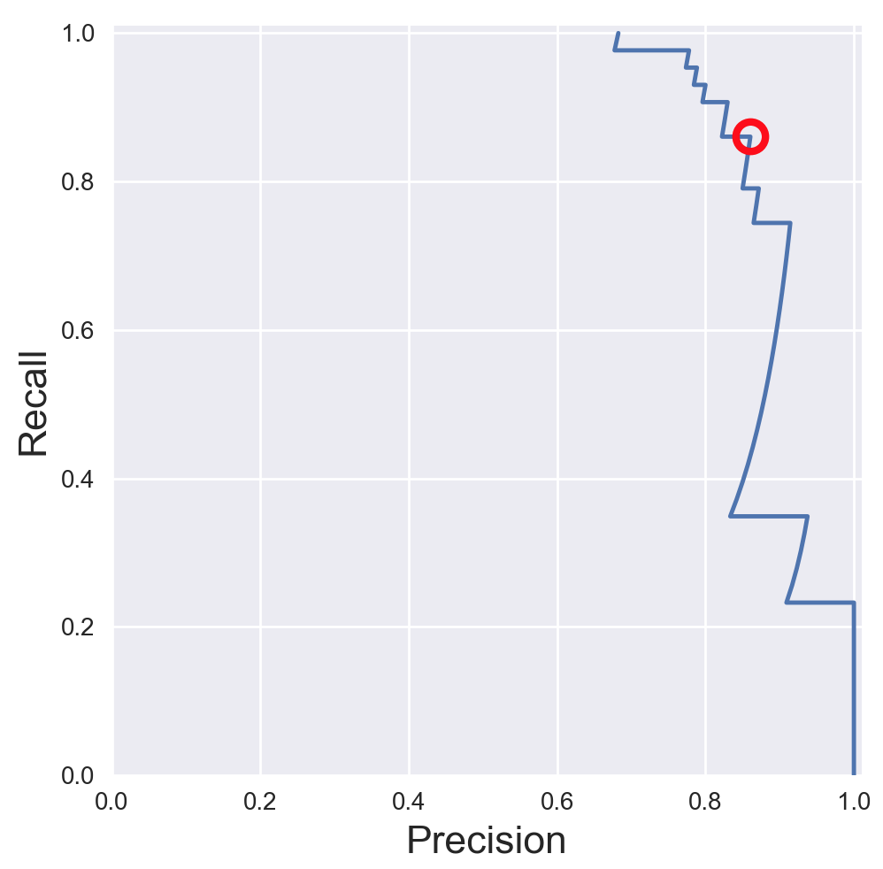

Evaluation
==========

Accuarcy is widely used as a metric for evalution, but others like precision, recall, etc. are important for 
different use cases.

Confusion Matrix
-----------------

.. figure:: images/confusion.png
    :width: 300px
    :align: center

    Wikipedia

.. figure:: images/confusion2.png
    :width: 400px
    :align: center

    Wikipedia
        
**Recall|Sensitivity**: (True Positive / True Positive + False Negative) High recall means to get all 
positives (i.e., True Positive + False Negative) despite having some false positives.
Search & extraction in legal cases, Tumour detection. Often need humans to filter false positives.

**Precision**: (True Positive / True Positive + False Positive) High precision means it is important 
to filter off the any false positives.
Search query suggestion, Document classification, customer-facing tasks. 

**F1-Score**: is the harmonic mean of precision and sensitivity

**1. Confusion Matrix**

Plain vanilla matrix.

>>> print sklearn.metrics.confusion_matrix(test_target,predictions)
[[14  0  0]
 [ 0 13  0]
 [ 0  1 10]]

Using a heatmap.

.. code:: python
  
   # create confusion matrix
   confusion_mc = confusion_matrix(y_test_mc, svm_predicted_mc)
   # convert to a dataframe
   df_cm = pd.DataFrame(confusion_mc, 
                        index = [i for i in range(0,10)], 
                        columns = [i for i in range(0,10)])
   # plot graph
   plt.figure(figsize=(5.5,4)) # define graph
   sns.heatmap(df_cm, annot=True) # draw heatmap, add annotation

.. image:: images/confusion3.png
    :scale: 40 %
    :align: center

**2. Evaluation Metrics**

.. code:: python

  from sklearn.metrics import accuracy_score, precision_score, recall_score, f1_score
  
  # Accuracy = TP + TN / (TP + TN + FP + FN)
  # Precision = TP / (TP + FP)
  # Recall = TP / (TP + FN)  Also known as sensitivity, or True Positive Rate
  # F1 = 2 * Precision * Recall / (Precision + Recall) 
  
  print('Accuracy:', accuracy_score(y_test, tree_predicted)
  print('Precision:', precision_score(y_test, tree_predicted)
  print('Recall:', recall_score(y_test, tree_predicted)
  print('F1:', f1_score(y_test, tree_predicted)
  
  Accuracy: 0.95
  Precision: 0.79
  Recall: 0.60
  F1: 0.68

There are many other evaluation metrics, a list can be found here:

.. code:: python

  from sklearn.metrics.scorer import SCORERS

  for i in sorted(list(SCORERS.keys())):
      print i  

  accuracy
  adjusted_rand_score
  average_precision
  f1
  f1_macro
  f1_micro
  f1_samples
  f1_weighted
  log_loss
  mean_absolute_error
  mean_squared_error
  median_absolute_error
  neg_log_loss
  neg_mean_absolute_error
  neg_mean_squared_error
  neg_median_absolute_error
  precision
  precision_macro
  precision_micro
  precision_samples
  precision_weighted
  r2
  recall
  recall_macro
  recall_micro
  recall_samples
  recall_weighted
  roc_auc

**3. Classification Report**

.. code:: python

  # Combined report with all above metrics
  from sklearn.metrics import classification_report

  print(classification_report(y_test, tree_predicted, target_names=['not 1', '1']))
  
                precision    recall  f1-score   support

        not 1       0.96      0.98      0.97       407
            1       0.79      0.60      0.68        43

  avg / total       0.94      0.95      0.94       450
  
  
Precision-Recall Curves
------------------------

.. code:: python

  from sklearn.metrics import precision_recall_curve
  
  # get decision function scores
  y_scores_lr = m.fit(X_train, y_train).decision_function(X_test)
  
  # get precision & recall values
  precision, recall, thresholds = precision_recall_curve(y_test, y_scores_lr)
  closest_zero = np.argmin(np.abs(thresholds))
  closest_zero_p = precision[closest_zero]
  closest_zero_r = recall[closest_zero]

  plt.figure()
  plt.xlim([0.0, 1.01])
  plt.ylim([0.0, 1.01])
  plt.plot(precision, recall, label='Precision-Recall Curve')
  plt.plot(closest_zero_p, closest_zero_r, 'o', markersize = 12, fillstyle = 'none', c='r', mew=3)
  plt.xlabel('Precision', fontsize=16)
  plt.ylabel('Recall', fontsize=16)
  plt.axes().set_aspect('equal')
  plt.show()

ROC Curves
----------------

Receiver Operating Characteristic (ROC) is used to show the performance of a binary classifier. 
Y-axis is True Positive Rate (Recall) & X-axis is False Positive Rate (Fall-Out). 
Area Under Curve (AUC) of a ROC is used. Higher AUC better.

.. code:: python

  from sklearn.metrics import roc_curve, auc

  X_train, X_test, y_train, y_test = train_test_split(X, y_binary_imbalanced, random_state=0)

  y_score_lr = lr.fit(X_train, y_train).decision_function(X_test)
  fpr_lr, tpr_lr, _ = roc_curve(y_test, y_score_lr)
  roc_auc_lr = auc(fpr_lr, tpr_lr)

  plt.figure()
  plt.xlim([-0.01, 1.00])
  plt.ylim([-0.01, 1.01])
  plt.plot(fpr_lr, tpr_lr, lw=3, label='LogRegr ROC curve (area = {:0.2f})'.format(roc_auc_lr))
  plt.xlabel('False Positive Rate', fontsize=16)
  plt.ylabel('True Positive Rate', fontsize=16)
  plt.title('ROC curve (1-of-10 digits classifier)', fontsize=16)
  plt.legend(loc='lower right', fontsize=13)
  plt.plot([0, 1], [0, 1], color='navy', lw=3, linestyle='--')
  plt.axes().set_aspect('equal')
  plt.show()

    
    
Cross-Validation
------------------

Takes more time and computation to use k-fold, but well worth the cost. 
By default, sklean uses stratified cross validation. Another type is leave one out cross-validation.

.. figure:: images/kfold.png
    :scale: 30 %
    :align: center

    k-fold cross validation, with 5-folds

.. code:: python

  from sklearn.model_selection import cross_val_score

  clf = KNeighborsClassifier(n_neighbors = 5)
  X = X_fruits_2d.as_matrix()
  y = y_fruits_2d.as_matrix()
  cv_scores = cross_val_score(clf, X, y)

  print('Cross-validation scores (3-fold):', cv_scores)
  print('Mean cross-validation score (3-fold): {:.3f}'.format(np.mean(cv_scores)))

Grid-Search
----------------

From Stackoverflow: Systematically working through multiple combinations of parameter tunes, 
cross validate each and determine which one gives the best performance.
You can work through many combination only changing parameters a bit.

.. code:: python

  from sklearn.svm import SVC
  from sklearn.model_selection import GridSearchCV
  from sklearn.metrics import roc_auc_score

  dataset = load_digits()
  X, y = dataset.data, dataset.target == 1
  X_train, X_test, y_train, y_test = train_test_split(X, y, random_state=0)

  # choose a classifier
  clf = SVC(kernel='rbf')
  # input grid value range
  grid_values = {'gamma': [0.001, 0.01, 0.05, 0.1, 1, 10, 100]}
  # other parameters can be input in the dictionary, e.g.,
  # grid_values = {'gamma': [0.01, 0.1, 1, 10], 'C': [0.01, 0.1, 1, 10]}
  

  # default metric to optimize over grid parameters: accuracy
  grid_clf_acc = GridSearchCV(clf, param_grid = grid_values)
  
  grid_clf_acc.fit(X_train, y_train)
  y_decision_fn_scores_acc = grid_clf_acc.decision_function(X_test) 

  print('Grid best parameter (max. accuracy): ', grid_clf_acc.best_params_)
  print('Grid best score (accuracy): ', grid_clf_acc.best_score_)

  # alternative metric to optimize over grid parameters: AUC
  # other scoring parameters include 'recall' or 'precision'
  grid_clf_auc = GridSearchCV(clf, param_grid = grid_values, scoring = 'roc_auc', cv=3) # indicate AUC
  grid_clf_auc.fit(X_train, y_train)
  y_decision_fn_scores_auc = grid_clf_auc.decision_function(X_test) 

  print('Test set AUC: ', roc_auc_score(y_test, y_decision_fn_scores_auc))
  print('Grid best parameter (max. AUC): ', grid_clf_auc.best_params_)
  print('Grid best score (AUC): ', grid_clf_auc.best_score_)

  # results 1
  ('Grid best parameter (max. accuracy): ', {'gamma': 0.001})
  ('Grid best score (accuracy): ', 0.99628804751299183)
  # results 2
  ('Test set AUC: ', 0.99982858122393004)
  ('Grid best parameter (max. AUC): ', {'gamma': 0.001})
  ('Grid best score (AUC): ', 0.99987412783021423)
  
  
  # gives break down of all permutations of gridsearch
  fittedmodel.cv_results_