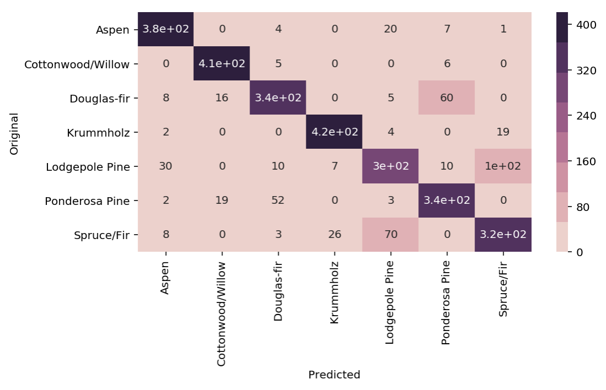
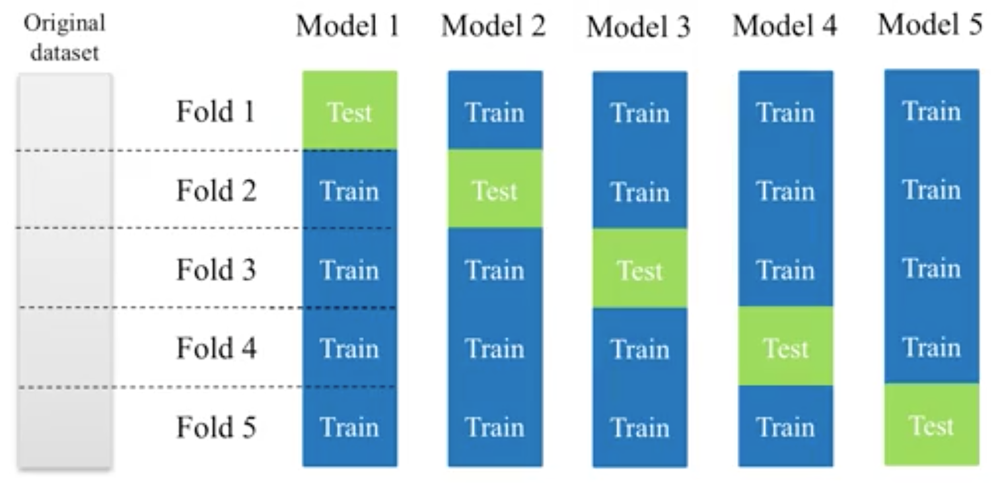

Evaluation
==========

Sklearn provides a good list of evaluation metrics for classification, regression and clustering problems.

http://scikit-learn.org/stable/modules/model_evaluation.html

In addition, it is also essential to know how to analyse the features and adjusting hyperparameters based on 
different evalution metrics.

Classification
---------------

Confusion Matrix
*****************

    Wikipedia

.. figure:: images/confusion2.png
    :width: 400px
    :align: center

    Wikipedia

    
    https://www.youtube.com/watch?v=21Igj5Pr6u4

**Recall|Sensitivity**: (True Positive / True Positive + False Negative) High recall means to get all 
positives (i.e., True Positive + False Negative) despite having some false positives.
Search & extraction in legal cases, Tumour detection. Often need humans to filter false positives.

**Precision**: (True Positive / True Positive + False Positive) High precision means it is important 
to filter off the any false positives.
Search query suggestion, Document classification, customer-facing tasks. 

**F1-Score**: is the harmonic mean of precision and sensitivity, ie., 2*((precision * recall) / (precision + recall))

**1. Confusion Matrix**

Plain vanilla matrix. Not very useful as does not show the labels. 
However, the matrix can be used to build a heatmap using plotly directly.

.. code:: python
  
  print (sklearn.metrics.confusion_matrix(test_target,predictions))
  array([[288,  64,   1,   0,   7,   3,  31],
         [104, 268,  11,   0,  43,  15,   5],
         [  0,   5, 367,  15,   6,  46,   0],
         [  0,   0,  11, 416,   0,   4,   0],
         [  1,  13,   5,   0, 424,   4,   0],
         [  0,   5,  75,  22,   4, 337,   0],
         [ 20,   0,   0,   0,   0,   0, 404]])

  # make heatmap using plotly
  from plotly.offline import iplot
  from plotly.offline import init_notebook_mode
  import plotly.graph_objs as go
  init_notebook_mode(connected=True)

  layout = go.Layout(width=800, height=400)
  data = go.Heatmap(z=x,x=title,y=title)
  fig = go.Figure(data=[data], layout=layout)
  iplot(fig)

  # this gives the values of each cell, but api unable to change the layout size
  import plotly.figure_factory as ff
  layout = go.Layout(width=800, height=500)
  data = ff.create_annotated_heatmap(z=x,x=title,y=title)
  iplot(data)

With pandas crosstab. Convert encoding into labels and put the two pandas series into a crosstab.

.. code:: python

  def forest(x):
    if x==1:
        return 'Spruce/Fir'
    elif x==2:
        return 'Lodgepole Pine'
    elif x==3:
        return 'Ponderosa Pine'
    elif x==4:
        return 'Cottonwood/Willow'
    elif x==5:
        return 'Aspen'
    elif x==6:
        return 'Douglas-fir'
    elif x==7:
        return 'Krummholz'

  # Create pd Series for Original
  # need to reset index as train_test is randomised
  Original = test_target.apply(lambda x: forest(x)).reset_index(drop=True)
  Original.name = 'Original'

  # Create pd Series for Predicted
  Predicted = pd.DataFrame(predictions, columns=['Predicted'])
  Predicted = Predicted[Predicted.columns[0]].apply(lambda x: forest(x))

  # Create Confusion Matrix
  confusion = pd.crosstab(Original, Predicted)
  confusion

Using a heatmap.

.. code:: python
  
   # add confusion matrix from pd.crosstab earlier
   plt.figure(figsize=(10, 5))
   sns.heatmap(confusion,annot=True,cmap=sns.cubehelix_palette(8));

**2. Evaluation Metrics**

.. code:: python

  from sklearn.metrics import accuracy_score, precision_score, recall_score, f1_score
  
  # Accuracy = TP + TN / (TP + TN + FP + FN)
  # Precision = TP / (TP + FP)
  # Recall = TP / (TP + FN)  Also known as sensitivity, or True Positive Rate
  # F1 = 2 * (Precision * Recall) / (Precision + Recall) 
  
  print('Accuracy:', accuracy_score(y_test, tree_predicted)
  print('Precision:', precision_score(y_test, tree_predicted)
  print('Recall:', recall_score(y_test, tree_predicted)
  print('F1:', f1_score(y_test, tree_predicted)
  
  Accuracy: 0.95
  Precision: 0.79
  Recall: 0.60
  F1: 0.68

  # for precision/recall/f1 in multi-class classification
  # need to add average=None or will prompt an error
  # scoring will be for each label, and averaging them is necessary
  from statistics import mean
  mean(f1_score(y_test, y_predict, average=None))

There are many other evaluation metrics, a list can be found here:

.. code:: python

  from sklearn.metrics.scorer import SCORERS

  for i in sorted(list(SCORERS.keys())):
      print i  

  accuracy
  adjusted_rand_score
  average_precision
  f1
  f1_macro
  f1_micro
  f1_samples
  f1_weighted
  log_loss
  mean_absolute_error
  mean_squared_error
  median_absolute_error
  neg_log_loss
  neg_mean_absolute_error
  neg_mean_squared_error
  neg_median_absolute_error
  precision
  precision_macro
  precision_micro
  precision_samples
  precision_weighted
  r2
  recall
  recall_macro
  recall_micro
  recall_samples
  recall_weighted
  roc_auc

**3. Classification Report**

.. code:: python

  # Combined report with all above metrics
  from sklearn.metrics import classification_report

  print(classification_report(y_test, tree_predicted, target_names=['not 1', '1']))
  
                precision    recall  f1-score   support

        not 1       0.96      0.98      0.97       407
            1       0.79      0.60      0.68        43

  avg / total       0.94      0.95      0.94       450

Classification report shows the details of precision, recall & f1-scores. 
It might be misleading to just print out a binary classification as their determination of True Positive, False Positive
might differ from us. The report will tease out the details as shown below. We can also set
``average=None`` & compute the mean when printing out each individual scoring.

.. code:: python

    accuracy = accuracy_score(y_test, y_predict)
    confusion = confusion_matrix(y_test,y_predict)
    f1 = f1_score(y_test, y_predict)
    recall = recall_score(y_test, y_predict)
    precision = precision_score(y_test, y_predict)

    f1_avg = mean(f1_score(y_test, y_predict, average=None))
    recall_avg = mean(recall_score(y_test, y_predict, average=None))
    precision_avg = mean(precision_score(y_test, y_predict, average=None))

    print('accuracy:\t', accuracy)
    print('\nf1:\t\t',f1)
    print('recall\t\t',recall)
    print('precision\t',precision)

    print('\nf1_avg:\t\t',f1_avg)
    print('recall_avg\t',recall_avg)
    print('precision_avg\t',precision_avg)

    print('\nConfusion Matrix')
    print(confusion)
    print('\n',classification_report(y_test, y_predict))

    University of Michigan: Coursera Data Science in Python

**4. Decision Function**

.. code:: python

  X_train, X_test, y_train, y_test = train_test_split(X, y_binary_imbalanced, random_state=0)
  y_scores_lr = lr.fit(X_train, y_train).decision_function(X_test)
  y_score_list = list(zip(y_test[0:20], y_scores_lr[0:20]))

  # show the decision_function scores for first 20 instances
  y_score_list

  [(0, -23.176682692580048),
   (0, -13.541079101203881),
   (0, -21.722576315155052),
   (0, -18.90752748077151),
   (0, -19.735941639551616),
   (0, -9.7494967330877031),
   (1, 5.2346395208185506),
   (0, -19.307366394398947),
   (0, -25.101037079396367),
   (0, -21.827003670866031),
   (0, -24.15099619980262),
   (0, -19.576751014363683),
   (0, -22.574837580426664),
   (0, -10.823683312193941),
   (0, -11.91254508661434),
   (0, -10.979579441354835),
   (1, 11.20593342976589),
   (0, -27.645821704614207),
   (0, -12.85921201890492),
   (0, -25.848618861971779)]
  
**5. Probability Function**

.. code:: python

  X_train, X_test, y_train, y_test = train_test_split(X, y_binary_imbalanced, random_state=0)
  # note that the first column of array indicates probability of predicting negative class,
  # 2nd column indicates probability of predicting positive class
  y_proba_lr = lr.fit(X_train, y_train).predict_proba(X_test)
  y_proba_list = list(zip(y_test[0:20], y_proba_lr[0:20,1]))

  # show the probability of positive class for first 20 instances
  y_proba_list

  [(0, 8.5999236926158807e-11),
   (0, 1.31578065170999e-06),
   (0, 3.6813318939966053e-10),
   (0, 6.1456121155693793e-09),
   (0, 2.6840428788564424e-09),
   (0, 5.8320607398268079e-05),
   (1, 0.99469949997393026),
   (0, 4.1201906576825675e-09),
   (0, 1.2553305740618937e-11),
   (0, 3.3162918920398805e-10),
   (0, 3.2460530855408745e-11),
   (0, 3.1472051953481208e-09),
   (0, 1.5699022391384567e-10),
   (0, 1.9921654858205874e-05),
   (0, 6.7057057309326073e-06),
   (0, 1.704597440356912e-05),
   (1, 0.99998640688336282),
   (0, 9.8530840165646881e-13),
   (0, 2.6020404794341749e-06),
   (0, 5.9441185633886803e-12)]

Precision-Recall Curves
**********************************

If your problem involves kind of searching a needle in the haystack; 
the positive class samples are very rare compared to the negative classes, use a precision recall curve. 

.. code:: python

  from sklearn.metrics import precision_recall_curve
  
  # get decision function scores
  y_scores_lr = m.fit(X_train, y_train).decision_function(X_test)
  
  # get precision & recall values
  precision, recall, thresholds = precision_recall_curve(y_test, y_scores_lr)
  closest_zero = np.argmin(np.abs(thresholds))
  closest_zero_p = precision[closest_zero]
  closest_zero_r = recall[closest_zero]

  plt.figure()
  plt.xlim([0.0, 1.01])
  plt.ylim([0.0, 1.01])
  plt.plot(precision, recall, label='Precision-Recall Curve')
  plt.plot(closest_zero_p, closest_zero_r, 'o', markersize = 12, fillstyle = 'none', c='r', mew=3)
  plt.xlabel('Precision', fontsize=16)
  plt.ylabel('Recall', fontsize=16)
  plt.axes().set_aspect('equal')
  plt.show()

.. image:: images/precision-recall-curve.png
    :scale: 40 %
    :align: center

ROC Curves
*****************

    Sensitivity vs 1-Specificity; or TP rate vs FP rate

Receiver Operating Characteristic (ROC) is used to show the performance of a binary classifier. 
Y-axis is True Positive Rate (Recall) & X-axis is False Positive Rate (Fall-Out). 
Area Under Curve (AUC) of a ROC is used. Higher AUC better.

The term came about in WWII where this metrics is used to determined a receiver operator's ability to distinguish
false positive and true postive correctly in the radar signals.

Some classifiers have a decision_function method while others have a probability prediction method, 
and some have both. Whichever one is available works fine for an ROC curve.

.. code:: python

  from sklearn.metrics import roc_curve, auc

  X_train, X_test, y_train, y_test = train_test_split(X, y_binary_imbalanced, random_state=0)

  y_score_lr = lr.fit(X_train, y_train).decision_function(X_test)
  fpr_lr, tpr_lr, _ = roc_curve(y_test, y_score_lr)
  roc_auc_lr = auc(fpr_lr, tpr_lr)

  plt.figure()
  plt.xlim([-0.01, 1.00])
  plt.ylim([-0.01, 1.01])
  plt.plot(fpr_lr, tpr_lr, lw=3, label='LogRegr ROC curve (area = {:0.2f})'.format(roc_auc_lr))
  plt.xlabel('False Positive Rate', fontsize=16)
  plt.ylabel('True Positive Rate', fontsize=16)
  plt.title('ROC curve (1-of-10 digits classifier)', fontsize=16)
  plt.legend(loc='lower right', fontsize=13)
  plt.plot([0, 1], [0, 1], color='navy', lw=3, linestyle='--')
  plt.axes().set_aspect('equal')
  plt.show()

.. figure:: images/roc-curve.png
    :scale: 40 %
    :align: center

Log Loss
*****************
Logarithmic Loss, or Log Loss is a popular Kaggle evaluation metric, 
which measures the performance of a classification model where the prediction input is a probability value between 0 and 1

.. figure:: images/logloss.png
    :scale: 60 %
    :align: center
    
    From datawookie

Log Loss quantifies the accuracy of a classifier by penalising false classifications;
the catch is that Log Loss ramps up very rapidly as the predicted probability approaches 0. 
This article from datawookie_ gives a very good explanation.

.. _datawookie: https://datawookie.netlify.com/blog/2015/12/making-sense-of-logarithmic-loss/

Regression
-----------
For regression problems, where the response or y is a continuous value, 
it is common to use R-Squared and RMSE, or MAE as evaluation metrics.
This website_ gives an excellent description on all the variants of errors metrics. 

.. _website: https://www.dataquest.io/blog/understanding-regression-error-metrics/

**R-squared**: Percentage of variability of dataset that can be explained by the model.

**MSE**. Mean squared error. Squaring then getting the mean of all errors (so change negatives into positives).

**RMSE**: Squared root of MSE so that it gives back the error at the same scale (as it was initially squared).

**MAE**: Mean Absolute Error. For negative errors, convert them to positive and obtain all error means.

The RMSE result will always be larger or equal to the MAE. If all of the errors have the same magnitude, then RMSE=MAE.
Since the errors are squared before they are averaged, the RMSE gives a relatively high weight to large errors. 
This means the RMSE should be more useful when large errors are particularly undesirable.

.. code:: python

    from sklearn.metrics import mean_squared_error
    from sklearn.metrics import mean_absolute_error

    forest = RandomForestRegressor(n_estimators= 375)
    model3 = forest.fit(X_train, y_train)
    fullmodel = forest.fit(predictor, target)
    print(model3)

    # R2
    r2_full = fullmodel.score(predictor, target)
    r2_trains = model3.score(X_train, y_train)
    r2_tests = model3.score(X_test, y_test)
    print('\nr2 full:', r2_full)
    print('r2 train:', r2_trains)
    print('r2 test:', r2_tests)

    # get predictions
    y_predicted_total = model3.predict(predictor)
    y_predicted_train = model3.predict(X_train)
    y_predicted_test = model3.predict(X_test)

    # get MSE
    MSE_total = mean_squared_error(target, y_predicted_total)
    MSE_train = mean_squared_error(y_train, y_predicted_train)
    MSE_test = mean_squared_error(y_test, y_predicted_test)

    # get RMSE by squared root
    print('\nTotal RMSE:', np.sqrt(MSE_total))
    print('Train RMSE:', np.sqrt(MSE_train))
    print('Test RMSE:', np.sqrt(MSE_test))

    # get MAE
    MAE_total = mean_absolute_error(target, y_predicted_total)
    MAE_train = mean_absolute_error(y_train, y_predicted_train)
    MAE_test = mean_absolute_error(y_test, y_predicted_test)

    # Train RMSE: 11.115272389673631
    # Test RMSE: 34.872611746182706
        
    # Train MAE 8.067078668023848
    # Train MAE 24.541799999999995

**RMSLE** Root Mean Square Log Error is a very popular evaluation metric in data science competition now.
It helps to reduce the effects of outliers compared to RMSE.

More: https://medium.com/analytics-vidhya/root-mean-square-log-error-rmse-vs-rmlse-935c6cc1802a

.. code:: python

    def rmsle(y, y0):
        assert len(y) == len(y0)
        return np.sqrt(np.mean(np.power(np.log1p(y)-np.log1p(y0), 2)))

K-fold Cross-Validation
------------------------

Takes more time and computation to use k-fold, but well worth the cost. 
By default, sklearn uses stratified k-fold cross validation. Another type is 'leave one out' cross-validation.

The mean of the final scores among each k model is the most generalised output.
This output can be compared to different model results for comparison.

More here_.

.. _here: https://medium.com/towards-data-science/train-test-split-and-cross-validation-in-python-80b61beca4b6

    k-fold cross validation, with 5-folds

``cross_val_score`` is a compact function to obtain the all scoring values using kfold in one line.

.. code:: python

    from sklearn.model_selection import cross_val_score
    from sklearn.ensemble import RandomForestClassifier

    X = df[df.columns[1:-1]]
    y = df['Cover_Type']

    # using 5-fold cross validation mean scores
    model = RandomForestClassifier()
    cv_scores = cross_val_score(model, X, y, scoring='accuracy', cv=5, n_jobs=-1)
    print(np.mean(cv_scores))

For greater control, like to define our own evaluation metrics etc., 
we can use ``KFold`` to obtain the train & test indexes for each fold iteration.

.. code:: python

    from sklearn.model_selection import KFold
    from sklearn.ensemble import RandomForestClassifier
    from sklearn.metrics import f1_score

    def kfold_custom(fold=4, X, y, model, eval_metric):
        kf = KFold(n_splits=4)
        score_total = []
        for train_index, test_index in kf.split(X):
            X_train, y_train = train[train_index][X_features], train[train_index][y_feature]
            X_test, y_test = test[test_index][X_features], test[test_index][y_feature]
            model.fit(X_train, y_train)
            y_predict = model.predict()
            score = eval_metric(y_test, y_predict)
            score_total.append(score)
        score = np.mean(score_total)
        return score

    model = RandomForestClassifier()
    kfold_custom(X, y, model, f1score)

There are many other variants of cross validations as shown below.

    Types of cross-validation available in sklearn

Hyperparameters Tuning
--------------------------
There are generally 3 methods of hyperparameters tuning, i.e., Grid-Search, Random-Search,
or the more automated Bayesian tuning.

Grid-Search
************

From Stackoverflow: Systematically working through multiple combinations of parameter tunes, 
cross validate each and determine which one gives the best performance.
You can work through many combination only changing parameters a bit.

Print out the ``best_params_`` and rebuild the model with these optimal parameters. 

Simple example.

.. code:: python

  from sklearn.model_selection import GridSearchCV
  from sklearn.ensemble import RandomForestClassifier

  model = RandomForestClassifier()

  grid_values = {'n_estimators':[150,175,200,225]}
  grid = GridSearchCV(model, param_grid = grid_values, cv=5)
  grid.fit(predictor, target)

  print(grid.best_params_)
  print(grid.best_score_)

  # {'n_estimators': 200}
  # 0.786044973545

Others.

.. code:: python

  from sklearn.svm import SVC
  from sklearn.model_selection import GridSearchCV
  from sklearn.metrics import roc_auc_score
  from sklearn.model_selection import train_test_split
  

  dataset = load_digits()
  X, y = dataset.data, dataset.target == 1
  X_train, X_test, y_train, y_test = train_test_split(X, y, random_state=0)

  # choose a classifier
  clf = SVC(kernel='rbf')

  # input grid value range
  grid_values = {'gamma': [0.001, 0.01, 0.05, 0.1, 1, 10, 100]}
  # other parameters can be input in the dictionary, e.g.,
  # grid_values = {'gamma': [0.01, 0.1, 1, 10], 'C': [0.01, 0.1, 1, 10]}
  # OR n_estimators, max_features from RandomForest
  # default metric to optimize over grid parameters: accuracy
  
  grid_clf_acc = GridSearchCV(clf, param_grid = grid_values, random_state=0)
  
  grid_clf_acc.fit(X_train, y_train)
  y_decision_fn_scores_acc = grid_clf_acc.decision_function(X_test) 

  print('Grid best parameter (max. accuracy): ', grid_clf_acc.best_params_)
  print('Grid best score (accuracy): ', grid_clf_acc.best_score_)

Using other scoring metrics

.. code:: python

  # alternative metric to optimize over grid parameters: AUC
  # other scoring parameters include 'recall' or 'precision'
  grid_clf_auc = GridSearchCV(clf, param_grid = grid_values, scoring = 'roc_auc', cv=3, random_state=0) # indicate AUC
  grid_clf_auc.fit(X_train, y_train)
  y_decision_fn_scores_auc = grid_clf_auc.decision_function(X_test) 

  print('Test set AUC: ', roc_auc_score(y_test, y_decision_fn_scores_auc))
  print('Grid best parameter (max. AUC): ', grid_clf_auc.best_params_)
  print('Grid best score (AUC): ', grid_clf_auc.best_score_)

  # results 1
  ('Grid best parameter (max. accuracy): ', {'gamma': 0.001})
  ('Grid best score (accuracy): ', 0.99628804751299183)
  # results 2
  ('Test set AUC: ', 0.99982858122393004)
  ('Grid best parameter (max. AUC): ', {'gamma': 0.001})
  ('Grid best score (AUC): ', 0.99987412783021423)
  
  
  # gives break down of all permutations of gridsearch
  print fittedmodel.cv_results_
  # gives parameters that gives the best indicated scoring type
  print CV.best_params_

Auto-Tuning
*****************************

**Bayesian Optimization** as the name implies uses Bayesian optimization with Gaussian processes
for autotuning. It is one of the most popular package now for auto-tuning. ``pip install bayesian-optimization``

More: https://github.com/fmfn/BayesianOptimization

.. code:: python

    from bayes_opt import BayesianOptimization

    # 1) Black box model function with output as evaluation metric

    def cat_hyp(depth, learning_rate, bagging_temperature):
        params = {"iterations": 100,
                  "eval_metric": "RMSE",
                  "verbose": False,
                  "depth": int(round(depth)),
                  "learning_rate": learning_rate,
                  "bagging_temperature": bagging_temperature}

        cat_feat = [] # Categorical features list
        cv_dataset = cgb.Pool(data=X, label=y, cat_features=cat_feat)

        # CV scores
        scores = catboost.cv(cv_dataset, params, fold_count=3)

        # negative as using RMSE, and optimizer tune to highest score 
        return -np.max(scores['test-RMSE-mean'])
        

    # 2) Bounded region of parameter space
    pbounds = {'depth': (2, 10),
               'bagging_temperature': (3,10),
               'learning_rate': (0.05,0.9)}

    # 3) Define optimizer function
    optimizer = BayesianOptimization(f=black_box_function,
                                     pbounds=pbounds,
                                     random_state=1)

    # 4) Start optimizing
        # init_points: no. steps of random exploration. Helps to diversify random space
        # n_iter: no. steps for bayesian optimization. Helps to exploit learnt parameters
    optimizer.maximize(init_points=2, n_iter=3)

    # 5) Get best parameters
    best_param = optimizer.max['params']

Here's another example using Random Forest

.. code:: python

    from bayes_opt import BayesianOptimization
    from sklearn.ensemble import RandomForestRegressor

    def rmsle(y, y0):
        assert len(y) == len(y0)
        return np.sqrt(np.mean(np.power(np.log1p(y)-np.log1p(y0), 2)))

    def black_box(n_estimators, max_depth):
        params = {"n_jobs": 5,
                  "n_estimators": int(round(n_estimators)),
                  "max_depth": max_depth}
        
        model = RandomForestRegressor(**params)
        model.fit(X_train, y_train)
        y_predict = model.predict(X_test)
        score = rmsle(y_test, y_predict)

        return -score

    # Search space
    pbounds = {'n_estimators': (1, 5),
               'max_depth': (10,50)}

    optimizer = BayesianOptimization(black_box, pbounds, random_state=2100)
    optimizer.maximize(init_points=10, n_iter=5)

**Bayesian Tuning and Bandits (BTB)** is a package used for auto-tuning ML models hyperparameters.
It similarly uses Gaussian Process to do this, though there is an option for Uniform. 
It was born from a Master thesis by Laura Gustafson in 2018. 
Because it is lower level than the above package, it has better flexibility, 
e.g., defining a k-fold cross-validation.

https://github.com/HDI-Project/BTB

.. code:: python

    from btb.tuning import GP
    from btb import HyperParameter, ParamTypes

    # remember to change INT to FLOAT where necessary
    tunables = [('n_estimators', HyperParameter(ParamTypes.INT, [500, 2000])),
                ('max_depth', HyperParameter(ParamTypes.INT, [3, 20]))]

    def auto_tuning(tunables, epoch, X_train, X_test, y_train, y_test, verbose=0):
        """Auto-tuner using BTB library"""
        tuner = GP(tunables)
        parameters = tuner.propose()
    
        score_list = []
        param_list = []

        for i in range(epoch):
            # ** unpacks dict in a argument
            model = RandomForestClassifier(**parameters, n_jobs=-1)
            model.fit(X_train, y_train)
            y_predict = model.predict(X_test)
            score = accuracy_score(y_test, y_predict)

            # store scores & parameters
            score_list.append(score)
            param_list.append(parameters)

            if verbose==0:
                pass
            elif verbose==1:
                print('epoch: {}, accuracy: {}'.format(i+1,score))
            elif verbose==2:
                print('epoch: {}, accuracy: {}, param: {}'.format(i+1,score,parameters))

            # get new parameters
            tuner.add(parameters, score)
            parameters = tuner.propose()

        best_s = tuner._best_score
        best_score_index = score_list.index(best_s)
        best_param = param_list[best_score_index]
        print('\nbest accuracy: {}'.format(best_s))
        print('best parameters: {}'.format(best_param))        
        return best_param

    best_param = auto_tuning(tunables, 5, X_train, X_test, y_train, y_test)

    # epoch: 1, accuracy: 0.7437106918238994
    # epoch: 2, accuracy: 0.779874213836478
    # epoch: 3, accuracy: 0.7940251572327044
    # epoch: 4, accuracy: 0.7908805031446541
    # epoch: 5, accuracy: 0.7987421383647799

    # best accuracy: 0.7987421383647799
    # best parameters: {'n_estimators': 1939, 'max_depth': 18}

For regression models, we have to make some slight modifications, 
since the optimization of hyperparameters is tuned towards a higher evaluation score.

.. code:: python

    from btb.tuning import GP
    from btb import HyperParameter, ParamTypes
    from sklearn.metrics import mean_squared_error

    def auto_tuning(tunables, epoch, X_train, X_test, y_train, y_test, verbose=0):
        """Auto-tuner using BTB library"""
        tuner = GP(tunables)
        parameters = tuner.propose()

        score_list = []
        param_list = []

        for i in range(epoch):
            # ** unpacks dict in a argument
            model = RandomForestRegressor(**parameters, n_jobs=10, verbose=3)
            model.fit(X_train, y_train)
            y_predict = model.predict(X_test)
            score = np.sqrt(mean_squared_error(y_test, y_predict))

            # store scores & parameters
            score_list.append(score)
            param_list.append(parameters)

            if verbose==0:
                pass
            elif verbose==1:
                print('epoch: {}, rmse: {}'.format(i+1,score))
            elif verbose==2:
                print('epoch: {}, rmse: {}, param: {}'.format(i+1,score,parameters))

            # BTB tunes parameters based the logic on higher score = good
            # but RMSE is lower the better, hence need to change scores to negative to inverse it
            score = -score
            
            # get new parameters
            tuner.add(parameters, score)
            parameters = tuner.propose()

        best_s = tuner._best_score
        best_score_index = score_list.index(best_s)
        best_param = param_list[best_score_index]
        print('\nbest rmse: {}'.format(best_s))
        print('best parameters: {}'.format(best_param))
        return best_param

**Auto-Sklearn** is another auto-ml package that automatically selects both the model and its hyperparameters.

https://automl.github.io/auto-sklearn/master/

.. code:: python

    import autosklearn.classification
    import sklearn.model_selection
    import sklearn.datasets
    import sklearn.metrics

    X, y = sklearn.datasets.load_digits(return_X_y=True)
    X_train, X_test, y_train, y_test = sklearn.model_selection.train_test_split(X, y, random_state=1)

    automl = autosklearn.classification.AutoSklearnClassifier()
    automl.fit(X_train, y_train)

    y_pred = automl.predict(X_test)
    print("Accuracy score", sklearn.metrics.accuracy_score(y_test, y_pred))

**Auto Keras** uses neural network for training. Similar to Google’s AutoML approach.

.. code:: python

    import autokeras as ak

    clf = ak.ImageClassifier()
    clf.fit(x_train, y_train)
    results = clf.predict(x_test)