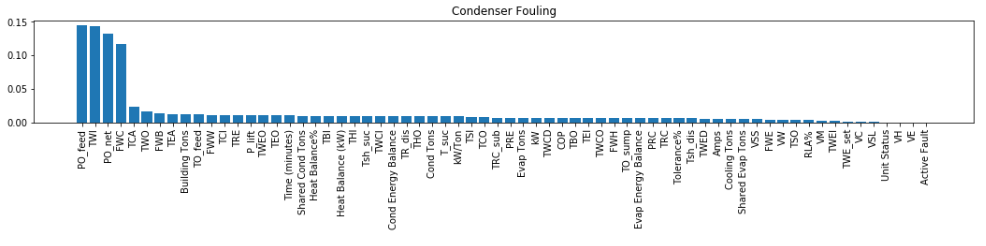

Explainability
===============

While sklearn's supervised models are black boxes, we can derive certain plots and metrics to interprete the outcome and model better.

Feature Importance
-------------------
Decision trees and other tree ensemble models, by default, allow us to obtain the importance of features.

.. code:: python

    import pandas as pd
    from sklearn.ensemble import RandomForestClassifier

    rf = RandomForestClassifier()
    model = rf.fit(X_train, y_train)

    # evaluation metrics
    y_predict = model.predict(X_test)
    accuracy = accuracy_score(y_test, y_predict)
    f1 = mean(f1_score(y_test, y_predict, average=None))

    # sort feature importance in df
    f_impt= pd.DataFrame(model.feature_importances_, index=dataframe.columns[:-1])
    f_impt = f_impt.sort_values(by=0,ascending=False)
    f_impt.columns = ['feature importance']

    # plot bar chart
    plt.figure(figsize=(18,2))
    plt.bar(f_impt.index,f_impt['feature importance'])
    plt.xticks(rotation='vertical')
    plt.title(fault)

    

Permutation Importance
-----------------------

Feature importance is a useful metric to **find the strength of each feature that contribute to a model**.
However, this is only available by default in sklean tree models. 
This Kaggle_ article provides a good clear explanation of an alternative feature importance, 
called permutation importance, which can be used for any model. This is a third party library that needs to be installed via ``pip install eli5``.

.. _Kaggle: https://www.kaggle.com/dansbecker/permutation-importance

How it works is the shuffling of individual features and see how it affects model accuarcy.
If a feature is important, the model accuarcy will be reduced more. 
If not important, the accuarcy should be affected a lot less.

.. figure:: images/permutation_impt.png
    :scale: 60 %
    :align: center
    
    From Kaggle

.. code:: python
    
    import eli5
    from eli5.sklearn import PermutationImportance

    perm = PermutationImportance(my_model, random_state=1).fit(test_X, test_y)
    eli5.show_weights(perm, feature_names = test_X.columns.tolist())

The output is as below. +/- refers to the randomness that shuffling resulted in.
The higher the weight, the more important the feature is. 
Negative values are possible, but actually refer to 0; though random chance caused the predictions on shuffled data to be more accurate.

    
    From Kaggle

Partial Dependence Plots
--------------------------
While feature importance shows what variables most affect predictions, **partial dependence plots show how a feature affects predictions**.
Using the fitted model to predict our outcome, and by repeatedly alter the value of just one variable, 
we can trace the predicted outcomes in a plot to show its dependence on the variable and when it plateaus.

https://www.kaggle.com/dansbecker/partial-plots

.. code:: python

    from matplotlib import pyplot as plt
    from pdpbox import pdp, get_dataset, info_plots

    # Create the data that we will plot
    pdp_goals = pdp.pdp_isolate(model=tree_model, dataset=val_X, model_features=feature_names, feature='Goal Scored')

    # plot it
    pdp.pdp_plot(pdp_goals, 'Goal Scored')
    plt.show()

    
    From Kaggle Learn

**2D Partial Dependence Plots** are also useful for interactions between features.

.. code:: python

    # just need to change pdp_isolate to pdp_interact
    features_to_plot = ['Goal Scored', 'Distance Covered (Kms)']
    inter1  =  pdp.pdp_interact(model=tree_model, dataset=val_X, 
                                model_features=feature_names, features=features_to_plot)

    pdp.pdp_interact_plot(pdp_interact_out=inter1, 
                          feature_names=features_to_plot, 
                          plot_type='contour')
    plt.show()

    
    From Kaggle Learn

SHAP
------
SHapley Additive exPlanations (SHAP) **break down a prediction to show the impact of each feature**. 

https://www.kaggle.com/dansbecker/shap-values

The explainer differs with the model type:
 * ``shap.TreeExplainer(my_model)`` for tree models
 * ``shap.DeepExplainer(my_model)`` for neural networks
 * ``shap.KernelExplainer(my_model)`` for all models, but slower, and gives approximate SHAP values

.. code:: python

    import shap  # package used to calculate Shap values

    # Create object that can calculate shap values
    explainer = shap.TreeExplainer(my_model)

    # Calculate Shap values
    shap_values = explainer.shap_values(data_for_prediction)

    # load JS lib in notebook
    shap.initjs()
    shap.force_plot(explainer.expected_value[1], shap_values[1], data_for_prediction)

    
    From Kaggle Learn