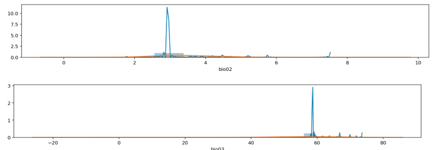
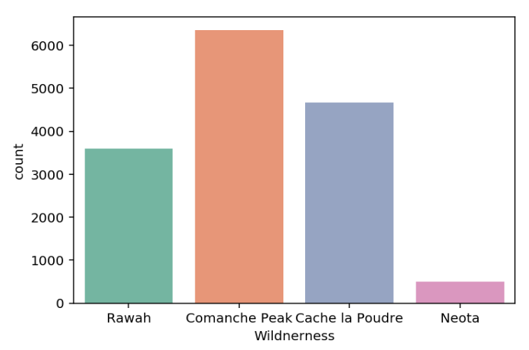
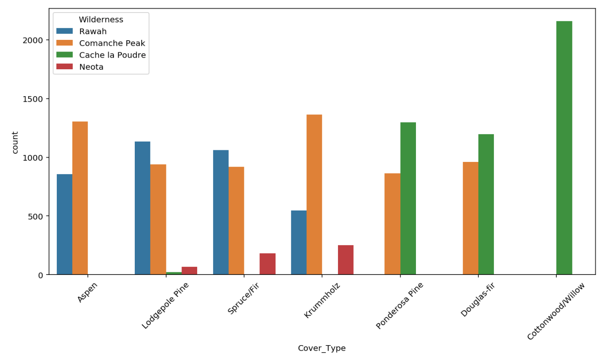
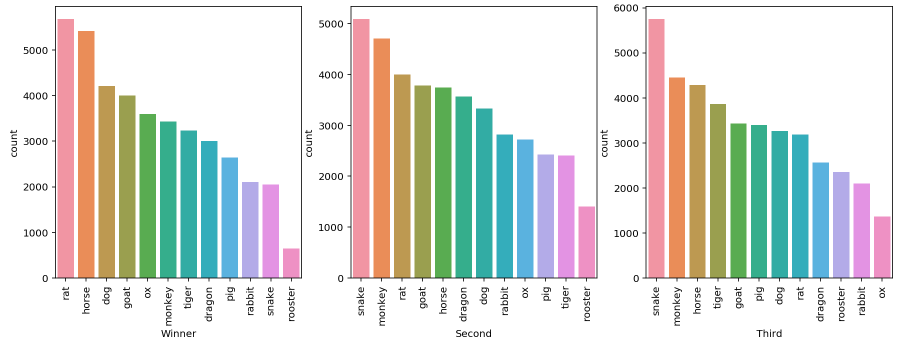
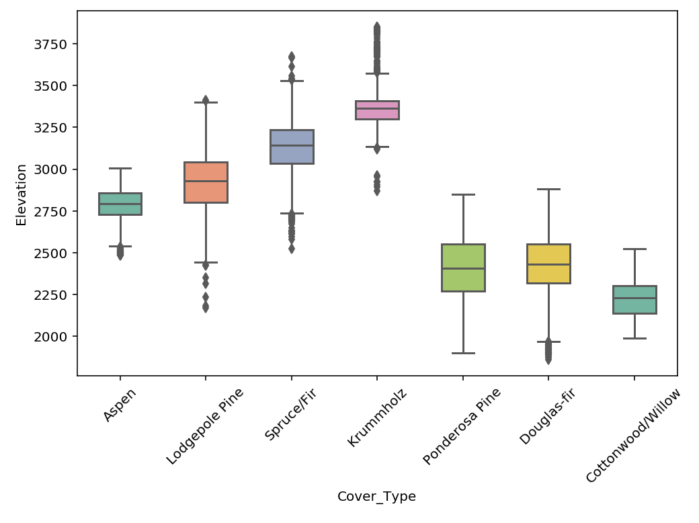
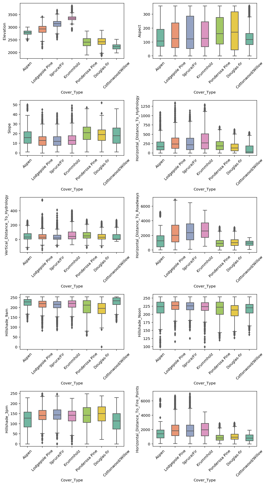

Exploratory Analysis
=========================

Exploratory data analysis (EDA) is an essential step to understand the data better;
in order to engineer and select features before modelling.
This often requires skills in visualisation to better interpret the data.

Univariate
------------

Distribution Plots
*******************
When plotting distributions, it is important to compare the distribution of both train and test sets.
If the test set very specific to certain features, the model will underfit and have a low accuarcy.

.. code:: python

    import seaborn as sns
    import matplotlib.pyplot as plt
    %config InlineBackend.figure_format = 'retina'
    %matplotlib inline

    for i in X.columns:
        plt.figure(figsize=(15,5))
        sns.distplot(X[i])
        sns.distplot(pred[i])

Count Plots
*******************
For **categorical** features, you may want to see if they have enough sample size for each category.

.. code:: python

    import seaborn as sns
    import matplotlib.pyplot as plt
    %config InlineBackend.figure_format = 'retina'
    %matplotlib inline

    df['Wildnerness'].value_counts()

    Comanche Peak      6349
    Cache la Poudre    4675
    Rawah              3597
    Neota               499
    Name: Wildnerness, dtype: int64

    cmap = sns.color_palette("Set2")
    sns.countplot(x='Wildnerness',data=df, palette=cmap);
    plt.xticks(rotation=45);

To check for possible relationships with the target, place the feature under hue.

.. code:: python

    plt.figure(figsize=(12,6))
    sns.countplot(x='Cover_Type',data=wild, hue='Wilderness');
    plt.xticks(rotation=45);

Multiple Plots

.. code:: python

    fig, axes = plt.subplots(ncols=3, nrows=1, figsize=(15, 5)) # note only for 1 row or 1 col, else need to flatten nested list in axes
    col = ['Winner','Second','Third']

    for cnt, ax in enumerate(axes):
        sns.countplot(x=col[cnt], data=df2, ax=ax, order=df2[col[cnt]].value_counts().index);
        
    for ax in fig.axes:
        plt.sca(ax)
        plt.xticks(rotation=90)

Box Plots
*******************
Using the 50 percentile to compare among different classes, it is easy to find feature that
can have high prediction importance if they do not overlap. Also can be use for outlier detection.
Features have to be **continuous**.

.. code:: python

    plt.figure(figsize=(7, 5))
    cmap = sns.color_palette("Set3")
    sns.boxplot(x='Cover_Type', y='Elevation', data=df, palette=cmap);
    plt.xticks(rotation=45);

Multiple Plots

.. code:: python

    cmap = sns.color_palette("Set2")

    fig, axes = plt.subplots(ncols=2, nrows=5, figsize=(10, 18))
    a = [i for i in axes for i in i] # axes is nested if >1 row & >1 col, need to flatten
    for i, ax in enumerate(a):
        sns.boxplot(x='Cover_Type', y=eda2.columns[i], data=eda, palette=cmap, width=0.5, ax=ax);

    # rotate x-axis for every single plot
    for ax in fig.axes:
        plt.sca(ax)
        plt.xticks(rotation=45)

    # set spacing for every subplot, else x-axis will be covered
    plt.tight_layout()

Multi-Variate
----------------

Correlation Plots
*******************

Heatmaps show a quick overall correlation between features.

Using plot.ly

.. code:: python

    from plotly.offline import iplot
    from plotly.offline import init_notebook_mode
    import plotly.graph_objs as go
    init_notebook_mode(connected=True)

    # create correlation in dataframe
    corr = df[df.columns[1:]].corr()

    layout = go.Layout(width=1000, height=600, \
                    title='Correlation Plot', \
                    font=dict(size=10))
    data = go.Heatmap(z=corr.values, x=corr.columns, y=corr.columns)
    fig = go.Figure(data=[data], layout=layout)
    iplot(fig)

.. image:: images/corr1.png
    :scale: 60 %
    :align: center

Using seaborn

.. code:: python

    import seaborn as sns
    import matplotlib.pyplot as plt
    %config InlineBackend.figure_format = 'retina'
    %matplotlib inline

    # create correlation in dataframe
    corr = df[df.columns[1:]].corr()

    plt.figure(figsize=(15, 8))
    sns.heatmap(corr, cmap=sns.color_palette("RdBu_r", 20));

.. image:: images/corr2.png
    :scale: 60 %
    :align: center