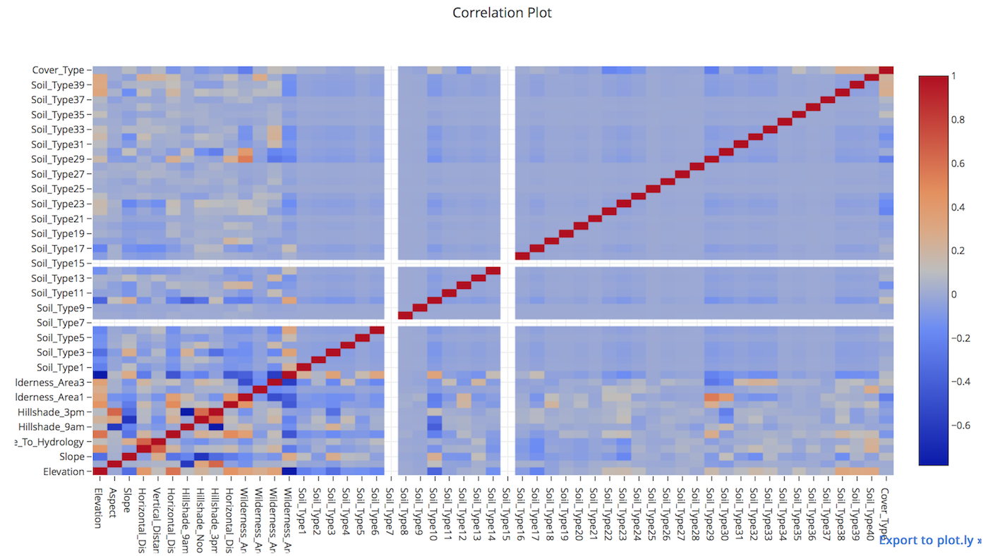
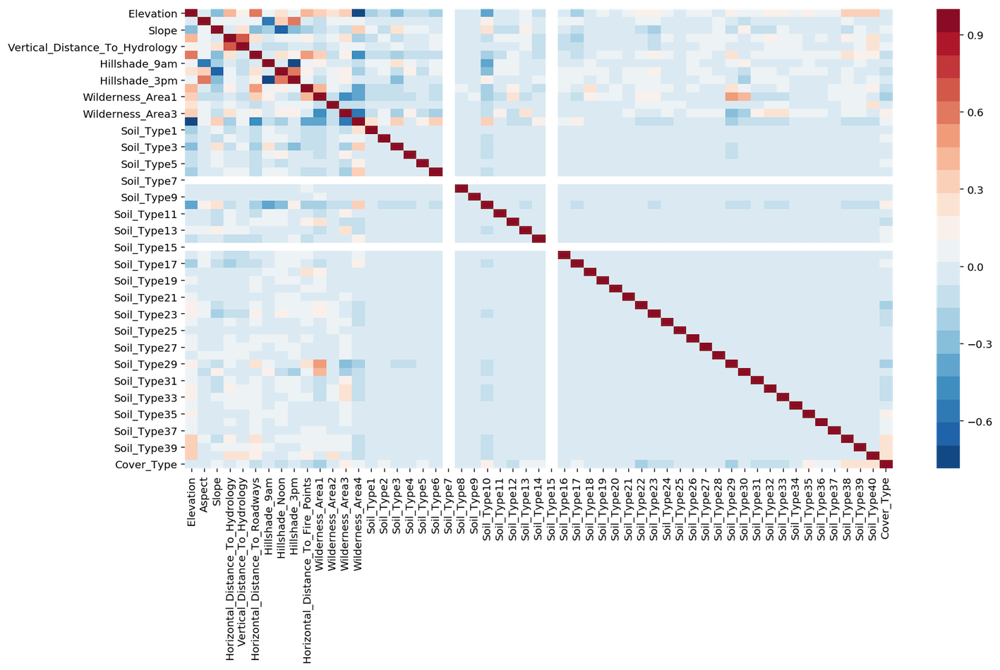

Exploratory Data Analysis
=========================

Exploratory data analysis (EDA) is an essential step to understand the data better;
in order to engineer and select features before modelling.
This often requires skills in visualisation to better interprete the data.

Correlation Plots
------------------

Heat-Map
*********
Heatmaps show a quick overall correlation between features.

Using plot.ly

.. code:: python

    from plotly.offline import iplot
    from plotly.offline import init_notebook_mode
    import plotly.graph_objs as go
    init_notebook_mode(connected=True)

    # create correlation in dataframe
    corr = df[df.columns[1:]].corr()

    layout = go.Layout(width=1000, height=600, \
                    title='Correlation Plot', \
                    font=dict(size=10))
    data = go.Heatmap(z=corr.values, x=corr.columns, y=corr.columns)
    fig = go.Figure(data=[data], layout=layout)
    iplot(fig)

Using seaborn

.. code:: python

    import seaborn as sns
    import matplotlib.pyplot as plt
    %config InlineBackend.figure_format = 'retina'
    %matplotlib inline

    # create correlation in dataframe
    corr = df[df.columns[1:]].corr()

    plt.figure(figsize=(15, 8))
    sns.heatmap(corr, cmap=sns.color_palette("RdBu_r", 20));

