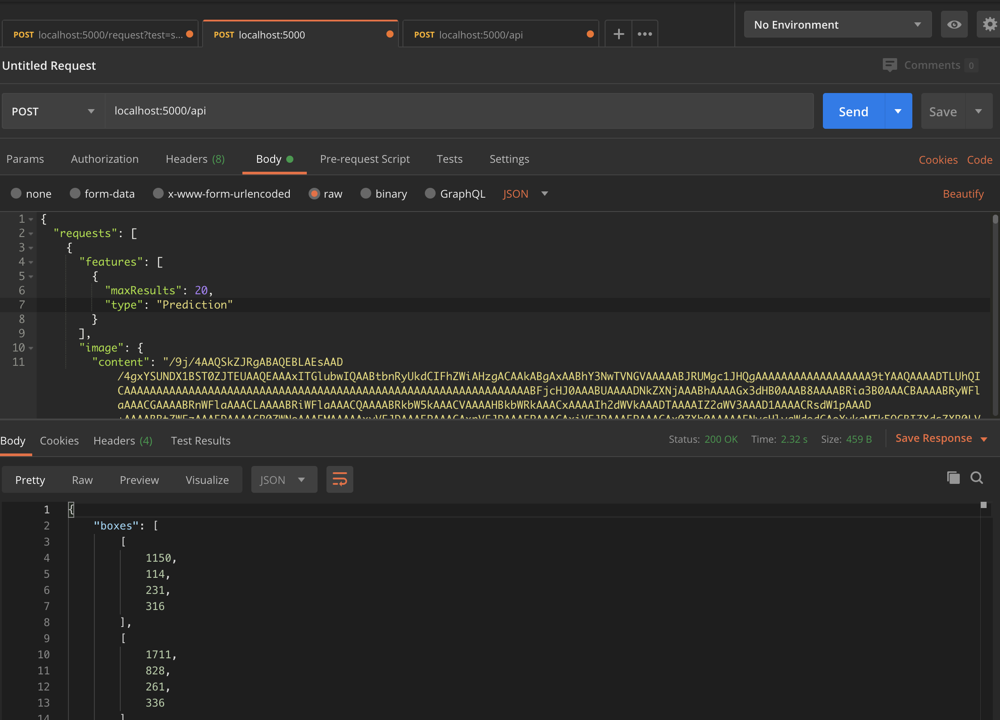

Flask
======

Flask is a micro web framework written in Python. 
It is easy and fast to implement with the knowledge of basic web development and REST APIs.
How is it relevant to model building? Sometimes, it might be necessary to 
run models in the cloud, and 

Basics
------
This gives a basic overall of how to run flask, with the debugger on,
and displaying a static ``index.html`` file.
A browser can then be nagivated to ``http://127.0.0.1:5000/`` to view the index page.

.. code:: Python

    from flask import Flask, render_template

    app = Flask(__name__)

    @app.route('/')
    def index():
        return render_template('index.html')

    if __name__ == '__main__':
        app.run(debug = True)

Folder Structure
-----------------

There are some default directory structure to adhere to. 
The first is that HTML files are placed under /templates, 
second is for Javascript, CSS or other static files like images, models or logs will be placed under /static

.. code:: bash

    ├── app.py
    ├── config.py
    ├── utils.py
    ├── static
    │   ├── css
    │   │   ├── bootstrap.css
    │   │   ├── ....
    │   ├── img
    │   │   └── img_1589185531.png
    │   ├── js
    │   │   ├── bootstrap.bundle.js
    │   │   ├── ....
    │   └── logs
    │       └── logfiles.log
    └── templates
        └── index.html

App Configs
-----------

Flask by default comes with a configuration dictionary which can be called as below.

.. code:: Python

    print(app.config)

    {'APPLICATION_ROOT': '/',
    'DEBUG': True,
    'ENV': 'development',
    'EXPLAIN_TEMPLATE_LOADING': False,
    'JSONIFY_MIMETYPE': 'application/json',
    'JSONIFY_PRETTYPRINT_REGULAR': False,
    'JSON_AS_ASCII': True,
    'JSON_SORT_KEYS': True,
    'MAX_CONTENT_LENGTH': None,
    'MAX_COOKIE_SIZE': 4093,
    'PERMANENT_SESSION_LIFETIME': datetime.timedelta(days=31),
    'PREFERRED_URL_SCHEME': 'http',
    'PRESERVE_CONTEXT_ON_EXCEPTION': None,
    'PROPAGATE_EXCEPTIONS': None,
    'SECRET_KEY': None,
    'SEND_FILE_MAX_AGE_DEFAULT': datetime.timedelta(seconds=43200),
    'SERVER_NAME': None,
    'SESSION_COOKIE_DOMAIN': None,
    'SESSION_COOKIE_HTTPONLY': True,
    'SESSION_COOKIE_NAME': 'session',
    'SESSION_COOKIE_PATH': None,
    'SESSION_COOKIE_SAMESITE': None,
    'SESSION_COOKIE_SECURE': False,
    'SESSION_REFRESH_EACH_REQUEST': True,
    'TEMPLATES_AUTO_RELOAD': None,
    'TESTING': False,
    'TRAP_BAD_REQUEST_ERRORS': None,
    'TRAP_HTTP_EXCEPTIONS': False,
    'USE_X_SENDFILE': False}

We can add new key-values or change values as any dictionary in python.

.. code:: Python

    # add a directory for image upload
    app.config['UPLOAD_IMG_FOLDER'] = 'static/img'

However, for a large project,
if there are multiple environments, each with different set of config values, 
we can create a configuration file. Refer to the links below for more. 

 * https://pythonise.com/series/learning-flask/flask-configuration-files
 * https://flask.palletsprojects.com/en/0.12.x/config/#configuring-from-files

Manipulating HTML
-----------------

There are various ways to pass variables into or manipulate html using flask.

Passing Variables
******************

We can use the double curly brackets ``{{ variable_name }}`` in html, and within flask
define a route. Within the render_template, we pass in the variable.

*In Python*

.. code:: python

    @app.route('/upload', methods=["POST"])
    def upload_file():
        img_path = 'static/img'
        img_name = 'img_{}.png'
        img = os.path.join(img_path, img_name)
        file = request.files['image_upload']
        file.save(img)

        return render_template('index.html', img_show=img)

*In HTML*

.. code:: html 

    

        
    

If Conditions, Loops, etc.
***************************

We can implement python code in the html using the syntax, i.e., ````.
However, note that we need to close it with the same synatx also, i.e. ````.

*In Python*

.. code:: python

    @app.route('/upload', methods=["POST"])
    def upload_file():
        img_path = 'static/img'
        img_name = 'img_{}.png'
        img = os.path.join(img_path, img_name)
        file = request.files['image_upload']
        file.save(img)

        return render_template('index.html', img_show=img)

*In HTML*

.. code:: html 

    
    

        
    

    

Testing
--------

There are a number of HTTP request methods. Below are the two commonly used ones.

+-----------+------------------------------------------------------------------------------------+
| ``GET``   | Sends data in unencrypted form to the server. E.g.  the ? values in URL            |
+-------------------+----------------------------------------------------------------------------+
| ``POST``  | Used to send HTML form data to server. Data received not cached by server.         |
+-----------+------------------------------------------------------------------------------------+

Postman
*******

Postman is a free software that makes it easy to test your APIs.
After launching the flask application, 
we can send a JSON request by specifying the method (POST),
and see the JSON response at the bottom panel.

Python
******

Similarly, we can also send a request using the Python "requests" package.

.. code:: html

    import requests

    # send request
    res = requests.post('http://localhost:5000/api', json={'key':'value'})
    # receieve response
    print(res.content)

File Upload
-----------

Below shows up to upload a file, e.g., an image to a directory in the server.

*In HTML*

.. code:: html 

    

        <form action="/upload" method="post" enctype="multipart/form-data">
            <input type="file" name="image_upload" accept=".jpg,.jpeg,.gif,.png" />
            <button type="submit" class="btn btn-primary">Submit</button>
        </form>
    

*In Python*

.. code:: python

    import os
    from time import time

    @app.route('/upload', methods=["POST"])
    def upload_file():
        img_path = 'static/img'

        # delete original image
        if len(os.listdir(path)) != 0:
            img = os.listdir(path)[0]
            os.remove(os.path.join(path,img))

        # retrieve and save image with unique name
        img_name = 'img_{}.png'.format(int(time()))
        img = os.path.join(path, img_name)
        file = request.files['image_upload']
        file.save(img)

        return render_template('index.html')

To upload multiple files, end the html form tag with "multiple", 
``<form action="/upload" method="post" enctype="multipart/form-data" multiple>``        

Logging
-------
We can use the in-built Python logging package for storing logs.
Note that there are 5 levels of logging, DEBUG, INFO, WARNING, ERROR and CRITICAL.
If initial configuration is set at a high level, e.g., WARNING, lower levels of logs,
i.e., DEBUG and INFO will not be logged.

Below is a basic logger.

.. code:: python

    import logging

    logging.basicConfig(level=logging.INFO, \
                        filename='../logfile.log', \
                        format='%(asctime)s :: %(levelname)s :: %(message)s')

    # some script
    logger.warning('This took x sec for model to complete')

We can use the function ``RotatingFileHandler`` to limit 
the file size ``maxBytes`` and number of log files ``backupCount`` to store.
Note that the latter argument must be at least 1.

.. code:: python

    import logging
    from logging.handlers import RotatingFileHandler

    log_formatter = logging.Formatter('%(asctime)s :: %(levelname)s :: %(message)s')
    logFile = '../logfile.log'

    handler = RotatingFileHandler(logFile, mode='a', maxBytes=10000, \
                                    backupCount=1, encoding=None, delay=0)
    handler.setFormatter(log_formatter)
    # note that if no name is specific in argument, it will assume "root"
    # and all logs from default flask output will be recorded
    # if another name given, default output will not be recorded, no matter the level set
    logger = logging.getLogger('new')
    logger.setLevel(logging.INFO)
    logger.addHandler(handler)

Docker
------

If the flask app is to be packaged in Docker, we need to set the IP to localhost, and 
expose the port during docker run.

.. code:: python

    if __name__ == "__main.py__":
        app.run(debug=True, host='0.0.0.0')

.. code:: bash

    docker run -p 5000:5000 imageName

If we run ``docker ps``, under PORTS, we should be able to see 
that the Docker host IP 0.0.0.0 and port 5000, is accessible to the container at port 5000.

Storing Keys
----------------------

We can and should set environment variables; i.e., variables stored in the OS,
especially for passwords and keys, rather than in python scripts. This helps with 
version control as you don't want to upload them to the github, or other version control platforms.
Presently I guess, it still reduces the need to copy/paste the keys into the script everytime you launch the app.

To do this, in Mac/Linux, we can store the environment variable in a ``.bash_profile``.

.. code:: bash

    # open/create bash_profile
    nano ~/.bash_profile

    # add new environment variable
    export SECRET_KEY="key"

    # restart bash_profile
    source ~/.bash_profile

    # we can test by printing it in the console
    echo $SECRET_KEY

We can also add this to the ``.bashrc`` file so that the variable will not be lost each time
you launch/restart the bash terminal.

.. code:: bash

    if [ -f ~/.bash_profile ]; then
        . ~/.bash_profile
    fi

In the flask script, we can then obtain the variable by using the os package.

.. code:: python

    import os
    SECRET_KEY = os.environ.get("SECRET_KEY")

For flask apps in docker containers, we can add an -e to include the environment variable into the
container.

.. code:: bash

    sudo docker run -e SECRET_KEY=$SECRET_KEY -p 5000:5000 comply

Changing Environment
--------------------

Sometimes certain configurations differ between the local development and 
server production environments. We can set a condition like the below.

Note by default flask environment is set to production

.. code:: python

    if os.environ['FLASK_ENV'] == 'production':
        UPLOAD_URL = 'url/in/production/server'
    elif os.environ['FLASK_ENV'] == 'development'
        UPLOAD_URL = '/upload'

We can then set the flask environment in docker as the below.
Or if we are not using docker, we can ``export FLASK_ENV=development; python app.py``.

.. code:: 

    # when testing in production environment, comment out below
    CMD export FLASK_ENV=development

    ENTRYPOINT [ "python", "-u", "app.py" ]

A more proper way to handle environments is mentioned in flask's documentation below.

 * https://flask.palletsprojects.com/en/0.12.x/config/#configuring-from-files

Scaling Flask
-----------------

Flask as a server is meant for development, as it tries to remind you everytime you launch it.
One reason is because it is not built to handle multiple requests, which almost always occur in real-life.

The way to patch this deficiency is to first, set up a WSGI (web server gateway interface),
and then a web server. The former is a connector to interface the python flask app to 
an established web server, which is built to handle concurrency and queues.

For WSGI, there are a number of different ones, including gunicorn, mod_wsgi, uWSGI, CherryPy, Bjoern.
The example below shows how to configure for a WSGI file. 
we give the example name of ``flask.wsgi``. The flask app must also be renamed as application.

.. code:: python

    #! /usr/bin/python
    import sys
    import os

    sys.path.insert(0, "/var/www/app")
    sys.path.insert(0,'/usr/local/lib/python3.6/site-packages')
    sys.path.insert(0, "/usr/local/bin/")

    os.environ['PYTHONPATH'] = '/usr/local/bin/python3.6'

    from app import app as application

For web servers, the two popular ones are Apache and Nginx.
The example below shows how to set up for Apache.

.. code:: 

    FROM python:3.6
    EXPOSE 5000

    # install apache & apache3-dev which contains mod_wsgi
    # remove existing lists not required
    RUN apt-get update && apt-get install -y apache2 \
            apache2-dev \   
            nano \
        && apt-get clean \
        && apt-get autoremove \
        && rm -rf /var/lib/apt/lists/*

    COPY requirements.txt .
    RUN pip install -r requirements.txt

    # need to reside in /var/www folder
    COPY ./app /var/www/app
    COPY ./flask.wsgi /var/www/app
    WORKDIR /var/www/app

    # enable full read/write/delete in static folder if files are to have full access
    RUN chmod 777 -R /var/www/app/static

    # from installed mod_wsgi package, also install mod_wsgi at apache end
    RUN /usr/local/bin/mod_wsgi-express install-module

    # setup wsgi server in the folder "/etc/mod_wsgi-express" to use wsgi file
    # change user and group from root user to a specific user, and define other configs
    # server-root, logs and other application level stuff will be stored in the directory, 
    # else will be stored in a temporary folder "/tmp/mod_wsgi-localhost:xxxx:x"
    RUN mod_wsgi-express setup-server flask.wsgi \
        --port=5000 \
        --user www-data \
        --group www-data \
        --server-root=/etc/mod_wsgi-express
        --threads=1 \
        --processes=1

    # start apache server
    CMD /etc/mod_wsgi-express/apachectl start -D FOREGROUND

 * https://www.digitalocean.com/community/tutorials/how-to-deploy-a-flask-application-on-an-ubuntu-vps
 * https://medium.com/ww-tech-blog/well-do-it-live-updating-machine-learning-models-on-flask-uwsgi-with-no-downtime-9de8b5ffdff8
 * https://www.appdynamics.com/blog/engineering/a-performance-analysis-of-python-wsgi-servers-part-2/
 * https://www.fullstackpython.com/wsgi-servers.html

OpenAPI
---------

OpenAPI specification is a description format for documenting Rest APIs.
Swagger is an open-source set of tools to build this OpenAPI standard.
There are a number of python packages that integrate both flask & swagger together. 

 * https://github.com/flasgger/flasgger

Resources
---------

 * https://www.tutorialspoint.com/flask/index.htm
 * https://www.machinelearningplus.com/python/python-logging-guide/
 * https://tutorialedge.net/python/python-logging-best-practices/
 * http://blog.luisrei.com/articles/flaskrest.html