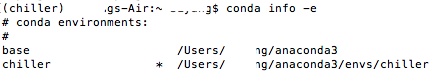
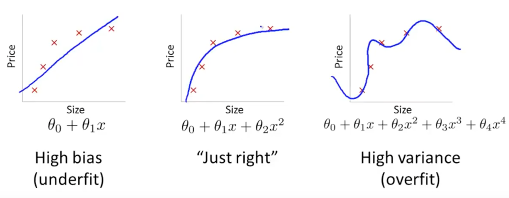
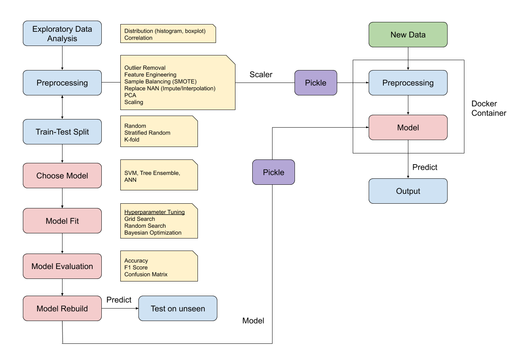
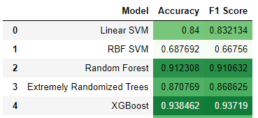

General Notes
=============

Virtual Environment
--------------------
Every project has a different set of requirements and different set of python packages to support it.
The versions of each package can differ or break with each python or dependent packages update, so it is important 
to isolate every project within an enclosed virtual environment. Anaconda provides a straight forward way to manage this.

Creating the Virtual Env
*************************

.. code:: Python

  # create environment, specify python base or it will copy all existing packages
  conda create -n yourenvname anaconda
  conda create -n yourenvname python=3.7
  conda create -n yourenvname anaconda python=3.7
  
  # activate environment
  source activate yourenvname
  
  # install package
  conda install -n yourenvname [package]
  
  # deactivate environment
  conda deactivate
  
  # delete environment
  # -a = all, remove all packages in the environment
  conda env remove -n yourenvname -a

  # see all environments
  conda env list

  # create yml environment file
  conda env export > environment.yml
  

An asterisk (*) will be placed at the current active environment.

    Current active environment

Using YMAL
***********

Alternatively, we can create a fixed environment file and execute using ``conda env create -f environment.yml``.
This will create an environment with the name and packages specified within the folder. 
Channels specify where the packages are installed from.

.. code:: Python

  name: environment_name
  channels:
    - conda-forge
    - defaults
  dependencies:
    - python=3.7
    - bokeh=0.9.2
    - numpy=1.9.*
    - pip:
      - baytune==0.3.1

Requirements.txt
*****************

If there is no ymal file specifying the packages to install, it is good practise to alternatively
create a requirements.txt using the package ``pip install pipreqs``. 
We can then create the txt in cmd using `pipreqs -f directory_path`, where -f overwrites any existing 
requirements.txt file.

Below is how the contents in a requirements.txt file looks like.
After creating the file, and activating the VM, install the packages at one go using
``pip install -r requirements.txt``.

.. code:: Python

  pika==1.1.0
  scipy==1.4.1
  # package from github, not present in pip
  git+https://github.com/cftang0827/pedestrian_detection_ssdlite
  scikit_image==0.16.2
  numpy==1.18.1

Modeling
---------

A parsimonious model is a the model that accomplishes the desired level of prediction with as few predictor variables as possible.

Variables
***********
``x`` = independent variable = explanatory = predictor

``y`` = dependent variable = response = target

Data Types
***********
The type of data is essential as it determines what kind of tests can be applied to it.

``Continuous:`` Also known as quantitative. Unlimited number of values

``Categorical:`` Also known as discrete or qualitative. Fixed number of values or *categories*

Bias-Variance Tradeoff
**********************
The best predictive algorithm is one that has good *Generalization Ability*.
With that, it will be able to give accurate predictions to new and previously unseen data.

*High Bias* results from *Underfitting* the model. This usually results from erroneous assumptions, and cause the model to be too general.

*High Variance* results from *Overfitting* the model, and it will predict the training dataset very accurately, but not with unseen new datasets.
This is because it will fit even the slightless noise in the dataset.

The best model with the highest accuarcy is the middle ground between the two.

    from Andrew Ng's lecture

Steps to Build a Predictive Model
********************************************

    Typical architecture for model building for supervised classification

Feature Selection, Preprocessing, Extraction
^^^^^^^^^^^^^^^^^^^^^^^^^^^^^^^^^^^^^^^^^^^^^^^^
 1. Remove features that have too many NAN or fill NAN with another value
 2. Remove features that will introduce data leakage
 3. Encode categorical features into integers
 4. Extract new useful features (between and within current features)

Normalise the Features
^^^^^^^^^^^^^^^^^^^^^^^^
With the exception of Tree models and Naive Bayes, other machine learning techniques like
Neural Networks, KNN, SVM should have their features scaled.

Train Test Split
^^^^^^^^^^^^^^^^^^^^^^^^
Split the dataset into *Train* and *Test* datasets.
By default, sklearn assigns 75% to train & 25% to test randomly.
A random state (seed) can be selected to fixed the randomisation

.. code:: Python
  
  from sklearn.model_selection import train_test_split

  X_train, X_test, y_train, y_test
  = train_test_split(predictor, target, test_size=0.25, random_state=0)

Create Model
^^^^^^^^^^^^
Choose model and set model parameters (if any).

.. code:: Python

  clf = DecisionTreeClassifier()

Fit Model
^^^^^^^^^^^^
Fit the model using the training dataset.

.. code:: Python

  model = clf.fit(X_train, y_train)

>>> print model
DecisionTreeClassifier(class_weight=None, criterion='gini', max_depth=None,
            max_features=None, max_leaf_nodes=None, min_samples_leaf=1,
            min_samples_split=2, min_weight_fraction_leaf=0.0,
            presort=False, random_state=None, splitter='best')

Test Model
^^^^^^^^^^^^
Test the model by predicting identity of unseen data using the testing dataset.

.. code:: Python

  y_predict = model.predict(X_test)

Score Model
^^^^^^^^^^^^
Use a confusion matrix and...

>>> print sklearn.metrics.confusion_matrix(y_test, predictions)
[[14  0  0]
 [ 0 13  0]
 [ 0  1 10]]

accuarcy percentage, and f1 score to obtain the predictive accuarcy.

.. code:: python

  import sklearn.metrics
  print sklearn.metrics.accuracy_score(y_test, y_predict)*100, '%'
  >>> 97.3684210526 %
  
Cross Validation
^^^^^^^^^^^^^^^^^^^^^^^^
When all code is working fine, remove the train-test portion and use Grid Search Cross Validation to compute
the best parameters with cross validation.

Final Model
^^^^^^^^^^^^
Finally, rebuild the model using the full dataset, and the chosen parameters tested.

Quick-Analysis for Multi-Models
*********************************

.. code:: python

  import pandas as pd
  from sklearn.preprocessing import StandardScaler
  from sklearn.model_selection import train_test_split

  from sklearn.svm import LinearSVC
  from sklearn.svm import SVC
  from sklearn.ensemble import RandomForestClassifier
  from sklearn.ensemble import ExtraTreesClassifier
  from xgboost import XGBClassifier

  from sklearn.metrics import accuracy_score, f1_score
  from statistics import mean 
  import seaborn as sns

  # models to test
  svml = LinearSVC()
  svm = SVC()
  rf = RandomForestClassifier()
  xg = XGBClassifier()
  xr = ExtraTreesClassifier()

  # iterations
  classifiers = [svml, svm, rf, xr, xg]
  names = ['Linear SVM', 'RBF SVM', 'Random Forest', 'Extremely Randomized Trees', 'XGBoost']
  results = []

  # train-test split
  X = df[df.columns[:-1]]
  # normalise data for SVM    
  X = StandardScaler().fit(X).transform(X)
  y = df['label']
  X_train, X_test, y_train, y_test = train_test_split(X, y, random_state=0)

  for name, clf in zip(names, classifiers):
      model = clf.fit(X_train, y_train)
      y_predict = model.predict(X_test)
      accuracy = accuracy_score(y_test, y_predict)
      f1 = mean(f1_score(y_test, y_predict, average=None))
      results.append([fault, name, accuracy, f1])

A final heatmap to compare the outcomes.

.. code:: python

  final = pd.DataFrame(results, columns=['Fault Type','Model','Accuracy','F1 Score'])
  final.style.background_gradient(cmap='Greens')

