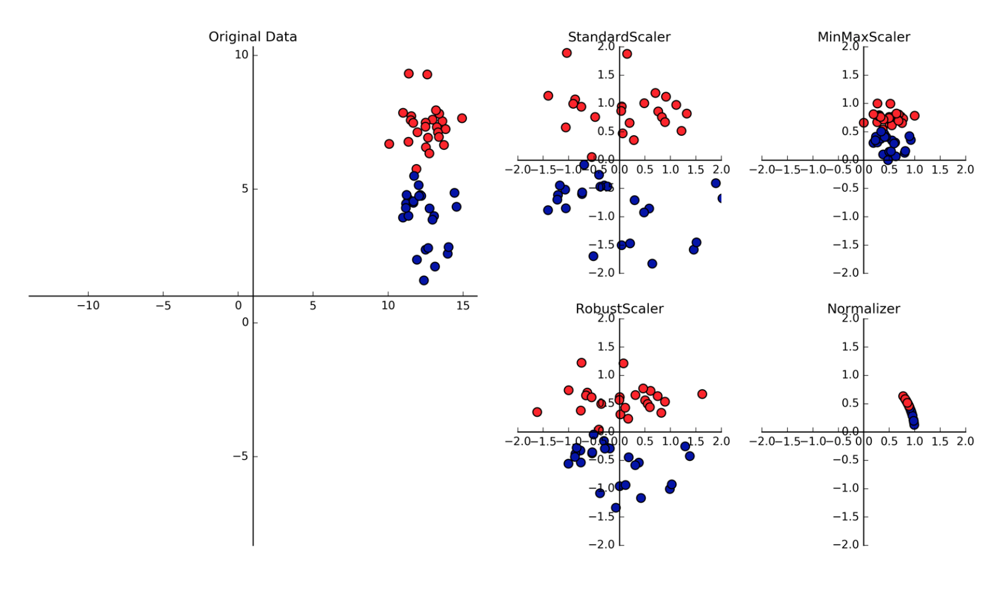

Feature Normalization
=======================
Normalisation is another important concept needed to change all features to the same scale.
This allows for faster convergence on learning, and more uniform influence for all weights.
More on sklearn website:

 * http://scikit-learn.org/stable/modules/preprocessing.html

`Tree-based models is not dependent on scaling, but non-tree models models,
very often are hugely dependent on it.`

    Introduction to Machine Learning in Python

Outliers can affect certain scalers, and it is important to either remove them or choose a scalar that is robust towards them.

 * https://scikit-learn.org/stable/auto_examples/preprocessing/plot_all_scaling.html
 * http://benalexkeen.com/feature-scaling-with-scikit-learn/

Scaling
-------
Standard Scaler
****************
It standardize features by removing the mean and scaling to unit variance
The standard score of a sample x is calculated as:

z = (x - u) / s

.. code:: python

  import pandas pd
  from sklearn.preprocessing import StandardScaler

  X_train, X_test, y_train, y_test = train_test_split(X_crime, y_crime,
                                                     random_state = 0)
  scaler = StandardScaler()
  X_train_scaled = scaler.fit_transform(X_train)
  # note that the test set using the fitted scaler in train dataset to transform in the test set
  X_test_scaled = scaler.transform(X_test)

Min Max Scale
**************
Another way to normalise is to use the Min Max Scaler, 
which changes all features to be between 0 and 1, as defined below:

.. figure:: images/minmaxscaler.png

.. code:: python

  import pandas pd
  from sklearn.preprocessing import MinMaxScaler
  scaler = MinMaxScaler()

  from sklearn.linear_model import Ridge
  X_train, X_test, y_train, y_test = train_test_split(X_crime, y_crime,
                                                     random_state = 0)

  X_train_scaled = scaler.fit_transform(X_train)
  X_test_scaled = scaler.transform(X_test)

  linridge = Ridge(alpha=20.0).fit(X_train_scaled, y_train)

RobustScaler
************
Works similarly to standard scaler except that it uses median and quartiles, instead of mean and variance.
Good as it ignores data points that are outliers.

Normalizer
***********
Scales each data point such that the feature vector has a Euclidean length of 1.
Often used when the direction of the data matters, not the length of the feature vector.

Pipeline
---------
Scaling have a chance of leaking the part of the test data in train-test split into the training data.
This is especially inevitable when using cross-validation.

We can scale the train and test datasets separately to avoid this.
However, a more convenient way is to use the pipeline function in sklearn, which wraps the scaler and classifier together,
and scale them separately during cross validation.

Any other functions can also be input here, e.g., rolling window feature extraction, which also have the potential to have data leakage.

.. code:: python

  from sklearn.pipeline import Pipeline

  # "scaler" & "svm" can be any name. But they must be placed in the correct order of processing
  pipe = Pipeline([("scaler", MinMaxScaler()), ("svm", SVC())])

  pipe.fit(X_train, y_train)
  Pipeline(steps=[('scaler', MinMaxScaler(copy=True, feature_range=(0, 1))), ('svm', SVC(C=1.0, cac
            decision_function_shape=None, degree=3, gamma='auto', kernel='rbf',
            max_iter=-1, probability=False, random_state=None, shrinking=True,
            tol=0.001, verbose=False))])

  pipe.score(X_test, y_test)
  0.95104895104895104

Persistance
------------
To save the fitted scaler to normalize new datasets, we can save it using pickle or joblib for reusing in the future.
