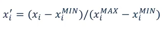

Feature Normalization
=======================
Normalisation is another important concept needed to change all features to the same scale.
This allows for faster convergence on learning, and more uniform influence for all weights.
More on sklearn website:

http://scikit-learn.org/stable/modules/preprocessing.html

Scale
-----
This changes the data to have means of 0 and standard error of 1.

.. code:: python

  import pandas pd
  from sklearn import preprocessing

  # standardise the means to 0 and standard error to 1
  for i in df.columns[:-1]: # df.columns[:-1] = dataframe for all features
    df[i] = preprocessing.scale(df[i].astype('float64'))

Min Max Scale
-------------
Another way to normalise is to use the Min Max Scaler, as defined below:

.. code:: python

  import pandas pd
  from sklearn.preprocessing import MinMaxScaler
  scaler = MinMaxScaler()

  from sklearn.linear_model import Ridge
  X_train, X_test, y_train, y_test = train_test_split(X_crime, y_crime,
                                                     random_state = 0)

  X_train_scaled = scaler.fit_transform(X_train)
  X_test_scaled = scaler.transform(X_test)

  linridge = Ridge(alpha=20.0).fit(X_train_scaled, y_train)
