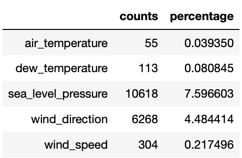
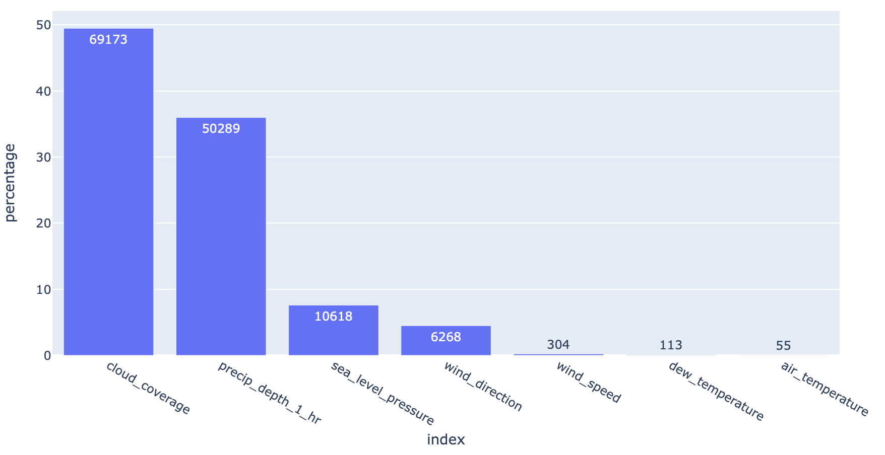
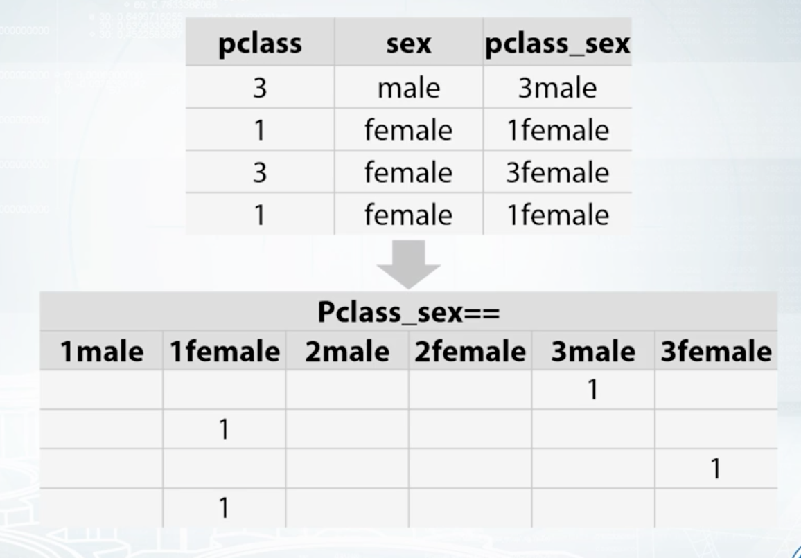

Feature Preprocessing
==========================

Missing Values
---------------

Machine learning models cannot accept null/NaN values. 
We will need to either remove them or fill them with a logical value.
To investigate how many nulls in each column:

.. code:: python

  def null_analysis(df):
    '''
    desc: get nulls for each column in counts & percentages
    arg: dataframe
    return: dataframe
    '''
    null_cnt = df.isnull().sum() # calculate null counts
    null_cnt = null_cnt[null_cnt!=0] # remove non-null cols
    null_percent = null_cnt / len(df) * 100 # calculate null percentages
    null_table = pd.concat([pd.DataFrame(null_cnt), pd.DataFrame(null_percent)], axis=1)
    null_table.columns = ['counts', 'percentage']
    null_table.sort_values('counts', ascending=False, inplace=True)
    return null_table

  # visualise null table
  import plotly_express as px
  null_table = null_analysis(weather_train)
  px.bar(null_table.reset_index(), x='index', y='percentage', text='counts', height=500)

It makes no sense to fill in the null values if there are too many of them.
We can set a threshold to delete the entire column if there are too many nulls.

.. code:: python

  def null_threshold(df, threshold=25):
    '''
    desc: delete columns based on a null percentage threshold
    arg: df=dataframe; threshold=percentage of nulls in column
    return: dataframe
    '''
    null_table = null_analysis(df)
    null_table = null_table[null_table['percentage']>=25]
    df.drop(null_table.index, axis=1, inplace = True)
    return df

We can change missing values for the entire dataframe into their individual column means or medians.

.. code:: python

  import pandas as pd
  import numpy as np
  from sklearn.impute import SimpleImputer

  impute = SimpleImputer(missing_values=np.nan, strategy='median', copy=False)
  imp_mean.fit(df)
  # output is in numpy, so convert to df
  df2 = pd.DataFrame(imp_mean.transform(df),columns=df.columns)

We can also use interpolation via pandas default function to fill in the missing values.
https://pandas.pydata.org/pandas-docs/stable/reference/api/pandas.Series.interpolate.html

.. code:: python

  import pandas as pd

  # limit: Maximum number of consecutive NaNs to fill. Must be greater than 0.
  df['colname'].interpolate(method='linear', limit=2)

Outliers
---------

Especially sensitive in linear models. They can be (1) removed manually by
defining the lower and upper bound limit, or (2) grouping the features into ranks.

Categorical & Ordinal
-----------------------
Ordinal features are categorical but ranked in a meaningful way.

Tree-Based Models
******************

**Label Encoding**: or conversion of category into integers.
  * Alphabetical order ``sklearn.preprocessing.LabelEncoder``
  * Order of appearance ``pd.factorize``

.. code:: python

  from sklearn import preprocessing    

  # Test data
  df = DataFrame(['A', 'B', 'B', 'C'], columns=['Col'])    

  df['Fact'] = pd.factorize(df['Col'])[0]
  
  le = preprocessing.LabelEncoder()
  df['Lab'] = le.fit_transform(df['Col'])

  print(df)
  #   Col  Fact  Lab
  # 0   A     0    0
  # 1   B     1    1
  # 2   B     1    1
  # 3   C     2    2

**Frequency Encoding**: conversion of category into frequencies.
    
.. code:: python
  
  ### FREQUENCY ENCODING
  
  # size of each category
  encoding = titanic.groupby('Embarked').size()
  # get frequency of each category
  encoding = encoding/len(titanic)
  titanic['enc'] = titanic.Embarked.map(encoding)
  
  # if categories have same frequency it can be an issue
  # will need to change it to ranked frequency encoding
  from scipy.stats import rankdata

Non-Tree Based Models
**********************
**One-Hot Encoding**: We could use an integer encoding directly, rescaled where needed. 
This may work for problems where there is a natural ordinal relationship between the categories, and in turn the integer values, such as labels for temperature ‘cold’, warm’, and ‘hot’.
There may be problems when there is no *ordinal* relationship and allowing the representation to lean on any such relationship might be damaging to learning to solve the problem. An example might be the labels ‘dog’ and ‘cat’.

Each category is one binary field of 1 & 0. Not good if too many categories in a feature. Need to store in sparse matrix.
  * Dummies: ``pd.get_dummies``, this converts a string into binary, and splits the columns according to n categories
  * sklearn: ``sklearn.preprocessing.OneHotEncoder``, string has to be converted into numeric, then stored in a sparse matrix.

**Feature Interactions**: interactions btw categorical features
  * Linear Models & KNN

    Coursera: How to Win a Data Science Competition
    

Coordinates
-------------
It is necessary to define a projection for a coordinate reference system if there is a classification in space,
eg k-means clustering. This basically change the coordinates from a spherical component to a flat surface.

Also take note of spatial auto-correlation.