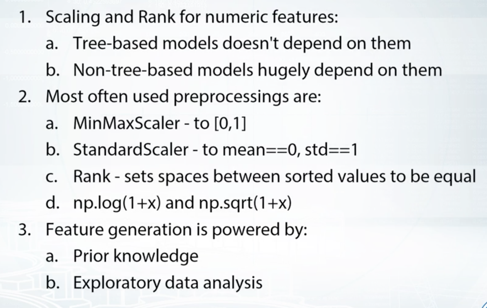

Feature Preprocessing & Generation
===================================

Numeric
--------
**Feature Proprocessing**

Scaling
********
Many ML algorithms require normalization or scaling. See more in here_.

.. _here: http://python-data-science.readthedocs.io/en/latest/normalisation.html#

Outliers
********
Especially sensitive in linear models. They can be (1) removed manually by
defining the lower and upper bound limit, or (2) grouping the features into ranks.

Transformation
***************
This helps in non-tree based and especially neural networks. 
Helps to drive big values close to features' average value.

Using Log Transform ``np.log(1+x)``. Or Raising to the power of one ``np.sqrt(x+2/3)``

Another important moment which holds true for all preprocessings is that sometimes, 
it is beneficial to train a model on concatenated data frames produced by different preprocessings, or to mix models training differently-preprocessed data. 
Again, linear models, KNN, and neural networks can benefit hugely from this. 

**Feature Generation**
Sometimes, we can engineer these new features using *prior knowledge and logic*, 
or *using Exploratory Data Analysis*.

Examples include:
  * multiplication, divisions, addition, and feature interactions
  * feature extraction
  

    Coursera: How to Win a Data Science Competition
