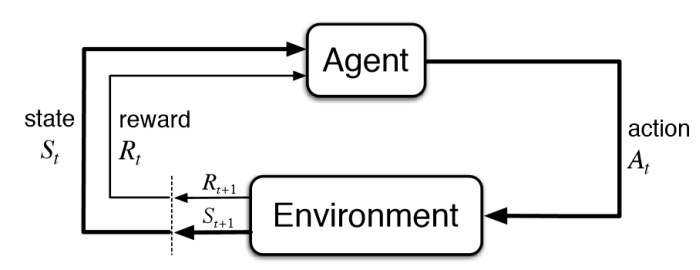

Reinforcement Learning
=======================

Concepts
--------------

Definitions
************
 * **argmax(x)**: position where the first max value occurs

Agent & the Environment
***********************
Reinforcement learning is an area of machine learning concerned 
with how software agents ought to take actions in an environment so as to maximize some notion of cumulative reward.

Exploration vs Exploitation
****************************
A central dilemma of reinforcement learning is to *exploit* what it has already experienced in order to obtain a reward.
But in order to do that, it has to *explore* in order to make better actions in the future.

Elements of Reinforcement Learning
************************************

 * Policy
 * Reward Signal
 * Value Function
 * Model of Environment
 
A **policy** defines the learning agent's way of behaving at a given time. 

A **reward** signal defines the goal of a reinforcement learning problem. 
On each step, the environment sends to the agent a single number called reward.

A **value function** is the total amount of reward an agent is predicted to accumulate over the future, starting from a state.
It is the values which we are most concerned when making decisions.

A **model of the environment** mimics the behavior of the enviornment. E.g., given a state & action, what is the next state and reward.
Such an approach is called a model-based method, in contrast with model-free methods.

    https://www.kdnuggets.com/2018/03/5-things-reinforcement-learning.html

Introduction
---------------
This series of medium_ articles gave a good description of various types of reinforcement learning
with jupyter notebook descriptions for various games. This includes deep learning using tensorflow.

.. _medium: https://medium.com/emergent-future/simple-reinforcement-learning-with-tensorflow-part-0-q-learning-with-tables-and-neural-networks-d195264329d0

**Markov Decision Problem**

Reinforcement learning helps to solve Markov Decision Problems (MDP).
The core problem of MDPs is to find a "policy" for the decision maker: a function π that specifies the action 
π(s) that the decision maker will choose when in state s. The diagram illustrate the Markov Decision Problem.

    Udacity, Machine Learning for Trading

Q-Learning
-----------
Q-Learning is an example of model-free reinforcement learning to solve the Markov Decision Problem.
It derives the policy by directly looking at the data instead of developing a model.

We first build a Q-table with each column as the type of action possible,
and then each row as the number of possible states. And initialise the table with all zeros.

    from Medium

Updating the function Q uses the following equation.

    from Medium

**Learning Hyperparameters**

 * learning rate, alpha: how quickly a network abandons the former value for the new. If the learning rate is 1, the new estimate will be the new Q-value.
 * discount rate, gamma: how much to discount the future reward.

**Exploration vs Exploitation**

This is known as the epsilon greedy strategy. In the beginning, the epsilon rates will be higher. 
The bot will explore the environment and randomly choose actions. 
The logic behind this is that the bot does not know anything about the environment.
However the more the bot explores the environment, the more the epsilon rate will decreases 
and the bot starts to exploit the environment.

There are other algothrims to manage the exploration vs exploiation problem, like softmax.

**Code**

Start the environment and training parameters for frozen lake in AI gym.

.. code:: python

    #code snippets from https://gist.github.com/simoninithomas/baafe42d1a665fb297ca669aa2fa6f92#file-q-learning-with-frozenlake-ipynb

    import numpy as np
    import gym
    import random

    env = gym.make("FrozenLake-v0")

    action_size = env.action_space.n
    state_size = env.observation_space.n

    qtable = np.zeros((state_size, action_size))
    print(qtable)

    # define hyperparameters ----------
    total_episodes = 15000        # Total episodes
    learning_rate = 0.8           # Learning rate
    max_steps = 99                # Max steps per episode
    gamma = 0.95                  # Discounting rate

    # Exploration parameters
    epsilon = 1.0                 # Exploration rate
    max_epsilon = 1.0             # Exploration probability at start
    min_epsilon = 0.01            # Minimum exploration probability 
    decay_rate = 0.005             # Exponential decay rate for exploration prob

Train and generate the Q-table.

.. code:: python

    # generate Q-table ------------
    # List of rewards
    rewards = []

    # 2 For life or until learning is stopped
    for episode in range(total_episodes):
        # Reset the environment
        state = env.reset()
        step = 0
        done = False
        total_rewards = 0
        
        for step in range(max_steps):
            # 3. Choose an action a in the current world state (s)
            ## First we randomize a number
            exp_exp_tradeoff = random.uniform(0, 1)
            
            ## If this number > greater than epsilon --> exploitation (taking the biggest Q value for this state)
            if exp_exp_tradeoff > epsilon:
                action = np.argmax(qtable[state,:])

            # Else doing a random choice --> exploration
            else:
                action = env.action_space.sample()

            # Take the action (a) and observe the outcome state(s') and reward (r)
            new_state, reward, done, info = env.step(action)

            # Update Q(s,a):= Q(s,a) + lr [R(s,a) + gamma * max Q(s',a') - Q(s,a)]
            # qtable[new_state,:] : all the actions we can take from new state
            qtable[state, action] = qtable[state, action] + learning_rate * (reward + gamma * np.max(qtable[new_state, :]) - qtable[state, action])
            
            total_rewards += reward
            
            # Our new state is state
            state = new_state
            
            # If done (if we're dead) : finish episode
            if done == True: 
                break
            
        # Reduce epsilon (because we need less and less exploration)
        epsilon = min_epsilon + (max_epsilon - min_epsilon)*np.exp(-decay_rate*episode) 
        rewards.append(total_rewards)

    print ("Score over time: " +  str(sum(rewards)/total_episodes))
    print(qtable)

Rerun the game using the Q-table generated.

.. code:: python
    
    env.reset()

    for episode in range(5):
        state = env.reset()
        step = 0
        done = False
        print("****************************************************")
        print("EPISODE ", episode)

        for step in range(max_steps):
            
            # Take the action (index) that have the maximum expected future reward given that state
            action = np.argmax(qtable[state,:])
            
            new_state, reward, done, info = env.step(action)
            
            if done:
                # Here, we decide to only print the last state (to see if our agent is on the goal or fall into an hole)
                env.render()
                
                # We print the number of step it took.
                print("Number of steps", step)
                break
            state = new_state
    env.close()