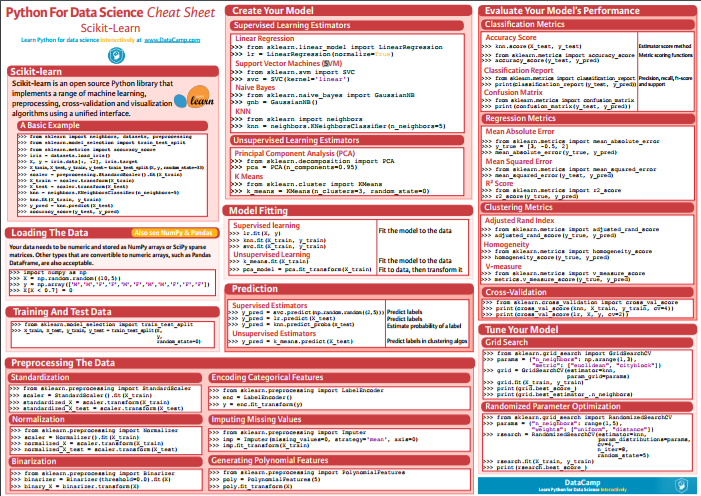

Resources
=========

Some useful websites and video series that I refer to:

1. Setosa_: Nice visual explanations of certain techniques

.. _Setosa: http://setosa.io/ev/

2. Scipy_: Introduction to scipy statistical packages

.. _Scipy: http://www.scipy-lectures.org/packages/statistics/index.html

3. JohnWittenauer_: Blog with posts on Python machine learning

.. _JohnWittenauer: http://www.johnwittenauer.net/machine-learning-exercises-in-python-part-1/

4. JakeVanderPlas_: Sklearn Machine Learning guide from the man!

.. _JakeVanderPlas: https://github.com/jakevdp/sklearn_tutorial/tree/master/notebooks

5. JosePortilla_: Notebooks from the famous Udemy Python instructor.

.. _JosePortilla: http://nbviewer.jupyter.org/github/donnemartin/data-science-ipython-notebooks/tree/master/scikit-learn/

6. SkLearn Tutorials_: Notebooks 

.. _Tutorials: https://github.com/justmarkham/scikit-learn-videos

7. FreeCodeCamp_: Very basic tutorials with videos.

.. _FreeCodeCamp: https://medium.freecodecamp.org/the-hitchhikers-guide-to-machine-learning-algorithms-in-python-bfad66adb378

8. YellowBricks_: Damn simple graphing package that is compatible with sklearn!

.. _YellowBricks: https://github.com/DistrictDataLabs/yellowbricks

|
|
**Decision Boundaries from Various Machine Learning Algorithm**

.. image:: images/resource.png

    
**Sci-Kit Learn Cheat Sheet from Data Camp**

**Decision Tree Map to use what Machine Learning Technique**

.. image:: images/ml_map.png
