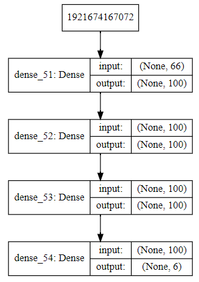
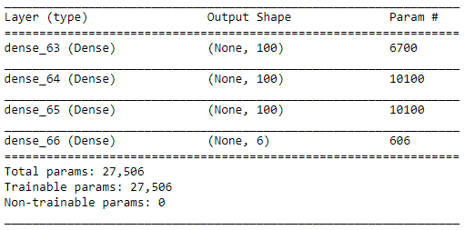
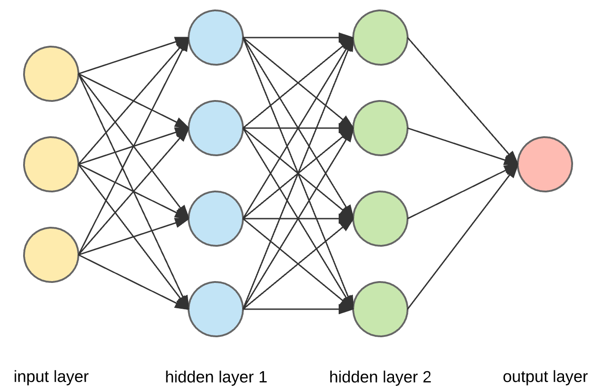
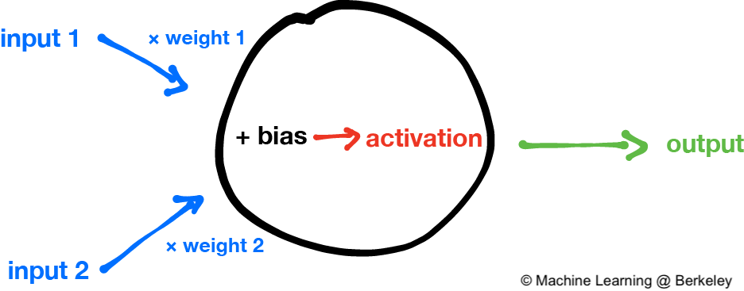
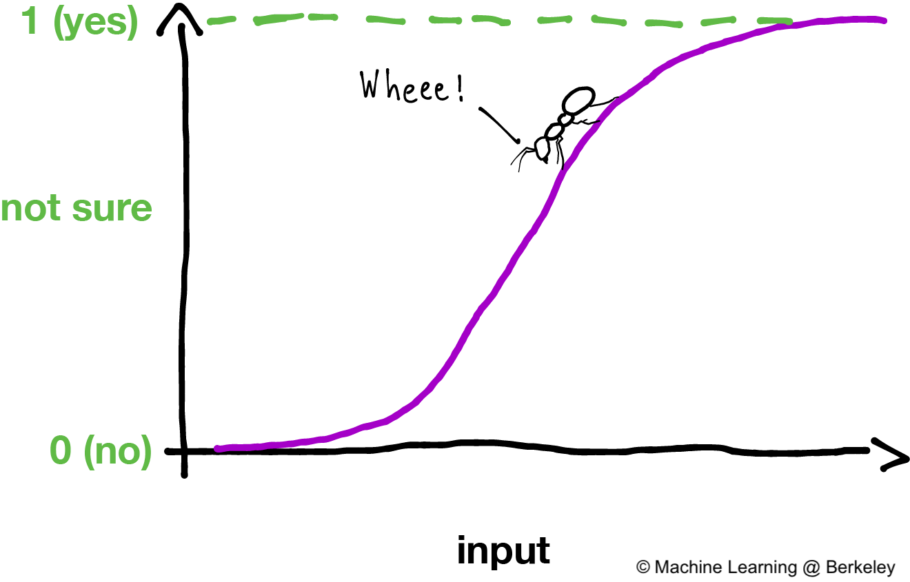
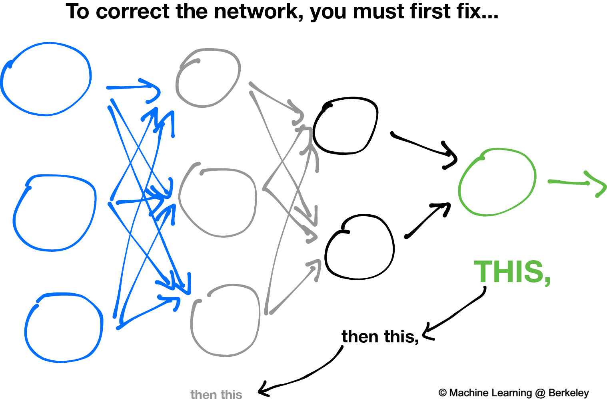
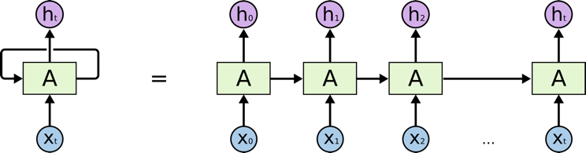

Deep Learning
===============
Deep Learning falls under the broad class of Articial Intelligence > Machine Learning.
It is a Machine Learning technique that uses multiple internal layers (**hidden layers**) of
non-linear processing units (**neurons**) to conduct supervised or unsupervised learning from data.
  

GPU
-----

Tensorflow is able to run faster and more effeciently using Nivida's GPU ``pip install tensorflow-gpu``.

Preprocessing
---------------

Keras accepts numpy input, so we have to convert. Also, for multi-class classification,
we need to convert them into binary values; i.e., using one-hot encoding

.. code:: python

    X = np.array(X)
    # one-hot encoding for multi-class y labels
    Y = pd.get_dummies(y)

Model architecture can also be displayed in a graph. Or we can print as a summary

.. code:: python

    from IPython.display import SVG
    from tensorflow.python.keras.utils.vis_utils import model_to_dot

    SVG(model_to_dot(model, show_shapes=True).create(prog='dot', format='svg'))

    model architecture printout

.. code:: python

    model.summary()

    model summary printout

ANN
-----------

Theory
*******

An **artifical neural network** consists of an input layer, hidden layers, and an output layer. 
This writeup by Berkeley_ gave an excellent introduction to the theory. 
Most of the diagrams are taken from the site.

.. _Berkeley: https://ml.berkeley.edu/blog/2017/02/04/tutorial-3/

    Structure of an artificial neutral network

Zooming in at a single perceptron, the input layer consists of every individual features, 
each with an assigned weight feeding to the hidden layer. 
An **activation function** tells the perception what outcome it is.

    Structure of a single perceptron

Activation functions consists of *ReLU*, *Tanh*, *Linear*, *Sigmoid*, *Softmax* and many others.
Sigmoid is used for binary classifications, while softmax is used for multi-class classifications.

    An activation function, using sigmoid function

The backward propagation algorithm works in such that the slopes of gradient descent is calculated by 
working backwards from the output layer back to the input layer. The weights are readjusted to reduce the 
loss and improve the accuracy of the model.

    Backward propagation

**A summary is as follows**

  1. Randomly initialize the weights for all the nodes.
  2. For every training example, perform a forward pass using the current weights, and calculate the output of each node going from left to right. The final output is the value of the last node.
  3. Compare the final output with the actual target in the training data, and measure the error using a loss function.
  4. Perform a backwards pass from right to left and propagate the error to every individual node using backpropagation. Calculate each weight’s contribution to the error, and adjust the weights accordingly using gradient descent. Propagate the error gradients back starting from the last layer.

Keras Model
***************

Building an ANN model in Keras library requires
    * input & hidden layers
    * model compliation
    * model fitting
    * model evalution

Definition of layers are typically done using the typical Dense layer, or regularization layer called Dropout.
The latter prevents overfitting as it randomly selects neurons to be ignored during training.

.. code:: python

    from tensorflow.keras.models import Sequential
    from tensorflow.keras.layers import Dense, Dropout

    # using dropout layers
    model = Sequential()
    model.add(Dense(512, activation='relu', input_shape=(784,)))
    model.add(Dropout(0.2))
    model.add(Dense(512, activation='relu'))
    model.add(Dropout(0.2))
    model.add(Dense(10, activation='softmax'))

Before training, the model needs to be compiled with the learning hyperparameters of optimizer, loss, and metric functions.

.. code:: python

    # from keras documentation
    # https://keras.io/getting-started/sequential-model-guide/

    # For a multi-class classification problem
    model.compile(optimizer='rmsprop',
                  loss='categorical_crossentropy',
                  metrics=['accuracy'])

    # For a binary classification problem
    model.compile(optimizer='rmsprop',
                  loss='binary_crossentropy',
                  metrics=['accuracy'])

    # For a mean squared error regression problem
    model.compile(optimizer='rmsprop',
                  loss='mse')

    # we can also set optimizer's parameters
    from tensorflow.keras.optimizers import RMSprop
    rmsprop = RMSprop(lr=0.001, rho=0.9, epsilon=None, decay=0.0)
    model.compile(optimizer=rmsprop, loss='mse')

We can also use sklearn's **cross-validation**.

.. code:: python

    from tensorflow.keras.layers import Dense
    from tensorflow.keras.models import Sequential

    def create_model():
        model = Sequential()
        model.add(Dense(6, input_dim=4, kernel_initializer='normal', activation='relu'))
        #model.add(Dense(4, kernel_initializer='normal', activation='relu'))
        model.add(Dense(1, kernel_initializer='normal', activation='sigmoid'))
        model.compile(loss='binary_crossentropy', optimizer='adam', metrics=['accuracy'])
        return model

    from sklearn.model_selection import cross_val_score
    from tensorflow.keras.wrappers.scikit_learn import KerasClassifier

    # Wrap our Keras model in an estimator compatible with scikit_learn
    estimator = KerasClassifier(build_fn=create_model, epochs=100, verbose=0)
    cv_scores = cross_val_score(estimator, all_features_scaled, all_classes, cv=10)
    cv_scores.mean()

The below gives a compiled code example code.

.. code:: python

    from tensorflow import keras
    from tensorflow.keras.datasets import mnist
    from tensorflow.keras.models import Sequential
    from tensorflow.keras.layers import Dense, Dropout
    from tensorflow.keras.optimizers import RMSprop

    (mnist_train_images, mnist_train_labels), (mnist_test_images, mnist_test_labels) = mnist.load_data()

    train_images = mnist_train_images.reshape(60000, 784)
    test_images = mnist_test_images.reshape(10000, 784)
    train_images = train_images.astype('float32')
    test_images = test_images.astype('float32')
    train_images /= 255
    test_images /= 255
    
    # convert the 0-9 labels into "one-hot" format, as we did for TensorFlow.
    train_labels = keras.utils.to_categorical(mnist_train_labels, 10)
    test_labels = keras.utils.to_categorical(mnist_test_labels, 10)

    model = Sequential()
    model.add(Dense(512, activation='relu', input_shape=(784,)))
    model.add(Dense(10, activation='softmax'))
    model.summary()

    Layer (type)                 Output Shape              Param #   
    =================================================================
    dense (Dense)                (None, 512)               401920    
    _________________________________________________________________
    dense_1 (Dense)              (None, 10)                5130      
    =================================================================
    Total params: 407,050
    Trainable params: 407,050
    Non-trainable params: 0
    _________________________________________________________________

    model.compile(loss='categorical_crossentropy',
                    optimizer=RMSprop(),
                    metrics=['accuracy'])

    history = model.fit(train_images, train_labels,
                        batch_size=100, #no of samples per gradient update
                        epochs=10, #iteration
                        verbose=1, #0=no printout, 1=progress bar, 2=step-by-step printout
                        validation_data=(test_images, test_labels))

    # Train on 60000 samples, validate on 10000 samples
    # Epoch 1/10
    # - 4s - loss: 0.2459 - acc: 0.9276 - val_loss: 0.1298 - val_acc: 0.9606
    # Epoch 2/10
    # - 4s - loss: 0.0991 - acc: 0.9700 - val_loss: 0.0838 - val_acc: 0.9733
    # Epoch 3/10
    # - 4s - loss: 0.0656 - acc: 0.9804 - val_loss: 0.0738 - val_acc: 0.9784
    # Epoch 4/10
    # - 4s - loss: 0.0493 - acc: 0.9850 - val_loss: 0.0650 - val_acc: 0.9798
    # Epoch 5/10
    # - 4s - loss: 0.0367 - acc: 0.9890 - val_loss: 0.0617 - val_acc: 0.9817
    # Epoch 6/10
    # - 4s - loss: 0.0281 - acc: 0.9915 - val_loss: 0.0698 - val_acc: 0.9800
    # Epoch 7/10
    # - 4s - loss: 0.0221 - acc: 0.9936 - val_loss: 0.0665 - val_acc: 0.9814
    # Epoch 8/10
    # - 4s - loss: 0.0172 - acc: 0.9954 - val_loss: 0.0663 - val_acc: 0.9823
    # Epoch 9/10
    # - 4s - loss: 0.0128 - acc: 0.9964 - val_loss: 0.0747 - val_acc: 0.9825
    # Epoch 10/10
    # - 4s - loss: 0.0098 - acc: 0.9972 - val_loss: 0.0840 - val_acc: 0.9795

    
    score = model.evaluate(test_images, test_labels, verbose=0)
    print('Test loss:', score[0])
    print('Test accuracy:', score[1])

CNN
----
**Convolutional Neural Network** (CNN) is suitable for unstructured data like image classification,
machine translation, sentence classification, and sentiment analysis.

Theory
******

This article from medium_ gives a good introduction of CNN. The steps goes something like this:

.. _medium: https://medium.com/@RaghavPrabhu/understanding-of-convolutional-neural-network-cnn-deep-learning-99760835f148

    1. Provide input image into **convolution layer**
    2. Choose parameters, apply filters with **strides**, **padding** if requires. Perform convolution on the image and apply **ReLU** activation to the matrix.
    3. Perform **pooling** to reduce dimensionality size. Max-pooling is most commonly used
    4. Add as many convolutional layers until satisfied
    5. **Flatten** the output and feed into a fully connected layer (**FC Layer**)
    6. Output the class using an activation function (Logistic Regression with cost functions) and classifies images.

.. figure:: images/cnn1.jpg
    :width: 450px
    :align: center

    from medium

There are many topologies, or CNN architecture to build on as the hyperparameters, layers etc. are endless. Some specialized
architecture includes **LeNet-5** (handwriting recognition), **AlexNet** (deeper than LeNet, image classification), 
**GoogLeNet** (deeper than AlexNet, includes inception modules, or groups of convolution), 
**ResNet** (even deeper, maintains performance using skip connections). This article1_ gives a good summary of each architecture.

.. _article1: https://medium.com/@RaghavPrabhu/cnn-architectures-lenet-alexnet-vgg-googlenet-and-resnet-7c81c017b848

Keras Model
***************

.. code:: python

    import tensorflow
    from tensorflow.keras.datasets import mnist
    from tensorflow.keras.models import Sequential
    from tensorflow.keras.layers import Dense, Dropout, Conv2D, MaxPooling2D, Flatten
    from tensorflow.keras.optimizers import RMSprop

    model = Sequential()
    model.add(Conv2D(32, kernel_size=(3, 3),
                    activation='relu',
                    input_shape=input_shape))

    # 64 3x3 kernels
    model.add(Conv2D(64, (3, 3), activation='relu'))
    # Reduce by taking the max of each 2x2 block
    model.add(MaxPooling2D(pool_size=(2, 2)))
    # Dropout to avoid overfitting
    model.add(Dropout(0.25))
    # Flatten the results to one dimension for passing into our final layer
    model.add(Flatten())
    # A hidden layer to learn with
    model.add(Dense(128, activation='relu'))
    # Another dropout
    model.add(Dropout(0.5))
    # Final categorization from 0-9 with softmax
    model.add(Dense(10, activation='softmax'))

    model.summary()

    # _________________________________________________________________
    # Layer (type)                 Output Shape              Param #   
    # =================================================================
    # conv2d (Conv2D)              (None, 26, 26, 32)        320       
    # _________________________________________________________________
    # conv2d_1 (Conv2D)            (None, 24, 24, 64)        18496     
    # _________________________________________________________________
    # max_pooling2d (MaxPooling2D) (None, 12, 12, 64)        0         
    # _________________________________________________________________
    # dropout (Dropout)            (None, 12, 12, 64)        0         
    # _________________________________________________________________
    # flatten (Flatten)            (None, 9216)              0         
    # _________________________________________________________________
    # dense (Dense)                (None, 128)               1179776   
    # _________________________________________________________________
    # dropout_1 (Dropout)          (None, 128)               0         
    # _________________________________________________________________
    # dense_1 (Dense)              (None, 10)                1290      
    # =================================================================
    # Total params: 1,199,882
    # Trainable params: 1,199,882
    # Non-trainable params: 0
    # _________________________________________________________________

    model.compile(loss='categorical_crossentropy',
              optimizer='adam',
              metrics=['accuracy'])

    history = model.fit(train_images, train_labels,
                        batch_size=32,
                        epochs=10,
                        verbose=1,
                        validation_data=(test_images, test_labels))

    # Train on 60000 samples, validate on 10000 samples
    # Epoch 1/10
    #  - 1026s - loss: 0.1926 - acc: 0.9418 - val_loss: 0.0499 - val_acc: 0.9834
    # Epoch 2/10
    #  - 995s - loss: 0.0817 - acc: 0.9759 - val_loss: 0.0397 - val_acc: 0.9874
    # Epoch 3/10
    #  - 996s - loss: 0.0633 - acc: 0.9811 - val_loss: 0.0339 - val_acc: 0.9895
    # Epoch 4/10
    #  - 991s - loss: 0.0518 - acc: 0.9836 - val_loss: 0.0302 - val_acc: 0.9909
    # Epoch 5/10
    #  - 996s - loss: 0.0442 - acc: 0.9861 - val_loss: 0.0322 - val_acc: 0.9905
    # Epoch 6/10
    #  - 994s - loss: 0.0395 - acc: 0.9878 - val_loss: 0.0303 - val_acc: 0.9898
    # Epoch 7/10
    #  - 1001s - loss: 0.0329 - acc: 0.9890 - val_loss: 0.0328 - val_acc: 0.9907
    # Epoch 8/10
    #  - 993s - loss: 0.0298 - acc: 0.9907 - val_loss: 0.0336 - val_acc: 0.9916
    # Epoch 9/10
    #  - 998s - loss: 0.0296 - acc: 0.9911 - val_loss: 0.0281 - val_acc: 0.9915
    # Epoch 10/10
    #  - 996s - loss: 0.0252 - acc: 0.9917 - val_loss: 0.0340 - val_acc: 0.9918

    score = model.evaluate(test_images, test_labels, verbose=0)
    print('Test loss:', score[0])
    print('Test accuracy:', score[1])

    # Test loss: 0.034049834153382426
    # Test accuracy: 0.9918

RNN
----
**Recurrent Neural Network** (RNN). A typical RNN looks like below, where X(t) is input, h(t) is output and A is the neural network which gains information from the previous step in a loop. 
The output of one unit goes into the next one and the information is passed.

Theory
******

    from medium

**Long Short Term Memory (LSTM)** is a special kind of Recurrent Neural Networks (RNN) with the capability of learning long-term dependencies.
The intricacies lie within the cell, where 3 internal mechanisms called gates regulate the flow of information. 
This consists of 4 activation functions, 3 sigmoid and 1 tanh, instead of the typical 1 activation function.
This medium from article_ gives a good description of it. An alternative, or simplified form of LSTM is 
**Gated Recurrent Unit (GRU)**.

.. _article: https://towardsdatascience.com/illustrated-guide-to-lstms-and-gru-s-a-step-by-step-explanation-44e9eb85bf21

.. figure:: images/rnn2.png
    :width: 5550px
    :align: center

    from medium.

Keras Model
***********

LSTM requires input needs to be of shape ``(num_sample, time_steps, num_features)`` if using tensorflow backend.

.. code:: python

    

The code below uses LSTM (long short-term memory) for sentiment analysis in IMDB movie reviews.

.. code:: python

    from tensorflow.keras.preprocessing import sequence
    from tensorflow.keras.models import Sequential
    from tensorflow.keras.layers import Dense, Embedding
    from tensorflow.keras.layers import LSTM
    from tensorflow.keras.datasets import imdb

    # words in sentences are encoded into integers
    # response is in binary 1-0
    (x_train, y_train), (x_test, y_test) = imdb.load_data(num_words=20000)

    # limit the sentence to first 80 words
    x_train = sequence.pad_sequences(x_train, maxlen=80)
    x_test = sequence.pad_sequences(x_test, maxlen=80)

    
    # embedding layer converts input data into dense vectors of fixed size of 20k words & 128 hidden neurons, better suited for neural network
    model = Sequential()
    model.add(Embedding(20000, 128)) #for nlp
    model.add(LSTM(128, dropout=0.2, recurrent_dropout=0.2)) #128 memory cells
    model.add(Dense(1, activation='sigmoid')) #1 class classification, sigmoid for binary classification

    model.compile(loss='binary_crossentropy',
                optimizer='adam',
                metrics=['accuracy'])

    model.fit(x_train, y_train,
            batch_size=32,
            epochs=15,
            verbose=1,
            validation_data=(x_test, y_test))

    Train on 25000 samples, validate on 25000 samples
    # Epoch 1/15
    #  - 139s - loss: 0.6580 - acc: 0.5869 - val_loss: 0.5437 - val_acc: 0.7200
    # Epoch 2/15
    #  - 138s - loss: 0.4652 - acc: 0.7772 - val_loss: 0.4024 - val_acc: 0.8153
    # Epoch 3/15
    #  - 136s - loss: 0.3578 - acc: 0.8446 - val_loss: 0.4024 - val_acc: 0.8172
    # Epoch 4/15
    #  - 134s - loss: 0.2902 - acc: 0.8784 - val_loss: 0.3875 - val_acc: 0.8276
    # Epoch 5/15
    #  - 135s - loss: 0.2342 - acc: 0.9055 - val_loss: 0.4063 - val_acc: 0.8308
    # Epoch 6/15
    #  - 132s - loss: 0.1818 - acc: 0.9292 - val_loss: 0.4571 - val_acc: 0.8308
    # Epoch 7/15
    #  - 124s - loss: 0.1394 - acc: 0.9476 - val_loss: 0.5458 - val_acc: 0.8177
    # Epoch 8/15
    #  - 126s - loss: 0.1062 - acc: 0.9609 - val_loss: 0.5950 - val_acc: 0.8133
    # Epoch 9/15
    #  - 133s - loss: 0.0814 - acc: 0.9712 - val_loss: 0.6440 - val_acc: 0.8218
    # Epoch 10/15
    #  - 134s - loss: 0.0628 - acc: 0.9783 - val_loss: 0.6525 - val_acc: 0.8138
    # Epoch 11/15
    #  - 136s - loss: 0.0514 - acc: 0.9822 - val_loss: 0.7252 - val_acc: 0.8143
    # Epoch 12/15
    #  - 137s - loss: 0.0414 - acc: 0.9869 - val_loss: 0.7997 - val_acc: 0.8035
    # Epoch 13/15
    #  - 136s - loss: 0.0322 - acc: 0.9890 - val_loss: 0.8717 - val_acc: 0.8120
    # Epoch 14/15
    #  - 132s - loss: 0.0279 - acc: 0.9905 - val_loss: 0.9776 - val_acc: 0.8114
    # Epoch 15/15
    #  - 140s - loss: 0.0231 - acc: 0.9918 - val_loss: 0.9317 - val_acc: 0.8090
    # Out[8]:
    # <tensorflow.python.keras.callbacks.History at 0x21c29ab8630>

    score, acc = model.evaluate(x_test, y_test,
                                batch_size=32,
                                verbose=1)
    print('Test score:', score)
    print('Test accuracy:', acc)

    # Test score: 0.9316869865119457
    # Test accuracy: 0.80904