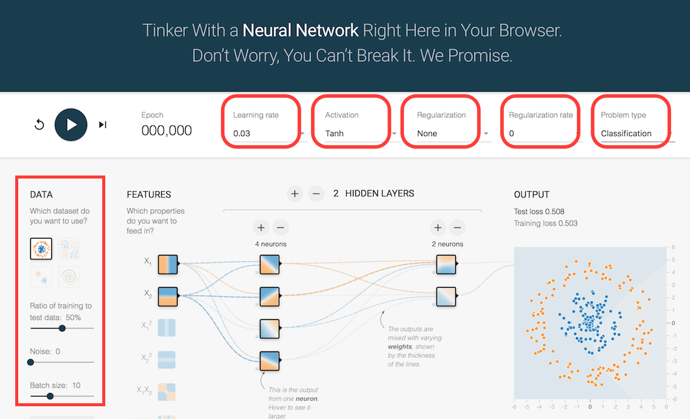
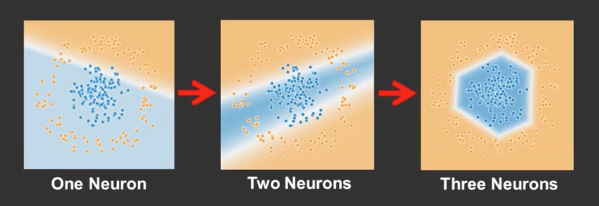
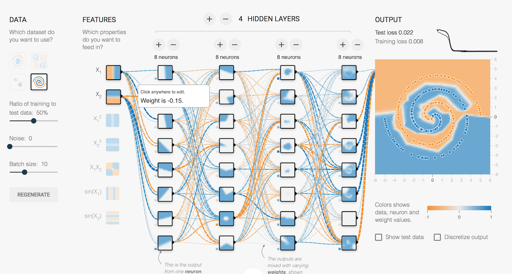
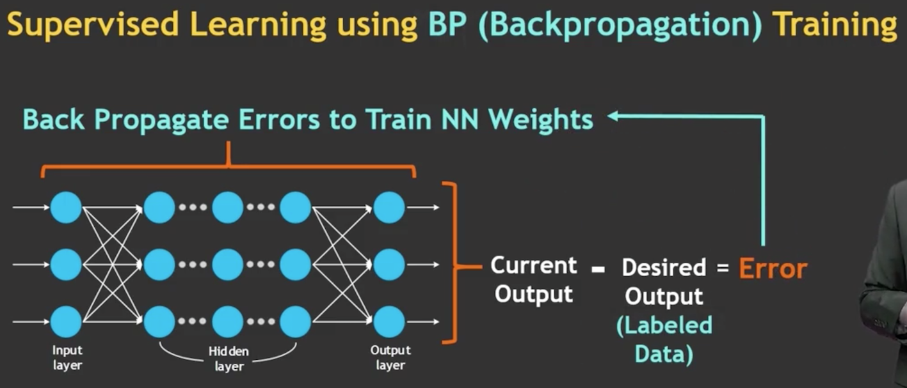

Deep Learning
===============
Deep Learning falls under the broad class of Articial Intelligence > Machine Learning.
It is a Machine Learning technique that uses multiple internal layers (**hidden layers**) of
non-linear processing units (**neurons**) to conduct supervised or unsupervised learning from data.

Some basic concepts of Deep Learning include:
  * Neutron, Perceptron
  * Neutral Network (NN)
  * Convolutional Neural Network (CNN)
  * Recurrent Neural Netowk (RNN)
  
  
Playground
-----------
Tensorflow Playground is the best applicaton to learn about NN without math. Note that this is a simple forward propagation.
View it here_.

.. _here: http://playground.tensorflow.org

.. list-table::
   :widths: 30 40 30

   * - Learning Rate
     - Determines the learning speed (0.00001 to 10)
   * - Activation
     - Select type of activation function 
     - ReLU, Tanh, Sigmoid, Linear
   * - Regularizaton
     - Type of Regularization to reduce overfitting
     - ``L1``: can reduce coefficients to 0. Useful for few features. ``L1``: useful for inputs that are correlated. 
   * - Regularization Rate
   * - Problem Type
     - Classificatoin or Regression

  1. Learning Rate
    * Determines the learning speed (0.00001 to 10)
  2. Activation
    * Select type of activation function 
    * ReLU, Tanh, Sigmoid, Linear
  3. Regularizaton
    * Type of Regularization to reduce overfitting
    * ``L1``: can reduce coefficients to 0. Useful for few features.
    * ``L1``: useful for inputs that are correlated. 
  4. Regularization Rate
    * 0 to 10
  5. Problem type
    * Classificatoin or Regression

Other variables include adjusting the # neurons (max: 8), # hidden layers (max: 6), data type, noise, batch size.

Here's an example output of using **1 hidden layer** with **1, 2 & 3 neurons** in that layer. 
1 neuron can only split by one straight line.

For more complicated datasets, more hidden layers need to be added.

    
From these examples, we can see that a **hidden layer** contains the intelligence
in a distributed fashion using many ``neurons``, ``interconnection``, ``weights``,
``activation functions``, etc. **Deep NN** have multiple neutral networks.

Backpropagation 
---------------
Backpropagation (BP) uses training iterations where **error size** is used
to determine the updated value of each weight in the NN.

    
    
CNN
----
**Convolutional Neural Network** (CNN) is a Feedforward (FF) Neural Network (NN).
  * Designed based on animals' visual cortex. Where visual neurons progressively focus on overlapping tiles & sequentially shifts **convulation process** to cover the entire visual field.
  * Uses **Multi-Layer Perceptrons** (MLPs)
  * **ReLU** activation is often used
  * Image/video recognition, recommender systems, natural language processing

Subsampling
************
Median Value

RNN
----
**Recurrent Neural Network** (RNN)

