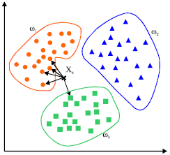
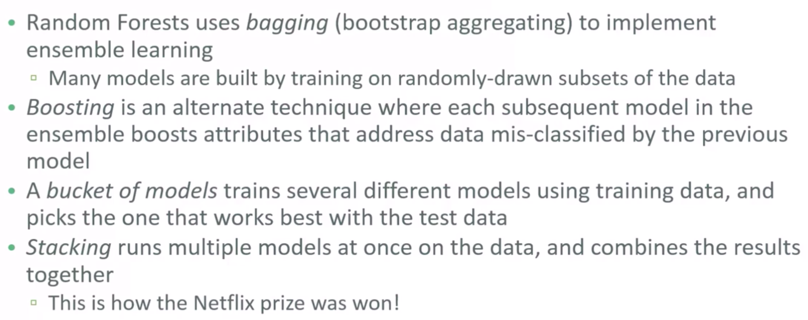

Supervised Learning
===================

Classification
--------------
When response is a categorical value.

K Nearest Neighbours (KNN)
**************************

    www.mathworks.com

.. note::

  1. **Distance Metric**: Eclidean Distance (default). In sklearn it is known as (Minkowski with p = 2)
  2. **How many nearest neighbour**: k=1 very specific, k=5 more general model. Use nearest k data points to determine classification
  3. **Weighting function on neighbours**: (optional)
  4. **How to aggregate class of neighbour points**: Simple majority (default)

.. code:: python

  #### IMPORT MODULES ####
  import pandas as pd
  import numpy as np
  from sklearn.cross_validation import train_test_split
  from sklearn.neighbors import KNeighborsClassifier

  #### TRAIN TEST SPLIT ####
  X_train, X_test, y_train, y_test = train_test_split(X, y, random_state=0)

  #### CREATE MODEL ####
  knn = KNeighborsClassifier(n_neighbors = 5)

  #### FIT MODEL ####
  knn.fit(X_train, y_train)
  #KNeighborsClassifier(algorithm='auto', leaf_size=30, metric='minkowski',
  #     metric_params=None, n_jobs=1, n_neighbors=5, p=2,
  #     weights='uniform')

  #### TEST MODEL ####
  knn.score(X_test, y_test)
  0.53333333333333333

Decision Tree
**************************
Uses gini index (default) or entropy to split the data at binary level.

**Strengths:** Can select a large number of features that best determine the targets.

**Weakness:** Tends to overfit the data as it will split till the end.
Pruning can be done to remove the leaves to prevent overfitting but that is not available in sklearn.
Small changes in data can lead to different splits. Not very reproducible for future data (see random forest).

More more tuning parameters https://medium.com/@mohtedibf/indepth-parameter-tuning-for-decision-tree-6753118a03c3

.. code:: python

  ###### IMPORT MODULES #######
  import pandas as pd
  import numpy as np
  from sklearn.tree import DecisionTreeClassifier

  #### TRAIN TEST SPLIT ####
  train_predictor, test_predictor, train_target, test_target = \
  train_test_split(predictor, target, test_size=0.25)

  print test_predictor.shape
  print train_predictor.shape
  (38, 4)
  (112, 4)

  #### CREATE MODEL ####
  clf = DecisionTreeClassifier()

  #### FIT MODEL ####
  model = clf.fit(train_predictor, train_target)
  print model
  DecisionTreeClassifier(class_weight=None, criterion='gini', max_depth=None,
              max_features=None, max_leaf_nodes=None, min_samples_leaf=1,
              min_samples_split=2, min_weight_fraction_leaf=0.0,
              presort=False, random_state=None, splitter='best')

  #### TEST MODEL ####
  predictions = model.predict(test_predictor)

  print sklearn.metrics.confusion_matrix(test_target,predictions)
  print sklearn.metrics.accuracy_score(test_target, predictions)*100, '%'
  [[14  0  0]
   [ 0 13  0]
   [ 0  1 10]]
  97.3684210526 %

  #### SCORE MODEL ####
  # it is easier to use this package that does everything nicely for a perfect confusion matrix
  from pandas_confusion import ConfusionMatrix
  ConfusionMatrix(test_target, predictions)
  Predicted   setosa  versicolor  virginica  __all__
  Actual
  setosa          14           0          0       14
  versicolor       0          13          0       13
  virginica        0           1         10       11
  __all__         14          14         10       38

  ####### FEATURE IMPORTANCE #### ####
  f_impt= pd.DataFrame(model.feature_importances_, index=df.columns[:-2])
  f_impt = f_impt.sort_values(by=0,ascending=False)
  f_impt.columns = ['feature importance']
  f_impt
  petal width (cm)	0.952542
  petal length (cm)	0.029591
  sepal length (cm)	0.017867
  sepal width (cm)	0.000000

Viewing the decision tree requires installing of the two packages `conda install graphviz` &
`conda install pydotplus`.

.. code:: python

  from sklearn.externals.six import StringIO  
  from IPython.display import Image  
  from sklearn.tree import export_graphviz
  import pydotplus
  dot_data = StringIO()
  export_graphviz(dtree, out_file=dot_data,  
                  filled=True, rounded=True,
                  special_characters=True)
  graph = pydotplus.graph_from_dot_data(dot_data.getvalue())  
  Image(graph.create_png())

Parameters to tune decision trees include **maxdepth** & **min sample leaf**.

.. code:: python

  from sklearn.tree import DecisionTreeClassifier
  from adspy_shared_utilities import plot_decision_tree
  from adspy_shared_utilities import plot_feature_importances

  X_train, X_test, y_train, y_test = train_test_split(X_cancer, y_cancer, random_state = 0)

  clf = DecisionTreeClassifier(max_depth = 4, min_samples_leaf = 8,
                              random_state = 0).fit(X_train, y_train)

  plot_decision_tree(clf, cancer.feature_names, cancer.target_names)

Ensemble Learning
**************************

    Udemy Machine Learning Course by Frank Kane

Random Forest
**************************
An ensemble of decision trees.

* It is widely used and has very good results on many problems
* sklearn.ensemble module
    * Classification: ``RandomForestClassifier``
    * Regression: ``RandomForestRegressor``
* One decision tree tends to overfit
* Many decision trees tends to be more stable and generalised
* Ensemble of trees should be diverse: introduce random variation into tree building

    University of Michigan: Coursera Data Science in Python

Randomness is introduced by two ways:
 * **Bootstrap**: AKA bagging. If your training set has N instances or samples in total, a bootstrap sample of size N is created by just repeatedly picking one of the N dataset rows at random with replacement, that is, allowing for the possibility of picking the same row again at each selection. You repeat this random selection process N times. The resulting bootstrap sample has N rows just like the original training set but with possibly some rows from the original dataset missing and others occurring multiple times just due to the nature of the random selection with replacement. This process is repeated to generate n samples, using the parameter ``n_estimators``, which will eventually generate n number decision trees.
 * **Splitting Features**:  When picking the best split for a node, instead of finding the best split across all possible features (decision tree), a random subset of features is chosen and the best split is found within that smaller subset of features. The number of features in the subset that are randomly considered at each stage is controlled by the ``max_features`` parameter.    

This randomness in selecting the bootstrap sample to train an individual tree in a forest ensemble, 
combined with the fact that splitting a node in the tree is restricted to random subsets of the features of the split, 
virtually guarantees that all of the decision trees and the random forest will be different.

    University of Michigan: Coursera Data Science in Python

Prediction is then averaged among the trees.

    University of Michigan: Coursera Data Science in Python

Key parameters include ``n_estimators``, ``max_features``, ``max_depth``, ``n_jobs``.

.. code:: python

  ###### IMPORT MODULES #### ###
  import pandas as pd
  import numpy as np
  from sklearn.ensemble import RandomForestClassifier
  from sklearn.cross_validation import train_test_split
  import sklearn.metrics

  #### TRAIN TEST SPLIT ####
  train_feature, test_feature, train_target, test_target = \
  train_test_split(feature, target, test_size=0.2)

  print train_feature.shape
  print test_feature.shape
  (404, 13)
  (102, 13)

  #### CREATE MODEL ####
  # use 100 decision trees
  clf = RandomForestClassifier(n_estimators=100, n_jobs=4, verbose=3)

  #### FIT MODEL ####
  model = clf.fit(train_feature, train_target)
  print model
  RandomForestClassifier(bootstrap=True, class_weight=None, criterion='gini',
              max_depth=None, max_features='auto', max_leaf_nodes=None,
              min_samples_leaf=1, min_samples_split=2,
              min_weight_fraction_leaf=0.0, n_estimators=100, n_jobs=1,
              oob_score=False, random_state=None, verbose=0,
              warm_start=False)

  #### TEST MODEL ####
  predictions = model.predict(test_feature)

  #### SCORE MODEL ####
  print 'accuracy', '\n', sklearn.metrics.accuracy_score(test_target, predictions)*100, '%', '\n'
  print 'confusion matrix', '\n', sklearn.metrics.confusion_matrix(test_target,predictions)
  accuracy
  82.3529411765 %
  confusion matrix
  [[21  0  3]
   [ 0 21  4]
   [ 8  3 42]]

  ####### FEATURE IMPORTANCE #### ####
  # rank the importance of features
  f_impt= pd.DataFrame(model.feature_importances_, index=df.columns[:-2])
  f_impt = f_impt.sort_values(by=0,ascending=False)
  f_impt.columns = ['feature importance']

  RM	0.225612
  LSTAT	0.192478
  CRIM	0.108510
  DIS	0.088056
  AGE	0.074202
  NOX	0.067718
  B	0.057706
  PTRATIO	0.051702
  TAX	0.047568
  INDUS	0.037871
  RAD	0.026538
  ZN	0.012635
  CHAS	0.009405

  #### GRAPHS ####

  # see how many decision trees are minimally required make the accuarcy consistent
  import numpy as np
  import matplotlib.pylab as plt
  import seaborn as sns
  %matplotlib inline

  trees=range(100)
  accuracy=np.zeros(100)

  for i in range(len(trees)):
    clf=RandomForestClassifier(n_estimators= i+1)
    model=clf.fit(train_feature, train_target)
    predictions=model.predict(test_feature)
    accuracy[i]=sklearn.metrics.accuracy_score(test_target, predictions)

  plt.plot(trees,accuracy)

  # well, seems like more than 10 trees will have a consistent accuracy of 0.82.
  # Guess there's no need to have an ensemble of 100 trees!

Gradient Boosted Decision Trees
********************************
Gradient Boosted Decision Trees (GBDT) builds a series of small decision trees,
with each tree attempting to correct errors from previous stage. Here's a good video_ on it, which describes AdaBoost, but gives a good overview of tree boosting models.

.. _video: https://www.youtube.com/watch?v=GM3CDQfQ4sw

Typically, gradient boosted tree ensembles use lots of shallow trees known in machine learning as weak learners. 
Built in a nonrandom way, to create a model that makes fewer and fewer mistakes as more trees are added. 
Once the model is built, making predictions with a gradient boosted tree models is fast and doesn't use a lot of memory. 

``learning_rate`` parameter controls how hard each tree tries to correct mistakes from previous round.
High learning rate, more complex trees.

Key parameters, ``n_estimators``, ``learning_rate``, ``max_depth``.

    University of Michigan: Coursera Data Science in Python
    

.. code:: python

  from sklearn.ensemble import GradientBoostingClassifier

  X_train, X_test, y_train, y_test = train_test_split(X_cancer, y_cancer, random_state = 0)

  
  # Default Parameters
  clf = GradientBoostingClassifier(random_state = 0)
  clf.fit(X_train, y_train)

  print('Breast cancer dataset (learning_rate=0.1, max_depth=3)')
  print('Accuracy of GBDT classifier on training set: {:.2f}'
       .format(clf.score(X_train, y_train)))
  print('Accuracy of GBDT classifier on test set: {:.2f}\n'
       .format(clf.score(X_test, y_test)))

  # Adjusting Learning Rate & Max Depth
  clf = GradientBoostingClassifier(learning_rate = 0.01, max_depth = 2, random_state = 0)
  clf.fit(X_train, y_train)

  print('Breast cancer dataset (learning_rate=0.01, max_depth=2)')
  print('Accuracy of GBDT classifier on training set: {:.2f}'
       .format(clf.score(X_train, y_train)))
  print('Accuracy of GBDT classifier on test set: {:.2f}'
       .format(clf.score(X_test, y_test)))

  # Results
  Breast cancer dataset (learning_rate=0.1, max_depth=3)
  Accuracy of GBDT classifier on training set: 1.00
  Accuracy of GBDT classifier on test set: 0.96

  Breast cancer dataset (learning_rate=0.01, max_depth=2)
  Accuracy of GBDT classifier on training set: 0.97
  Accuracy of GBDT classifier on test set: 0.97

XGBoost
********
XGBoost or eXtreme Gradient Boosting, is a form of gradient boosted decision trees is 
that designed to be highly efficient, flexible and portable. It is one of the highly dominative classifier in 
competitive machine learning competitions.

https://www.analyticsvidhya.com/blog/2016/03/complete-guide-parameter-tuning-xgboost-with-codes-python/#

.. code:: python

  from xgboost import XGBClassifier
  from sklearn.model_selection import train_test_split
  from sklearn.metrics import accuracy_score

  X_train, X_test, y_train, y_test = train_test_split(X, Y, random_state=0)
  
  # fit model no training data
  model = XGBClassifier()
  model.fit(X_train, y_train)
  
  # make predictions for test data
  y_pred = model.predict(X_test)
  predictions = [round(value) for value in y_pred]
  
  # evaluate predictions
  accuracy = accuracy_score(y_test, predictions)
  print("Accuracy: %.2f%%" % (accuracy * 100.0))
 

Light Gradient Boosting
*************************
LightGBM is a lightweight version of gradient boosting developed by Microsoft. 
It has similar performance to XGBoost but can run much faster than it.

https://lightgbm.readthedocs.io/en/latest/index.html

.. code:: python

  import lightgbm

  X_train, X_test, y_train, y_test = train_test_split(x, y, test_size=0.2, random_state=42, stratify=y)

  # Create the LightGBM data containers
  train_data = lightgbm.Dataset(X_train, label=y)
  test_data = lightgbm.Dataset(X_test, label=y_test)

  parameters = {
    'application': 'binary',
    'objective': 'binary',
    'metric': 'auc',
    'is_unbalance': 'true',
    'boosting': 'gbdt',
    'num_leaves': 31,
    'feature_fraction': 0.5,
    'bagging_fraction': 0.5,
    'bagging_freq': 20,
    'learning_rate': 0.05,
    'verbose': 0
  }

  model = lightgbm.train(parameters,
                        train_data,
                        valid_sets=test_data,
                        num_boost_round=5000,
                        early_stopping_rounds=100)

CatBoost
************
Category Boosting has high performance compared to other popular models,
and does not require conversion of categorical values into numbers.
It is said to be even faster than LighGBM.

More: https://catboost.ai

.. python::

  from CatBoost import CatBoostClassifier()

Naive Bayes
************

Naive Bayes is a probabilistic model. 
Features are assumed to be independent of each other in a given class. This makes the math very easy.
E.g., words that are unrelated multiply together to form the final probability.

**Prior Probability**: Pr(y). Probability that a class (y) occurred in entire training dataset

**Liklihood**: Pr(y|xi) Probability of a class (y) occuring given all the features (xi).

There are 3 types of Naive Bayes:
 * Bernouli: binary features (absence/presence of words)
 * Multinomial: discrete features (account for frequency of words too, TF-IDF [frequency–inverse document frequency])
 * Gaussian: continuous / real-value features (stores aerage avlue & standard deviation of each feature for each class)
 
Bernouli and Multinomial models are commonly used for sparse count data like text classification. The latter normally works better.
Gaussian model is used for high-dimensional data. 

.. figure:: images/naivebayes.png
   :width: 400px
   :align: center

   University of Michigan: Coursera Data Science in Python

Sklearn allows **partial fitting**, i.e., fit the model incrementally if dataset is too large for memory.

Naive Bayes model only have one smoothing parameter called ``alpha`` (default 0.1). It adds a virtual data point that have positive values for all features. 
This is necessary considering that if there are no positive feature, the entire probability will be 0 
(since it is a multiplicative model). More alpha means more smoothing, and more generalisation (less complex) model.

.. code:: python

  from sklearn.naive_bayes import GaussianNB
  from adspy_shared_utilities import plot_class_regions_for_classifier

  X_train, X_test, y_train, y_test = train_test_split(X_C2, y_C2, random_state=0)

  # no parameters for tuning
  nbclf = GaussianNB().fit(X_train, y_train)
  plot_class_regions_for_classifier(nbclf, X_train, y_train, X_test, y_test,
                                 'Gaussian Naive Bayes classifier: Dataset 1')
                                 
  print('Accuracy of GaussianNB classifier on training set: {:.2f}'
      .format(nbclf.score(X_train, y_train)))
  print('Accuracy of GaussianNB classifier on test set: {:.2f}'
      .format(nbclf.score(X_test, y_test)))
                                 
                                 

Logistic Regression
**************************
Binary output or y value. Functions are available in both statsmodels and sklearn packages.

.. code:: python

  #### IMPORT MODULES ####
  import pandas as pd
  import statsmodels.api as sm

  #### FIT MODEL ####
  lreg = sm.Logit(df3['diameter_cut'], df3[trainC]).fit()
  print lreg.summary()

  Optimization terminated successfully.
         Current function value: 0.518121
         Iterations 6
                             Logit Regression Results
  ==============================================================================
  Dep. Variable:           diameter_cut   No. Observations:                18067
  Model:                          Logit   Df Residuals:                    18065
  Method:                           MLE   Df Model:                            1
  Date:                Thu, 04 Aug 2016   Pseudo R-squ.:                  0.2525
  Time:                        14:13:14   Log-Likelihood:                -9360.9
  converged:                       True   LL-Null:                       -12523.
                                          LLR p-value:                     0.000
  ================================================================================
                     coef    std err          z      P>|z|      [95.0% Conf. Int.]
  --------------------------------------------------------------------------------
  depth            4.2529      0.067     63.250      0.000         4.121     4.385
  layers_YESNO    -2.1102      0.037    -57.679      0.000        -2.182    -2.039
  ================================================================================

  #### CONFIDENCE INTERVALS ####
  params = lreg.params
  conf = lreg.conf_int()
  conf['OR'] = params
  conf.columns = ['Lower CI', 'Upper CI', 'OR']
  print (np.exp(conf))

  Lower CI   Upper CI         OR
  depth         61.625434  80.209893  70.306255
  layers_YESNO   0.112824   0.130223   0.121212

A regularisation penlty L2, just like ridge regression is by default in ``sklearn.linear_model``, 
``LogisticRegression``, controlled using the parameter C (default 1).

.. code:: python

  from sklearn.linear_model import LogisticRegression
  from adspy_shared_utilities import (plot_class_regions_for_classifier_subplot)

  fig, subaxes = plt.subplots(1, 1, figsize=(7, 5))
  y_fruits_apple = y_fruits_2d == 1   # make into a binary problem: apples vs everything else
  X_train, X_test, y_train, y_test = (
  train_test_split(X_fruits_2d.as_matrix(),
                  y_fruits_apple.as_matrix(),
                  random_state = 0))

  clf = LogisticRegression(C=100).fit(X_train, y_train)
  plot_class_regions_for_classifier_subplot(clf, X_train, y_train, None,
                                           None, 'Logistic regression \
  for binary classification\nFruit dataset: Apple vs others',
                                           subaxes)

  h = 6
  w = 8
  print('A fruit with height {} and width {} is predicted to be: {}'
       .format(h,w, ['not an apple', 'an apple'][clf.predict([[h,w]])[0]]))

  h = 10
  w = 7
  print('A fruit with height {} and width {} is predicted to be: {}'
       .format(h,w, ['not an apple', 'an apple'][clf.predict([[h,w]])[0]]))
  subaxes.set_xlabel('height')
  subaxes.set_ylabel('width')

  print('Accuracy of Logistic regression classifier on training set: {:.2f}'
       .format(clf.score(X_train, y_train)))
  print('Accuracy of Logistic regression classifier on test set: {:.2f}'
       .format(clf.score(X_test, y_test)))

Support Vector Machine
***********************

Support Vector Machines (SVM) involves locating the support vectors of two boundaries 
to find a maximum tolerance hyperplane. Side note: linear kernels work best for text classification.

    University of Michigan: Coursera Data Science in Python

Have 3 tuning parameters. Need to normalize first too!

1. Have regularisation using parameter C, just like logistic regression. Default to 1. Limits the importance of each point.
2. Type of kernel. Default is Radial Basis Function (RBF)
3. Gamma parameter for adjusting kernel width. Influence of a single training example reaches. Low gamma > far reach, high values > limited reach.

.. code:: python

  from sklearn.svm import SVC
  from adspy_shared_utilities import plot_class_regions_for_classifier_subplot

  X_train, X_test, y_train, y_test = train_test_split(X_C2, y_C2, random_state = 0)

  fig, subaxes = plt.subplots(1, 1, figsize=(7, 5))
  this_C = 1.0
  clf = SVC(kernel = 'linear', C=this_C).fit(X_train, y_train)
  title = 'Linear SVC, C = {:.3f}'.format(this_C)
  plot_class_regions_for_classifier_subplot(clf, X_train, y_train, None, None, title, subaxes)

We can directly call a linear SVC by directly importing the ``LinearSVC`` function

.. code:: python

  from sklearn.svm import LinearSVC
  X_train, X_test, y_train, y_test = train_test_split(X_cancer, y_cancer, random_state = 0)

  clf = LinearSVC().fit(X_train, y_train)
  print('Breast cancer dataset')
  print('Accuracy of Linear SVC classifier on training set: {:.2f}'
       .format(clf.score(X_train, y_train)))
  print('Accuracy of Linear SVC classifier on test set: {:.2f}'
       .format(clf.score(X_test, y_test)))

**Multi-Class Classification**, i.e., having more than 2 target values, is also possible.
With the results, it is possible to compare one class versus all other classes.

.. code:: python

  from sklearn.svm import LinearSVC

  X_train, X_test, y_train, y_test = train_test_split(X_fruits_2d, y_fruits_2d, random_state = 0)

  clf = LinearSVC(C=5, random_state = 67).fit(X_train, y_train)
  print('Coefficients:\n', clf.coef_)
  print('Intercepts:\n', clf.intercept_)

visualising in a graph...

.. code:: python

  plt.figure(figsize=(6,6))
  colors = ['r', 'g', 'b', 'y']
  cmap_fruits = ListedColormap(['#FF0000', '#00FF00', '#0000FF','#FFFF00'])

  plt.scatter(X_fruits_2d[['height']], X_fruits_2d[['width']],
             c=y_fruits_2d, cmap=cmap_fruits, edgecolor = 'black', alpha=.7)

  x_0_range = np.linspace(-10, 15)

  for w, b, color in zip(clf.coef_, clf.intercept_, ['r', 'g', 'b', 'y']):
      # Since class prediction with a linear model uses the formula y = w_0 x_0 + w_1 x_1 + b, 
      # and the decision boundary is defined as being all points with y = 0, to plot x_1 as a 
      # function of x_0 we just solve w_0 x_0 + w_1 x_1 + b = 0 for x_1:
      plt.plot(x_0_range, -(x_0_range * w[0] + b) / w[1], c=color, alpha=.8)
      
  plt.legend(target_names_fruits)
  plt.xlabel('height')
  plt.ylabel('width')
  plt.xlim(-2, 12)
  plt.ylim(-2, 15)
  plt.show()

**Kernalised Support Vector Machines**

For complex classification, new dimensions can be added to SVM. e.g., square of x. 
There are many types of kernal transformations. By default, SVM will use the Radial Basis Function (RBF) kernel.

.. code:: python

  from sklearn.svm import SVC
  from adspy_shared_utilities import plot_class_regions_for_classifier

  X_train, X_test, y_train, y_test = train_test_split(X_D2, y_D2, random_state = 0)

  # The default SVC kernel is radial basis function (RBF)
  plot_class_regions_for_classifier(SVC().fit(X_train, y_train),
                                   X_train, y_train, None, None,
                                   'Support Vector Classifier: RBF kernel')

  # Compare decision boundries with polynomial kernel, degree = 3
  plot_class_regions_for_classifier(SVC(kernel = 'poly', degree = 3)
                                   .fit(X_train, y_train), X_train,
                                   y_train, None, None,
                                   'Support Vector Classifier: Polynomial kernel, degree = 3')

Full tuning in Support Vector Machines, using normalisation, kernel tuning, and regularisation.

.. code:: python

  from sklearn.preprocessing import MinMaxScaler
  scaler = MinMaxScaler()
  X_train_scaled = scaler.fit_transform(X_train)
  X_test_scaled = scaler.transform(X_test)

  clf = SVC(kernel = 'rbf', gamma=1, C=10).fit(X_train_scaled, y_train)
  print('Breast cancer dataset (normalized with MinMax scaling)')
  print('RBF-kernel SVC (with MinMax scaling) training set accuracy: {:.2f}'
       .format(clf.score(X_train_scaled, y_train)))
  print('RBF-kernel SVC (with MinMax scaling) test set accuracy: {:.2f}'
       .format(clf.score(X_test_scaled, y_test)))

Neural Networks
****************

Examples using Multi-Layer Perceptrons (MLP).

    University of Michigan: Coursera Data Science in Python
    

    Activation Function.
    University of Michigan: Coursera Data Science in Python

Parameters include 
 * ``hidden_layer_sizes`` which is the number of hidden layers, with no. units in each layer (default 100). 
 * ``solvers`` is the algorithm usedthat does the numerical work of finding the optimal weights. default ``adam`` used for large datasets, ``lbfgs`` is used for smaller datasets. 
 * ``alpha``: L2 regularisation, default is 0.0001, 
 * ``activation``: non-linear function used for activation function which include ``relu`` (default), ``logistic``, ``tanh``

**One Hidden Layer**

.. code:: python
  
  from sklearn.neural_network import MLPClassifier
  from adspy_shared_utilities import plot_class_regions_for_classifier_subplot

  X_train, X_test, y_train, y_test = train_test_split(X_D2, y_D2, random_state=0)

  fig, subaxes = plt.subplots(3, 1, figsize=(6,18))

  for units, axis in zip([1, 10, 100], subaxes):
      nnclf = MLPClassifier(hidden_layer_sizes = [units], solver='lbfgs',
                           random_state = 0).fit(X_train, y_train)
      
      title = 'Dataset 1: Neural net classifier, 1 layer, {} units'.format(units)
      
      plot_class_regions_for_classifier_subplot(nnclf, X_train, y_train,
                                               X_test, y_test, title, axis)
      plt.tight_layout()

**Two Hidden Layers, L2 Regularisation (alpha), Activation**

.. code:: python

  X_train, X_test, y_train, y_test = train_test_split(X_D2, y_D2, random_state=0)

  fig, subaxes = plt.subplots(4, 1, figsize=(6, 23))

  for this_alpha, axis in zip([0.01, 0.1, 1.0, 5.0], subaxes):
      nnclf = MLPClassifier(solver='lbfgs', activation = 'tanh',
                           alpha = this_alpha,
                           hidden_layer_sizes = [100, 100],
                           random_state = 0).fit(X_train, y_train)
      
      title = 'Dataset 2: NN classifier, alpha = {:.3f} '.format(this_alpha)
      
      plot_class_regions_for_classifier_subplot(nnclf, X_train, y_train,
                                               X_test, y_test, title, axis)
      plt.tight_layout()
      

**Normalisation**: Input features should be normalised.

.. code:: python

  from sklearn.neural_network import MLPClassifier
  from sklearn.preprocessing import MinMaxScaler

  scaler = MinMaxScaler()

  X_train, X_test, y_train, y_test = train_test_split(X_cancer, y_cancer, random_state = 0)
  X_train_scaled = scaler.fit_transform(X_train)
  X_test_scaled = scaler.transform(X_test)

  clf = MLPClassifier(hidden_layer_sizes = [100, 100], alpha = 5.0,
                     random_state = 0, solver='lbfgs').fit(X_train_scaled, y_train)

  print('Breast cancer dataset')
  print('Accuracy of NN classifier on training set: {:.2f}'
       .format(clf.score(X_train_scaled, y_train)))
  print('Accuracy of NN classifier on test set: {:.2f}'
       .format(clf.score(X_test_scaled, y_test)))

  # RESULTS
  Breast cancer dataset
  Accuracy of NN classifier on training set: 0.98
  Accuracy of NN classifier on test set: 0.97

Auto-ML
********
Quite a number of open-sourced automatic machine learning packages have been released.
It selects the best models and their hyperparameters, making it extremely easy to train supervised models.

Auto Keras
^^^^^^^^^^^
Uses neural network for training. Similar to Google's AutoML approach.

.. code:: python

  import autokeras as ak

  clf = ak.ImageClassifier()
  clf.fit(x_train, y_train)
  results = clf.predict(x_test)

Auto Sklearn
^^^^^^^^^^^^^
Using Bayesian optimizer, this automation trains using models within sklearn.

.. code:: python

  import autosklearn.classification
  import sklearn.model_selection
  import sklearn.datasets
  import sklearn.metrics

  X, y = sklearn.datasets.load_digits(return_X_y=True)
  X_train, X_test, y_train, y_test = \
          sklearn.model_selection.train_test_split(X, y, random_state=1)

  # time_left_for_this_task (total) must be more than per_run_time_limit
  automl = autosklearn.classification.AutoSklearnClassifier(time_left_for_this_task=60, 
                                                            per_run_time_limit=30)
  automl.fit(X_train, y_train)
  y_hat = automl.predict(X_test)
  print("Accuracy score", sklearn.metrics.accuracy_score(y_test, y_hat))

We can see the total results

.. code:: python

  print(automl.sprint_statistics())

  # auto-sklearn results:
  #   Dataset name: cb9e4c17575300e0bcdb85c0920f3385
  #   Metric: accuracy
  #   Best validation score: 1.000000
  #   Number of target algorithm runs: 51
  #   Number of successful target algorithm runs: 47
  #   Number of crashed target algorithm runs: 3
  #   Number of target algorithms that exceeded the time limit: 1
  #   Number of target algorithms that exceeded the memory limit: 0

Auto WEKA
^^^^^^^^^^
WEKA is a GUI-based software for easy quick analysis of datasets.
It is the same in concept as Auto Sklearn but have a wider range of models
and hyperparameters.

|
Regression
----------
When response is a continuous value.

OLS Regression
***************************************
Ordinary Least Squares Regression or OLS Regression is the most basic form and fundamental of regression.
Best fit line ``ŷ = a + bx`` is drawn based on the ordinary least squares method. i.e., least total area of squares (sum of squares) with length from each x,y point to regresson line.

OLS can be conducted using statsmodel package.

.. code:: python

  model = smf.ols(formula='diameter ~ depth', data=df3).fit()
  print model.summary()

  OLS Regression Results
  ==============================================================================
  Dep. Variable:               diameter   R-squared:                       0.512
  Model:                            OLS   Adj. R-squared:                  0.512
  Method:                 Least Squares   F-statistic:                 1.895e+04
  Date:                Tue, 02 Aug 2016   Prob (F-statistic):               0.00
  Time:                        17:10:34   Log-Likelihood:                -51812.
  No. Observations:               18067   AIC:                         1.036e+05
  Df Residuals:                   18065   BIC:                         1.036e+05
  Df Model:                           1
  Covariance Type:            nonrobust
  ==============================================================================
  coef    std err          t      P>|t|      [95.0% Conf. Int.]
  ------------------------------------------------------------------------------
  Intercept      2.2523      0.054     41.656      0.000         2.146     2.358
  depth         11.5836      0.084    137.675      0.000        11.419    11.749
  ==============================================================================
  Omnibus:                    12117.030   Durbin-Watson:                   0.673
  Prob(Omnibus):                  0.000   Jarque-Bera (JB):           391356.565
  Skew:                           2.771   Prob(JB):                         0.00
  Kurtosis:                      25.117   Cond. No.                         3.46
  ==============================================================================

  Warnings:
  [1] Standard Errors assume that the covariance matrix of the errors is correctly specified.

or sci-kit learn package

.. code:: python

  from sklearn import linear_model
  
  reg = linear_model.LinearRegression()
  model = reg.fit ([[0, 0], [1, 1], [2, 2]], [0, 1, 2])
  
  model
  LinearRegression(copy_X=True, fit_intercept=True, n_jobs=1, normalize=False)
  reg.coef_
  array([ 0.5,  0.5])
  
  # R2 scores
  r2_trains = model.score(X_train, y_train)
  r2_tests = model.score(X_test, y_test)

Ridge Regression
****************
**Regularisaton** is an important concept used in Ridge Regression as well as the next LASSO regression.
Ridge regression uses regularisation which adds a penalty parameter to a variable when it has a large variation.
Regularisation prevents overfitting by restricting the model, thus lowering its complexity.

 * Uses L2 regularisation, which *reduces the sum of squares* of the parameters
 * The influence of L2 is controlled by an alpha parameter. Default is 1.
 * High alpha means more regularisation and a simpler model.
 * More in https://www.analyticsvidhya.com/blog/2016/01/complete-tutorial-ridge-lasso-regression-python/

.. code:: python

  #### IMPORT MODULES ####
  import panda as pd
  import numpy as np
  from sklearn.linear_model import Ridge
  from sklearn.preprocessing import MinMaxScaler

  #### TRAIN-TEST SPLIT ####
  X_train, X_test, y_train, y_test = train_test_split(X_crime, y_crime,
                                                   random_state = 0)

  #### NORMALIZATION ####
    # using minmaxscaler
  scaler = MinMaxScaler()
  X_train_scaled = scaler.fit_transform(X_train)
  X_test_scaled = scaler.transform(X_test)

  #### CREATE AND FIT MODEL ####
  linridge = Ridge(alpha=20.0).fit(X_train_scaled, y_train)

  print('Crime dataset')
  print('ridge regression linear model intercept: {}'
     .format(linridge.intercept_))
  print('ridge regression linear model coeff:\n{}'
     .format(linridge.coef_))
  print('R-squared score (training): {:.3f}'
     .format(linridge.score(X_train_scaled, y_train)))
  print('R-squared score (test): {:.3f}'
     .format(linridge.score(X_test_scaled, y_test)))
  print('Number of non-zero features: {}'
     .format(np.sum(linridge.coef_ != 0)))

To investigate the effect of alpha:

.. code:: python

  print('Ridge regression: effect of alpha regularization parameter\n')
  for this_alpha in [0, 1, 10, 20, 50, 100, 1000]:
    linridge = Ridge(alpha = this_alpha).fit(X_train_scaled, y_train)
    r2_train = linridge.score(X_train_scaled, y_train)
    r2_test = linridge.score(X_test_scaled, y_test)
    num_coeff_bigger = np.sum(abs(linridge.coef_) > 1.0)
    print('Alpha = {:.2f}\nnum abs(coeff) > 1.0: {}, \
          r-squared training: {:.2f}, r-squared test: {:.2f}\n'
         .format(this_alpha, num_coeff_bigger, r2_train, r2_test))

.. note::

  * Many variables with small/medium effects: Ridge
  * Only a few variables with medium/large effects: LASSO

LASSO Regression
****************
LASSO refers to Least Absolute Shrinkage and Selection Operator Regression.
Like Ridge Regression this also has a regularisation property.

* Uses L1 regularisation, which *reduces sum of the absolute values of coefficients*, that change unimportant features (their regression coefficients) into 0
* This is known as a sparse solution, or a kind of feature selection, since some variables were removed in the process
* The influence of L1 is controlled by an alpha parameter. Default is 1.
* High alpha means more regularisation and a simpler model. When alpha = 0, then it is a normal OLS regression.

a. Bias increase & variability decreases when alpha increases.
b. Useful when there are many features (explanatory variables).
c. Have to standardize all features so that they have mean 0 and std error 1.
d. Have several algorithms: LAR (Least Angle Regression). Starts w 0 predictors & add each predictor that is most correlated at each step.

.. code:: python

  #### IMPORT MODULES ####
  import pandas as pd
  import numpy as py
  from sklearn import preprocessing
  from sklearn.cross_validation import train_test_split
  from sklearn.linear_model import LassoLarsCV
  import sklearn.metrics
  from sklearn.datasets import load_boston

  #### NORMALIZATION ####
  # standardise the means to 0 and standard error to 1
  for i in df.columns[:-1]: # df.columns[:-1] = dataframe for all features
    df[i] = preprocessing.scale(df[i].astype('float64'))
  df.describe()

  #### TRAIN TEST SPLIT ####
  train_feature, test_feature, train_target, test_target = \
  train_test_split(feature, target, random_state=123, test_size=0.2)

  print train_feature.shape
  print test_feature.shape
  (404, 13)
  (102, 13)

  #### CREATE MODEL ####
  # Fit the LASSO LAR regression model
  # cv=10; use k-fold cross validation
  # precompute; True=model will be faster if dataset is large
  model=LassoLarsCV(cv=10, precompute=False)

  #### FIT MODEL ####
  model = model.fit(train_feature,train_target)
  print model
  LassoLarsCV(copy_X=True, cv=10, eps=2.2204460492503131e-16,
        fit_intercept=True, max_iter=500, max_n_alphas=1000, n_jobs=1,
        normalize=True, positive=False, precompute=False, verbose=False)

  #### ANALYSE COEFFICIENTS ####
  Compare the regression coefficients, and see which one LASSO removed.
  LSTAT is the most important predictor, followed by RM, DIS, and RAD. AGE is removed by LASSO

  df2=pd.DataFrame(model.coef_, index=feature.columns)
  df2.sort_values(by=0,ascending=False)
  RM	3.050843
  RAD	2.040252
  ZN	1.004318
  B	0.629933
  CHAS	0.317948
  INDUS	0.225688
  AGE	0.000000
  CRIM	-0.770291
  NOX	-1.617137
  TAX	-1.731576
  PTRATIO	-1.923485
  DIS	-2.733660
  LSTAT	-3.878356

  #### SCORE MODEL ####
  # MSE from training and test data
  from sklearn.metrics import mean_squared_error
  train_error = mean_squared_error(train_target, model.predict(train_feature))
  test_error = mean_squared_error(test_target, model.predict(test_feature))

  print ('training data MSE')
  print(train_error)
  print ('test data MSE')
  print(test_error)

  # MSE closer to 0 are better
  # test dataset is less accurate as expected
  training data MSE
  20.7279948891
  test data MSE
  28.3767672242

  # R-square from training and test data
  rsquared_train=model.score(train_feature,train_target)
  rsquared_test=model.score(test_feature,test_target)
  print ('training data R-square')
  print(rsquared_train)
  print ('test data R-square')
  print(rsquared_test)

  # test data explained 65% of the predictors
  training data R-square
  0.755337444405
  test data R-square
  0.657019301268
  
  
Polynomial Regression
**********************

.. code:: python

  from sklearn.linear_model import LinearRegression
  from sklearn.linear_model import Ridge
  from sklearn.preprocessing import PolynomialFeatures

  
  # Normal Linear Regression
  X_train, X_test, y_train, y_test = train_test_split(X_F1, y_F1,
                                                     random_state = 0)
  linreg = LinearRegression().fit(X_train, y_train)

  print('linear model coeff (w): {}'
       .format(linreg.coef_))
  print('linear model intercept (b): {:.3f}'
       .format(linreg.intercept_))
  print('R-squared score (training): {:.3f}'
       .format(linreg.score(X_train, y_train)))
  print('R-squared score (test): {:.3f}'
       .format(linreg.score(X_test, y_test)))

  print('\nNow we transform the original input data to add\n\
  polynomial features up to degree 2 (quadratic)\n')
  
  # Polynomial Regression
  poly = PolynomialFeatures(degree=2)
  X_F1_poly = poly.fit_transform(X_F1)

  X_train, X_test, y_train, y_test = train_test_split(X_F1_poly, y_F1,
                                                     random_state = 0)
  linreg = LinearRegression().fit(X_train, y_train)

  print('(poly deg 2) linear model coeff (w):\n{}'
       .format(linreg.coef_))
  print('(poly deg 2) linear model intercept (b): {:.3f}'
       .format(linreg.intercept_))
  print('(poly deg 2) R-squared score (training): {:.3f}'
       .format(linreg.score(X_train, y_train)))
  print('(poly deg 2) R-squared score (test): {:.3f}\n'
       .format(linreg.score(X_test, y_test)))

  # Polynomial with Ridge Regression
  '''Addition of many polynomial features often leads to
  overfitting, so we often use polynomial features in combination
  with regression that has a regularization penalty, like ridge
  regression.'''

  X_train, X_test, y_train, y_test = train_test_split(X_F1_poly, y_F1,
                                                     random_state = 0)
  linreg = Ridge().fit(X_train, y_train)

  print('(poly deg 2 + ridge) linear model coeff (w):\n{}'
       .format(linreg.coef_))
  print('(poly deg 2 + ridge) linear model intercept (b): {:.3f}'
       .format(linreg.intercept_))
  print('(poly deg 2 + ridge) R-squared score (training): {:.3f}'
       .format(linreg.score(X_train, y_train)))
  print('(poly deg 2 + ridge) R-squared score (test): {:.3f}'
       .format(linreg.score(X_test, y_test)))

Decision Tree Regressor
************************
Same as decision tree classifier but the target is continuous.

.. code:: python

  from sklearn.tree import DecisionTreeRegressor

Random Forest Regressor
************************
Same as randomforest classifier but the target is continuous.

.. code:: python

  from sklearn.ensemble import RandomForestRegressor

Neutral Networks
*****************

.. code:: python

  from sklearn.neural_network import MLPRegressor

  fig, subaxes = plt.subplots(2, 3, figsize=(11,8), dpi=70)

  X_predict_input = np.linspace(-3, 3, 50).reshape(-1,1)

  X_train, X_test, y_train, y_test = train_test_split(X_R1[0::5], y_R1[0::5], random_state = 0)

  for thisaxisrow, thisactivation in zip(subaxes, ['tanh', 'relu']):
      for thisalpha, thisaxis in zip([0.0001, 1.0, 100], thisaxisrow):
          mlpreg = MLPRegressor(hidden_layer_sizes = [100,100],
                               activation = thisactivation,
                               alpha = thisalpha,
                               solver = 'lbfgs').fit(X_train, y_train)
          y_predict_output = mlpreg.predict(X_predict_input)
          thisaxis.set_xlim([-2.5, 0.75])
          thisaxis.plot(X_predict_input, y_predict_output,
                       '^', markersize = 10)
          thisaxis.plot(X_train, y_train, 'o')
          thisaxis.set_xlabel('Input feature')
          thisaxis.set_ylabel('Target value')
          thisaxis.set_title('MLP regression\nalpha={}, activation={})'
                            .format(thisalpha, thisactivation))
          plt.tight_layout()
          
          
