Unsupervised Learning
=====================
No labeled responses, the goal is to capture interesting structure or information.

Applications include:
  * Visualise structure of a complex dataset
  * Density estimations to predict probabilities of events
  * Compress and summarise the data
  * Extract features for supervised learning
  * Discover important clusters or outliers

Transformations
---------------
Processes that extract or compute information.

Kernel Density Estimation
*************************

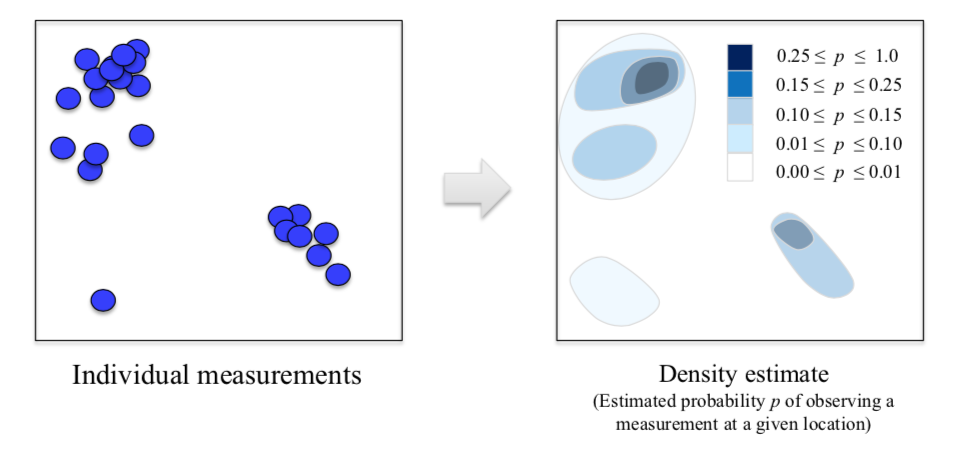

    University of Michigan: Coursera Data Science in Python

Dimensionality Reduction
************************
  * **Curse of Dimensionality**: Very hard to visualise with many dimensions
  * Finds an approximate version of your dataset using fewer features
  * Used for exploring and visualizing a dataset to understand grouping or relationships
  * Often visualized using a 2-dimensional scatterplot
  * Also used for compression, finding features for supervised learning
  * Can be classified into linear (PCA), or non-linear (manifold) reduction techniques

Principal Component Analysis
^^^^^^^^^^^^^^^^^^^^^^^^^^^^^^^

PCA summarises multiple fields of data into principal components, 
usually just 2 so that it is easier to visualise in a 2-dimensional plot. 
The 1st component will show the most variance of the entire dataset in the hyperplane,
while the 2nd shows the 2nd shows the most variance at a right angle to the 1st.
Because of the strong variance between data points, 
patterns tend to be teased out from a high dimension to even when there's just two dimensions.
These 2 components can serve as new features for a supervised analysis.

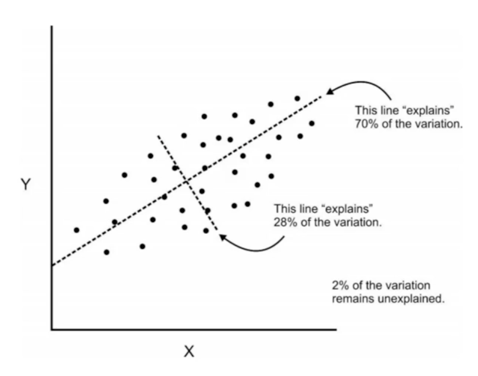

In short, PCA finds the best possible characteristics, 
that summarises the classes of a feature. Two excellent sites elaborate more: setosa_,
quora_. The most challenging part of PCA is interpreting the components.

.. _setosa: http://setosa.io/ev/principal-component-analysis/
.. _quora: https://www.quora.com/What-is-an-intuitive-explanation-for-PCA

.. code:: python

  from sklearn.preprocessing import StandardScaler
  from sklearn.decomposition import PCA
  from sklearn.datasets import load_breast_cancer

  cancer = load_breast_cancer()
  df = pd.DataFrame(cancer['data'],columns=cancer['feature_names'])

  # Before applying PCA, each feature should be centered (zero mean) and with unit variance
  scaled_data = StandardScaler().fit(df).transform(df)  

  pca = PCA(n_components = 2).fit(scaled_data)
  # PCA(copy=True, n_components=2, whiten=False)

  x_pca = pca.transform(scaled_data)
  print(df.shape, x_pca.shape)
  
  # RESULTS
  (569, 30) (569, 2)

To see how much variance is preserved for each dataset.

.. code:: python

   percent = pca.explained_variance_ratio_
   print(percent)
   print(sum(percent))

   # [0.9246348, 0.05238923] 1st component explained variance of 92%, 2nd explained 5%
   # 0.986 total variance explained from 2 components is 97%

Plotting the PCA-transformed version of the breast cancer dataset. 
We can see that malignant and benign cells cluster between two groups and can apply a linear classifier
to this two dimensional representation of the dataset.

.. code:: python

    plt.figure(figsize=(8,6))
    plt.scatter(x_pca[:,0], x_pca[:,1], c=cancer['target'], cmap='plasma', alpha=0.4, edgecolors='black', s=65);
    plt.xlabel('First Principal Component')
    plt.ylabel('Second Principal Component')

  
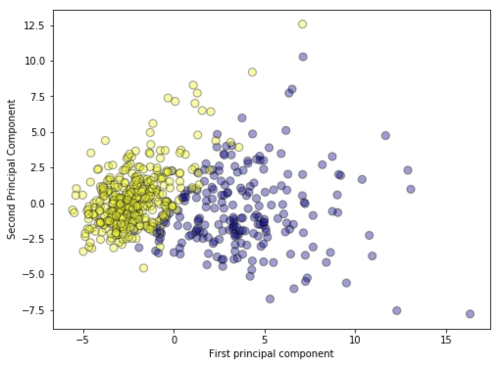
      
      
Plotting the magnitude of each feature value for the first two principal components.
This gives the best explanation for the components for each field.

.. code:: python

  fig = plt.figure(figsize=(8, 4))
  plt.imshow(pca.components_, interpolation = 'none', cmap = 'plasma')
  feature_names = list(cancer.feature_names)

  plt.gca().set_xticks(np.arange(-.5, len(feature_names)));
  plt.gca().set_yticks(np.arange(0.5, 2));
  plt.gca().set_xticklabels(feature_names, rotation=90, ha='left', fontsize=12);
  plt.gca().set_yticklabels(['First PC', 'Second PC'], va='bottom', fontsize=12);

  plt.colorbar(orientation='horizontal', ticks=[pca.components_.min(), 0, 
                                                pca.components_.max()], pad=0.65);

                                                
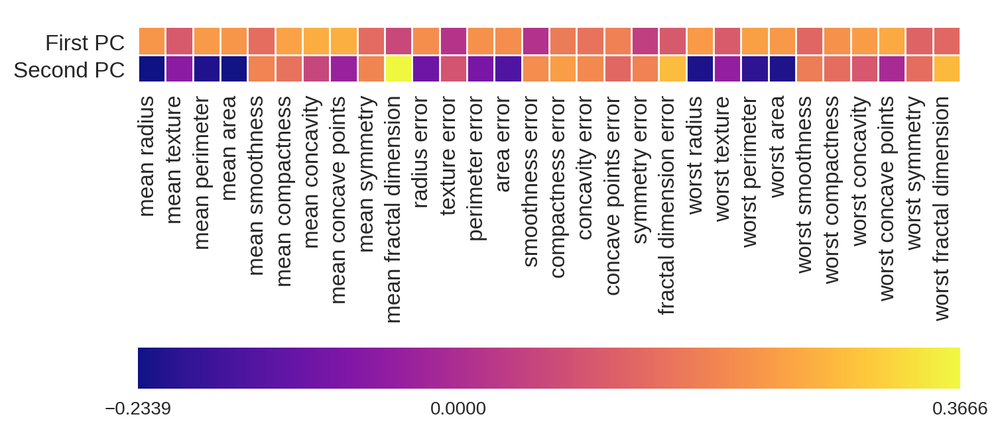

We can also plot the feature magnitudes in the scatterplot like in R into two separate axes, also known as a biplot.
This shows the relationship of each feature's magnitude clearer in a 2D space.

.. code:: python

    # put feature values into dataframe
    components = pd.DataFrame(pca.components_.T, index=df.columns, columns=['PCA1','PCA2'])

    # plot size
    plt.figure(figsize=(10,8))

    # main scatterplot
    plt.scatter(x_pca[:,0], x_pca[:,1], c=cancer['target'], cmap='plasma', alpha=0.4, edgecolors='black', s=40);
    plt.xlabel('First Principal Component')
    plt.ylabel('Second Principal Component')
    plt.ylim(15,-15);
    plt.xlim(20,-20);

    # individual feature values
    ax2 = plt.twinx().twiny();
    ax2.set_ylim(-0.5,0.5);
    ax2.set_xlim(-0.5,0.5);

    # reference lines
    ax2.hlines(0,-0.5,0.5, linestyles='dotted', colors='grey')
    ax2.vlines(0,-0.5,0.5, linestyles='dotted', colors='grey')

    # offset for labels
    offset = 1.07

    # arrow & text
    for a, i in enumerate(components.index):
        ax2.arrow(0, 0, components['PCA1'][a], -components['PCA2'][a], \
                alpha=0.5, facecolor='white', head_width=.01)
        ax2.annotate(i, (components['PCA1'][a]*offset, -components['PCA2'][a]*offset), color='orange')
        
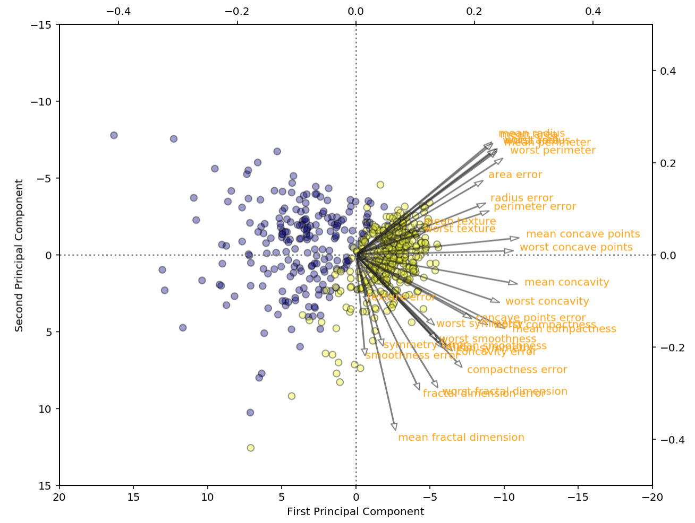

Lastly, we can specify the percentage explained variance, and let PCA decide on the number components.

.. code:: python

  from sklearn.decomposition import PCA
  pca = PCA(0.99, whiten=True)
  data = pca.fit_transform(digits.data)

Multi-Dimensional Scaling
^^^^^^^^^^^^^^^^^^^^^^^^^^^^^^^
Multi-Dimensional Scaling (MDS) is a type of manifold learning algorithm that to visualize 
a high dimensional dataset and project it onto a lower dimensional space - 
in most cases, a two-dimensional page. PCA is weak in this aspect.

sklearn gives a good overview of various manifold techniques. https://scikit-learn.org/stable/modules/manifold.html

.. code:: python

  from adspy_shared_utilities import plot_labelled_scatter
  from sklearn.preprocessing import StandardScaler
  from sklearn.manifold import MDS

  # each feature should be centered (zero mean) and with unit variance
  X_fruits_normalized = StandardScaler().fit(X_fruits).transform(X_fruits)  

  mds = MDS(n_components = 2)

  X_fruits_mds = mds.fit_transform(X_fruits_normalized)

  plot_labelled_scatter(X_fruits_mds, y_fruits, ['apple', 'mandarin', 'orange', 'lemon'])
  plt.xlabel('First MDS feature')
  plt.ylabel('Second MDS feature')
  plt.title('Fruit sample dataset MDS');

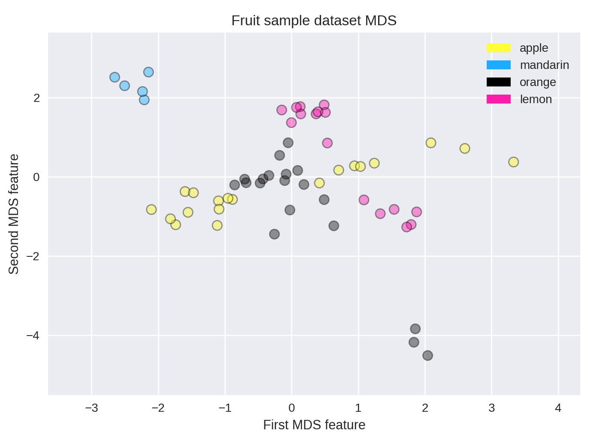

t-SNE
^^^^^^
t-Distributed Stochastic Neighbor Embedding (t-SNE) is a powerful manifold learning algorithm for visualizing clusters. It finds a two-dimensional representation of your data, 
such that the distances between points in the 2D scatterplot match as closely as possible the distances 
between the same points in the original high dimensional dataset. In particular, 
t-SNE gives much more weight to preserving information about distances between points that are neighbors. 

More information here_.

.. _here: https://distill.pub/2016/misread-tsne

.. code:: python

  from sklearn.manifold import TSNE

  tsne = TSNE(random_state = 0)

  X_tsne = tsne.fit_transform(X_fruits_normalized)

  plot_labelled_scatter(X_tsne, y_fruits, 
      ['apple', 'mandarin', 'orange', 'lemon'])
  plt.xlabel('First t-SNE feature')
  plt.ylabel('Second t-SNE feature')
  plt.title('Fruits dataset t-SNE');

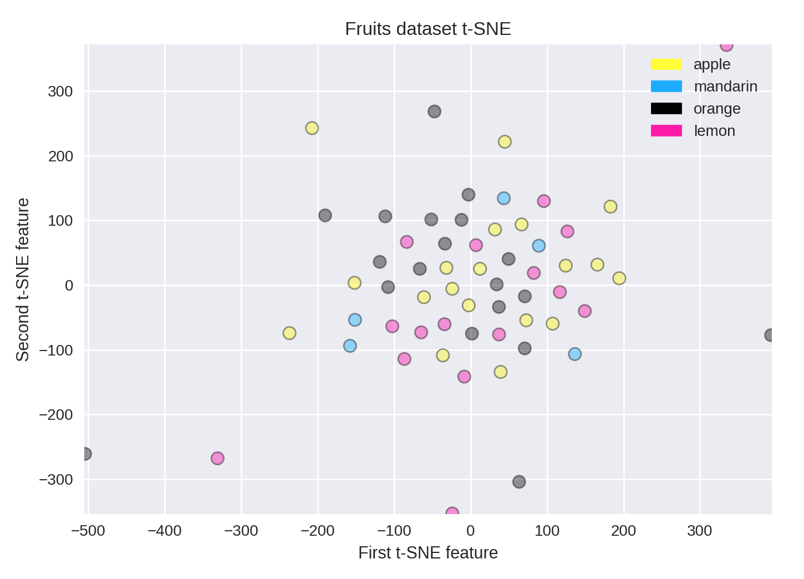
    
    You can see how some dimensionality reduction methods may be less successful on some datasets. 
    Here, it doesn't work as well at finding structure in the small fruits dataset, compared to other methods like MDS.

LDA
^^^^^^^
Latent Dirichlet Allocation is another dimension reduction method, but unlike PCA, it is a supervised method. 
It attempts to find a feature subspace or decision boundary that maximizes class separability.
It then projects the data points to new dimensions in a way that the clusters are as separate from each other 
as possible and the individual elements within a cluster are as close to the centroid of the cluster as possible. 

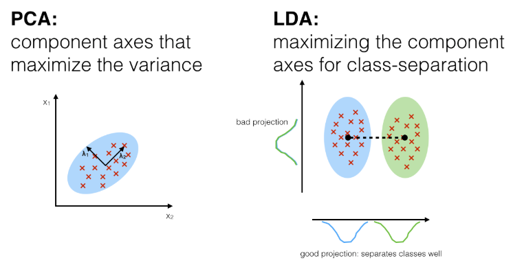

Differences of PCA & LDA, from:
 * https://sebastianraschka.com/Articles/2014_python_lda.html
 * https://stackabuse.com/implementing-lda-in-python-with-scikit-learn/

.. code:: python

  # from sklearn documentation
  from sklearn.decomposition import LatentDirichletAllocation
  from sklearn.datasets import make_multilabel_classification

  # This produces a feature matrix of token counts, similar to what
  # CountVectorizer would produce on text.
  X, _ = make_multilabel_classification(random_state=0)
  lda = LatentDirichletAllocation(n_components=5, random_state=0)
  X_lda = lda.fit_transform(X, y)

  # check the explained variance
  percent = lda.explained_variance_ratio_
  print(percent)
  print(sum(percent))

Self-Organzing Maps
^^^^^^^^^^^^^^^^^^^^^^^
SOM is a special type of neural network that is trained using unsupervised learning to produce a two-dimensional map.
Each row of data is assigned to its Best Matching Unit (BMU) neuron. Neighbourhood effect to create a topographic map

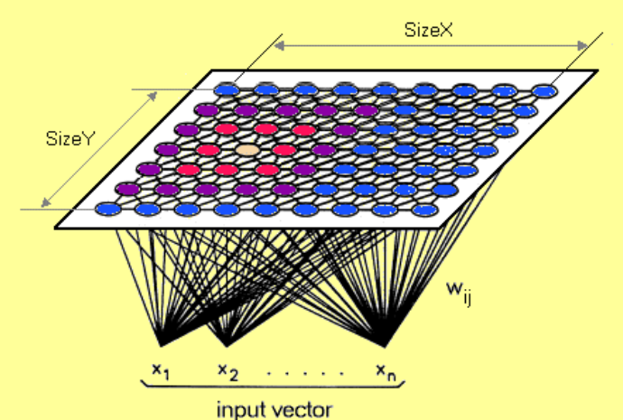

They differ from other artificial neural networks as:
 1. they apply competitive learning as opposed to error-correction learning (such as backpropagation with gradient descent) 
 2. in the sense that they use a neighborhood function to preserve the topological properties of the input space.
 3. Consist of only one visible output layer

Requires scaling or normalization of all features first.

https://github.com/JustGlowing/minisom

We first need to calculate the number of neurons and how many of them making up each side.
The ratio of the side lengths of the map is approximately the ratio of the two largest eigenvalues of the training data’s covariance matrix.

.. code:: python

  # total no. of neurons required
  total_neurons = 5*sqrt(normal.shape[1])

  # calculate eigen_values
  normal_cov = np.cov(data_normal)
  eigen_values = np.linalg.eigvals(normal_cov)

  # 2 largest eigenvalues
  result = sorted([i.real for i in eigen_values])[-2:]
  ratio_2_largest_eigen = result[1]/result[0]

  side = total_neurons/ratio_2_largest_eigen

  # two sides
  print(total_neurons)
  print('1st side', side)
  print('2nd side', ratio_2_largest_eigen)

Then we build the model.

.. code:: python

  # 1st side, 2nd side, # features
  model = MiniSom(5, 4, 66, sigma=1.5, learning_rate=0.5, 
                neighborhood_function='gaussian', random_seed=10)

  # initialise weights to the map
  model.pca_weights_init(data_normal)
  # train the model
  model.train_batch(df, 60000, verbose=True)

Plot out the map.

.. code:: python

  plt.figure(figsize=(6, 5))
  plt.pcolor(som.distance_map().T, cmap='bone_r') 

Quantization error is the distance between each vector and the BMU.

.. code:: python

  som.quantization_error(array)

Clustering
----------
Find groups in data & assign every point in the dataset to one of the groups.

K-Means
**************************
Need to specify K number of clusters. It is also important to scale the features before applying K-means,
unless the fields are not meant to be scaled, like distances.
Categorical data is not appropriate as clustering calculated using euclidean distance (means). 
For long distances over an lat/long coordinates, they need to be projected to a flat surface.

One aspect of k means is that different random starting points for the cluster centers often result in very different clustering solutions. 
So typically, the k-means algorithm is run in scikit-learn with ten different random initializations 
and the solution occurring the most number of times is chosen. 

**Downsides**
 * Very sensitive to outliers. Have to remove before running the model
 * Might need to reduce dimensions if very high no. of features or the distance separation might not be obvious

.. figure:: images/kmeans4.png
    :width: 600px
    :align: center

    Introduction to Machine Learning with Python

**Methodology**
  1. Specify number of clusters (3)
  2. 3 random data points are randomly selected as cluster centers
  3. Each data point is assigned to the cluster center it is cloest to
  4. Cluster centers are updated to the mean of the assigned points
  5. Steps 3-4 are repeated, till cluster centers remain unchanged

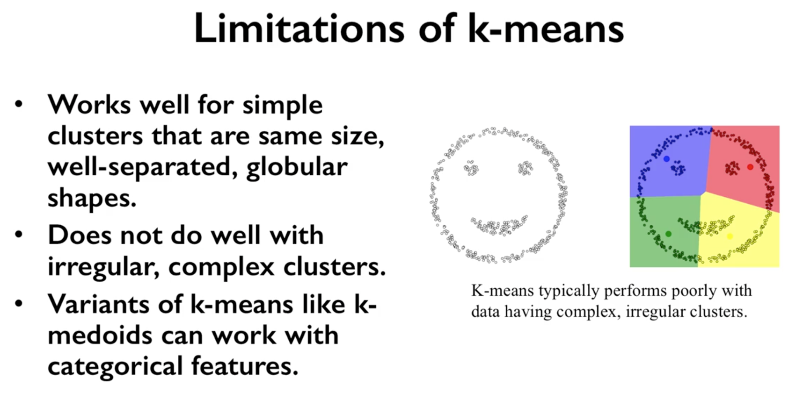
    
    University of Michigan: Coursera Data Science in Python

**Example 1**

.. code:: python

  from sklearn.datasets import make_blobs
  from sklearn.cluster import KMeans
  from adspy_shared_utilities import plot_labelled_scatter
  from sklearn.preprocessing import MinMaxScaler

  fruits = pd.read_table('fruit_data_with_colors.txt')
  X_fruits = fruits[['mass','width','height', 'color_score']].as_matrix()
  y_fruits = fruits[['fruit_label']] - 1

  X_fruits_normalized = MinMaxScaler().fit(X_fruits).transform(X_fruits)  

  kmeans = KMeans(n_clusters = 4, random_state = 0)
  kmeans.fit(X_fruits)

  plot_labelled_scatter(X_fruits_normalized, kmeans.labels_, 
                        ['Cluster 1', 'Cluster 2', 'Cluster 3', 'Cluster 4'])

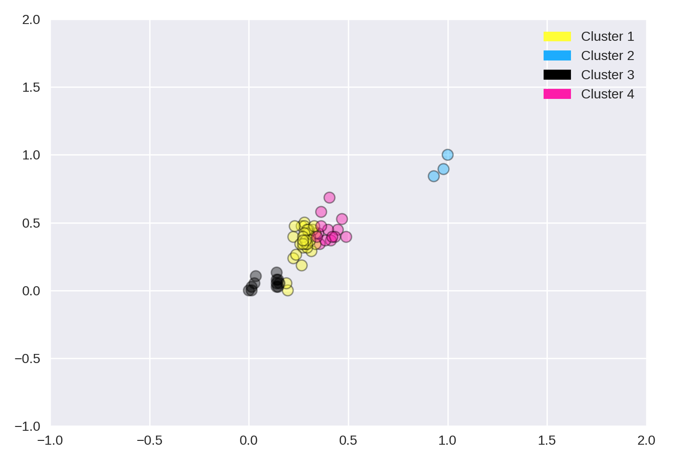

**Example 2**

.. code:: python 

  #### IMPORT MODULES ####
  import pandas as pd
  from sklearn import preprocessing
  from sklearn.cross_validation import train_test_split
  from sklearn.cluster import KMeans
  from sklearn.datasets import load_iris
  

  #### NORMALIZATION ####
  # standardise the means to 0 and standard error to 1
  for i in df.columns[:-2]: # df.columns[:-1] = dataframe for all features, minus target
      df[i] = preprocessing.scale(df[i].astype('float64'))

  df.describe()
  
  
  
  #### TRAIN-TEST SPLIT ####
  train_feature, test_feature = train_test_split(feature, random_state=123, test_size=0.2)

  print train_feature.shape
  print test_feature.shape
  (120, 4)
  (30, 4)

  #### A LOOK AT THE MODEL ####
  KMeans(n_clusters=2)
  KMeans(copy_x=True, init='k-means++', max_iter=300, n_clusters=2, n_init=10,
      n_jobs=1, precompute_distances='auto', random_state=None, tol=0.0001,
      verbose=0)
  
  
  
  #### ELBOW CHART TO DETERMINE OPTIMUM K ####
  from scipy.spatial.distance import cdist
  import numpy as np
  clusters=range(1,10)
  # to store average distance values for each cluster from 1-9
  meandist=[]

  # k-means cluster analysis for 9 clusters                                                           
  for k in clusters:
      # prepare the model
      model=KMeans(n_clusters=k)
      # fit the model
      model.fit(train_feature)
      # test the model
      clusassign=model.predict(train_feature)
      # gives average distance values for each cluster solution
          # cdist calculates distance of each two points from centriod
          # get the min distance (where point is placed in clsuter)
          # get average distance by summing & dividing by total number of samples
      meandist.append(sum(np.min(cdist(train_feature, model.cluster_centers_, 'euclidean'), axis=1)) 
      / train_feature.shape[0])
      
      
  import matplotlib.pylab as plt
  import seaborn as sns
  %matplotlib inline
  """Plot average distance from observations from the cluster centroid
  to use the Elbow Method to identify number of clusters to choose"""

  plt.plot(clusters, meandist)
  plt.xlabel('Number of clusters')
  plt.ylabel('Average distance')
  plt.title('Selecting k with the Elbow Method')

  # look a bend in the elbow that kind of shows where 
  # the average distance value might be leveling off such that adding more clusters 
  # doesn't decrease the average distance as much
  
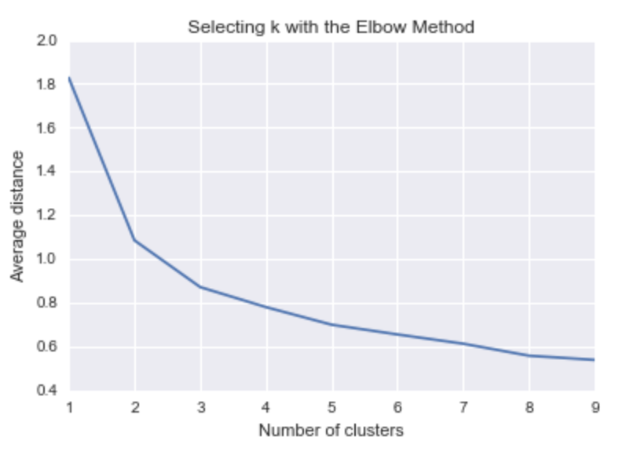

We can visualise the clusters by reducing the dimensions into 2 using PCA.
They are separate by theissen polygons, though at a multi-dimensional space.

.. code:: python

  pca = PCA(n_components = 2).fit(df).transform(df)
  labels = kmeans.labels_

  plt.figure(figsize=(8,8))
  plt.scatter(pd.DataFrame(pca)[0],pd.DataFrame(pca)[1], c=labels, cmap='plasma', alpha=0.5);

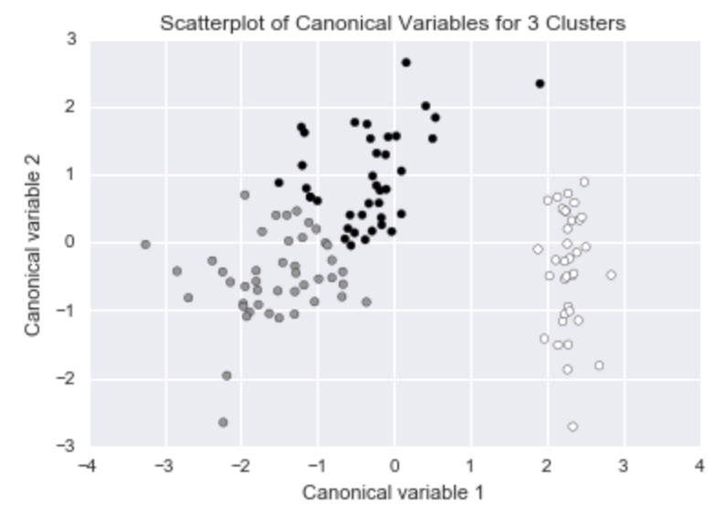

Sometimes we need to find the cluster centres so that we can get an absolute distance measure of centroids to new data. 
Each feature will have a defined centre for each cluster.

.. code:: python

  # get cluster centres
  centroids = model.cluster_centers_
  # for each row, define cluster centre
  centroid_labels = [centroids[i] for i in model.labels_]

If we have labels or y, and want to determine which y belongs to which cluster for an evaluation score,
we can use a groupby to find the most number of labels that fall in a cluster and manually label them as such.

df = concat.groupby(['label','cluster'])['cluster'].count()
df

Gaussian Mixture Model
************************

GMM is, in essence a density estimation model but can function like clustering. It has a probabilistic model under the hood so it 
returns a matrix of probabilities belonging to each cluster for each data point. More: https://jakevdp.github.io/PythonDataScienceHandbook/05.12-gaussian-mixtures.html

We can input the `covariance_type` argument such that it can choose between `diag` (the default, ellipse constrained to the axes), 
`spherical` (like k-means), or `full` (ellipse without a specific orientation).

.. code:: python

  from sklearn.mixture import GaussianMixture

  # gmm accepts input as array, so have to convert dataframe to numpy
  input_gmm = normal.values

  gmm = GaussianMixture(n_components=4, covariance_type='full', random_state=42)
  gmm.fit(input_gmm)
  result = gmm.predict(test_set)

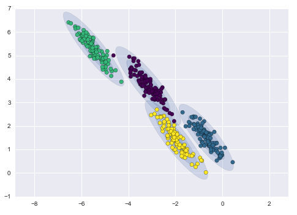

  from Python Data Science Handbook by Jake VanderPlas

`BIC` or `AIC` are used to determine the optimal number of clusters, the former usually recommends a simpler model. 
Note that number of clusters or components measures how well GMM works as a density estimator, not as a clustering algorithm.

.. code:: python

  from sklearn.mixture import GaussianMixture
  import matplotlib.pyplot as plt
  %matplotlib inline 
  %config InlineBackend.figure_format = 'retina'

  input_gmm = normal.values

  bic_list = []
  aic_list = []
  ranges = range(1,30)

  for i in ranges:
      gmm = GaussianMixture(n_components=i).fit(input_gmm)
      # BIC
      bic = gmm.bic(input_gmm)
      bic_list.append(bic)
      # AIC
      aic = gmm.aic(input_gmm)
      aic_list.append(aic)

  plt.figure(figsize=(10, 5))
  plt.plot(ranges, bic_list, label='BIC');
  plt.plot(ranges, aic_list, label='AIC');
  plt.legend(loc='best');

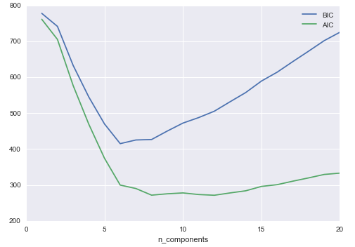

  from Python Data Science Handbook by Jake VanderPlas

Agglomerative Clustering
************************

Agglomerative Clustering is a method of clustering technique used to build clusters from bottom up.

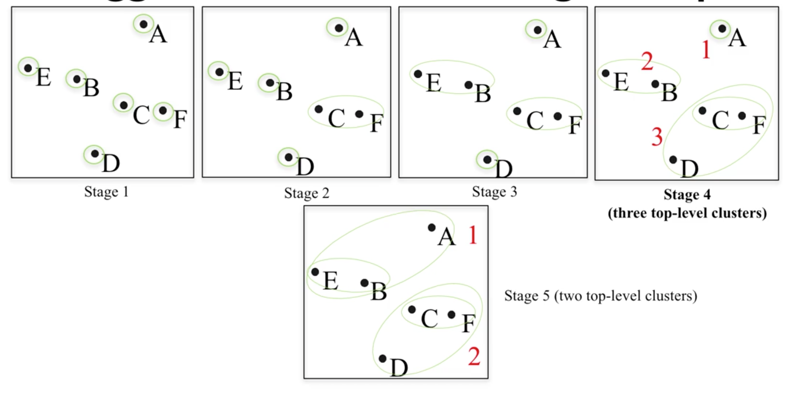
    
    University of Michigan: Coursera Data Science in Python

Methods of linking clusters together.
    
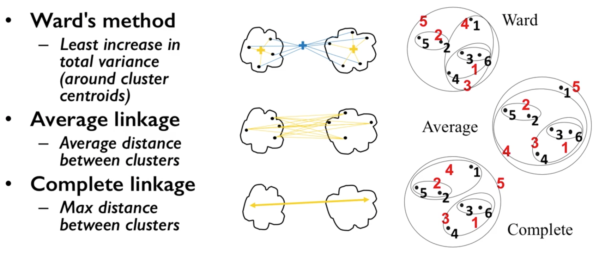
    
    University of Michigan: Coursera Data Science in Python
        
        
.. code:: python  
  
  from sklearn.datasets import make_blobs
  from sklearn.cluster import AgglomerativeClustering
  from adspy_shared_utilities import plot_labelled_scatter

  X, y = make_blobs(random_state = 10)

  cls = AgglomerativeClustering(n_clusters = 3)
  cls_assignment = cls.fit_predict(X)

  plot_labelled_scatter(X, cls_assignment, 
          ['Cluster 1', 'Cluster 2', 'Cluster 3'])
          
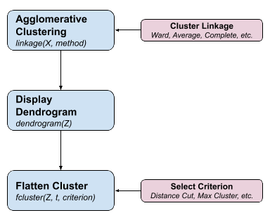

One of the benfits of this clustering is that a hierarchy can be built.

.. code:: python

  X, y = make_blobs(random_state = 10, n_samples = 10)
  plot_labelled_scatter(X, y, 
          ['Cluster 1', 'Cluster 2', 'Cluster 3'])
  print(X)

  [[  5.69192445  -9.47641249]
   [  1.70789903   6.00435173]
   [  0.23621041  -3.11909976]
   [  2.90159483   5.42121526]
   [  5.85943906  -8.38192364]
   [  6.04774884 -10.30504657]
   [ -2.00758803  -7.24743939]
   [  1.45467725  -6.58387198]
   [  1.53636249   5.11121453]
   [  5.4307043   -9.75956122]]
   
   # BUILD DENDROGRAM
   from scipy.cluster.hierarchy import ward, dendrogram
   plt.figure(figsize=(10,5))
   dendrogram(ward(X))
   plt.show()

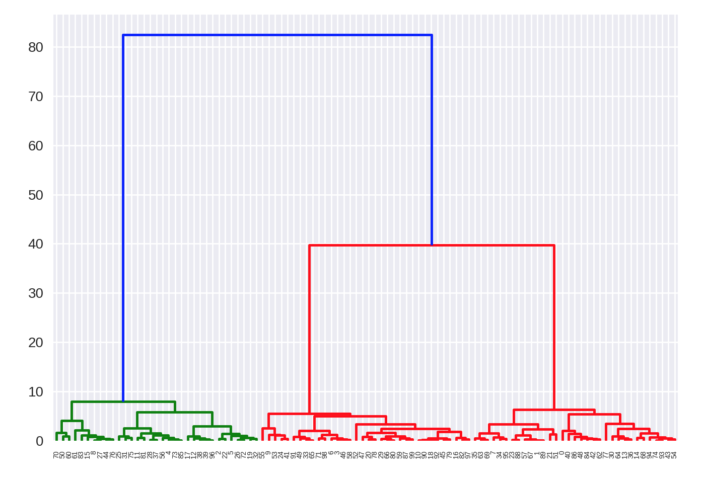
        
More in this link: https://joernhees.de/blog/2015/08/26/scipy-hierarchical-clustering-and-dendrogram-tutorial/

sklearn agglomerative clustering is very slow, and an alternative ``fastcluster`` library
performs much faster as it is a C++ library with a python interface.

.. code:: python

  import fastcluster
  from scipy.cluster.hierarchy import fcluster
  from scipy.cluster.hierarchy import dendrogram, ward
  from scipy.spatial.distance import pdist

  Z = fastcluster.linkage_vector(df, method='ward', metric='euclidean')

  # get dendrogram details into dataframe
  Z_df = pd.DataFrame(data=Z, columns=['clusterOne','clusterTwo','distance','newClusterSize'])

  # plot dendrogram
  plt.figure(figsize=(10, 5))
  dendrogram(ward(X))
  plt.show();
  
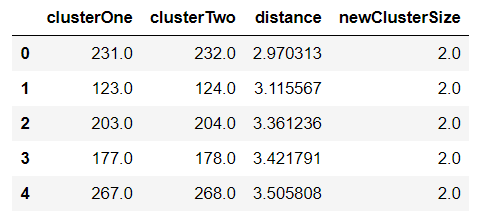

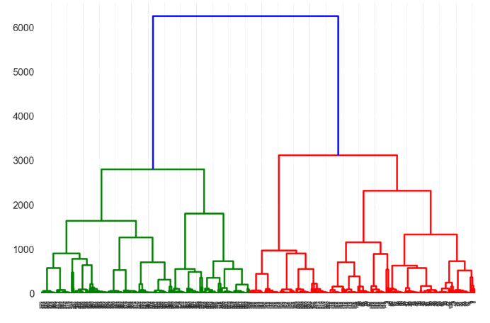

Then we select the distance threshold to cut the dendrogram to obtain the selected clustering level.
The output is the cluster labelled for each row of data. As expected from the dendrogram, a cut at
2000 gives us 5 clusters.

.. code:: python

  distance_threshold = 2000
  clusters = fcluster(Z, distance_threshold, criterion='distance')
  chosen_clusters = pd.DataFrame(data=clusters, columns=['cluster'])

  chosen_clusters['cluster'].unique()
  # array([4, 5, 2, 3, 1], dtype=int64)

Evaluating the best number of clusters can be done through the elbow plot & BIC.

DBSCAN
*******
Density-Based Spatial Clustering of Applications with Noise (DBSCAN). 
Need to scale/normalise data. DBSCAN works by identifying crowded regions
referred to as dense regions.

Key parameters are ``eps`` and ``min_samples``. 
If there are at least min_samples many data points within a distance of eps
to a given data point, that point will be classified as a core sample.
Core samples that are closer to each other than the distance eps are put into
the same cluster by DBSCAN.

There is recently a new method called HDBSCAN (H = Hierarchical). 
https://hdbscan.readthedocs.io/en/latest/index.html

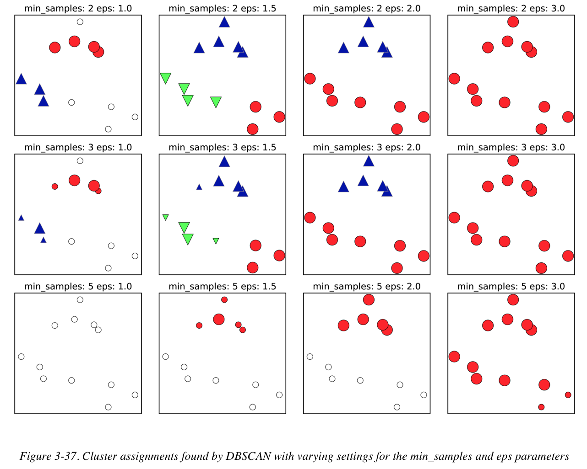

    Introduction to Machine Learning with Python

**Methodology**
  1. Pick an arbitrary point to start
  2. Find all points with distance *eps* or less from that point
  3. If points are more than *min_samples* within distance of *esp*, point is labelled as a core sample, and assigned a new cluster label
  4. Then all neighbours within *eps* of the point are visited
  5. If they are core samples their neighbours are visited in turn and so on
  6. The cluster thus grows till there are no more core samples within distance *eps* of the cluster
  7. Then, another point that has not been visited is picked, and step 1-6 is repeated
  8. 3 kinds of points are generated in the end, core points, boundary points, and noise
  9. Boundary points are core clusters but not within distance of *esp*

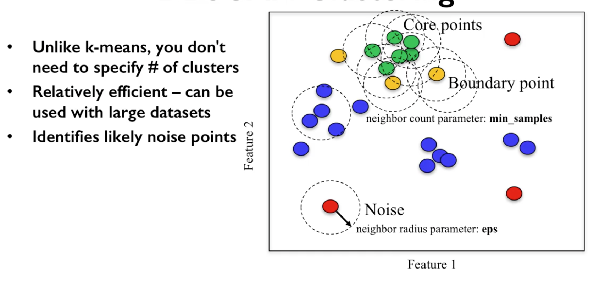
    
    University of Michigan: Coursera Data Science in Python

.. code:: python

  from sklearn.cluster import DBSCAN
  from sklearn.datasets import make_blobs

  X, y = make_blobs(random_state = 9, n_samples = 25)

  dbscan = DBSCAN(eps = 2, min_samples = 2)

  cls = dbscan.fit_predict(X)
  print("Cluster membership values:\n{}".format(cls))
  Cluster membership values:
      [ 0  1  0  2  0  0  0  2  2 -1  1  2  0  0 -1  0  0  1 -1  1  1  2  2  2  1]
      # -1 indicates noise or outliers

  plot_labelled_scatter(X, cls + 1, 
          ['Noise', 'Cluster 0', 'Cluster 1', 'Cluster 2'])
          
          
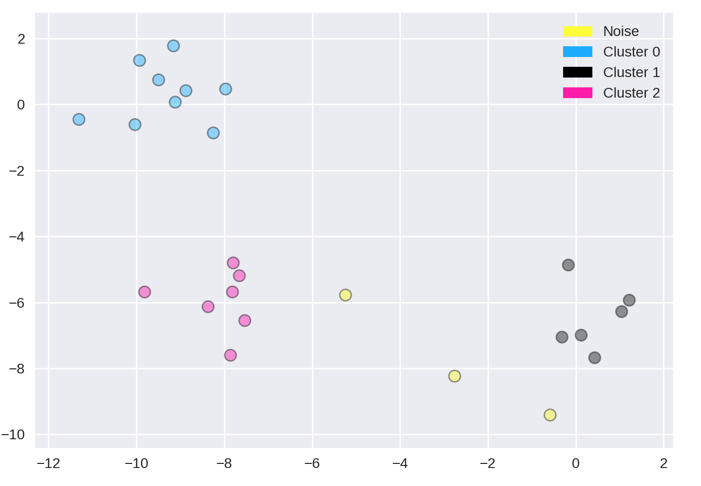

One-Class Classification
-------------------------
These requires the training of a normal state(s), allows outliers to be detected when they lie outside trained state.

One Class SVM
**************

One-class SVM is an unsupervised algorithm that learns a decision function for outlier detection: 
classifying new data as similar or different to the training set.

Besides the kernel, two other parameters are impt:
The nu parameter should be the proportion of outliers you expect to observe (in our case around 2%), 
the gamma parameter determines the smoothing of the contour lines.

.. code:: python

  from sklearn.svm import OneClassSVM

  train, test = train_test_split(data, test_size=.2)
  train_normal = train[train['y']==0]
  train_outliers = train[train['y']==1]
  outlier_prop = len(train_outliers) / len(train_normal)

  model = OneClassSVM(kernel='rbf', nu=outlier_prop, gamma=0.000001)
  svm.fit(train_normal[['x1','x4','x5']])

Isolation Forest
*****************

.. code:: python

  from sklearn.ensemble import IsolationForest

  clf = IsolationForest(behaviour='new', max_samples=100,
                      random_state=rng, contamination='auto')
            
  clf.fit(X_train)
  y_pred_test = clf.predict(X_test)
  
  # -1 are outliers
  # array([ 1,  1,  1,  1,  1,  1,  1,  1,  1, -1,  1,  1,  1,  1,  1,  1])

  # average anomaly scores. the lower, the more abnormal. negative scores represent outliers, positive scores represent inliers.
  clf.decision_function(X_test)
  array([ 0.14528263,  0.14528263, -0.08450298,  0.14528263,  0.14528263,
        0.14528263,  0.14528263,  0.14528263,  0.14528263, -0.14279962,
        0.14528263,  0.14528263, -0.05483886, -0.10086102,  0.14528263,
        0.14528263])

Distance Metrics
------------------

Euclidean Distance & Cosine Similarity
****************************************

Euclidean distance is the straight line distance between points, while cosine distance is the cosine of the angle
between these two points.

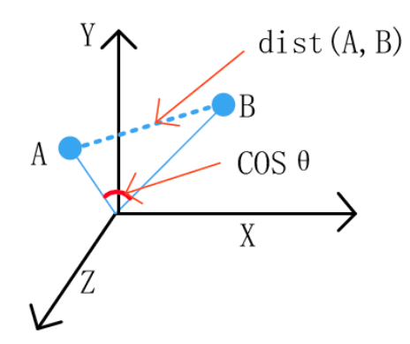

.. code:: python

    from scipy.spatial.distance import euclidean

    euclidean([1,2],[1,3])
    # 1
    

.. code:: python
    
    from scipy.spatial.distance import cosine

    cosine([1,2],[1,3])
    # 0.010050506338833642

Mahalanobis Distance
****************************************

Mahalonobis distance is the distance between a point and a distribution, not between two distinct points.
Therefore, it is effectively a multivariate equivalent of the Euclidean distance.

https://www.machinelearningplus.com/statistics/mahalanobis-distance/

 * ``x``: is the vector of the observation (row in a dataset), 
 * ``m``: is the vector of mean values of independent variables (mean of each column), 
 * ``C^(-1)``: is the inverse covariance matrix of independent variables.

Multiplying by the inverse covariance (correlation) matrix essentially means dividing the 
input with the matrix. This is so that if features in your dataset are strongly correlated, the covariance will be high. 
Dividing by a large covariance will effectively reduce the distance.

While powerful, its use of correlation can be detrimantal when there is multicollinearity 
(strong correlations among features). 

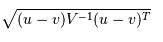

.. code:: python

    import pandas as pd
    import numpy as np
    from scipy.spatial.distance import mahalanobis

    def mahalanobisD(normal_df, y_df):
        # calculate inverse covariance from normal state
        x_cov = normal_df.cov()
        inv_cov = np.linalg.pinv(x_cov)
        
        # get mean of normal state df
        x_mean = normal_df.mean()
        
        # calculate mahalanobis distance from each row of y_df
        distanceMD = []
        for i in range(len(y_df)):
            MD = mahalanobis(x_mean, y_df.iloc[i], inv_cov)
            distanceMD.append(MD)
            
        return distanceMD

Jaccard’s Distance
*********************

Dynamic Time Warping
***********************

If two time series are identical, but one is shifted slightly along the time axis, 
then Euclidean distance may consider them to be very different from each other. 
DTW was introduced to overcome this limitation and give intuitive distance measurements 
between time series by ignoring both global and local shifts in the time dimension.

DTW is a technique that finds the optimal alignment between two time series, 
if one time series may be “warped” non-linearly by stretching or shrinking it along its time axis.
Dynamic time warping is often used in speech recognition to determine if two waveforms 
represent the same spoken phrase. In a speech waveform, 
the duration of each spoken sound and the interval between sounds are permitted to vary, 
but the overall speech waveforms must be similar.

From the creators of FastDTW, it produces an accurate minimum-distance warp path between two time series than is nearly optimal 
(standard DTW is optimal, but has a quadratic time and space complexity).

Output: Identical = 0, Difference > 0

.. code:: python

    import numpy as np
    from scipy.spatial.distance import euclidean
    from fastdtw import fastdtw

    x = np.array([[1,1], [2,2], [3,3], [4,4], [5,5]])
    y = np.array([[2,2], [3,3], [4,4]])
    distance, path = fastdtw(x, y, dist=euclidean)
    print(distance)

    # 2.8284271247461903

Stan Salvador & Philip ChanFast. DTW: Toward Accurate Dynamic Time Warping in Linear Time and Space. Florida Institude of Technology. https://cs.fit.edu/~pkc/papers/tdm04.pdf

