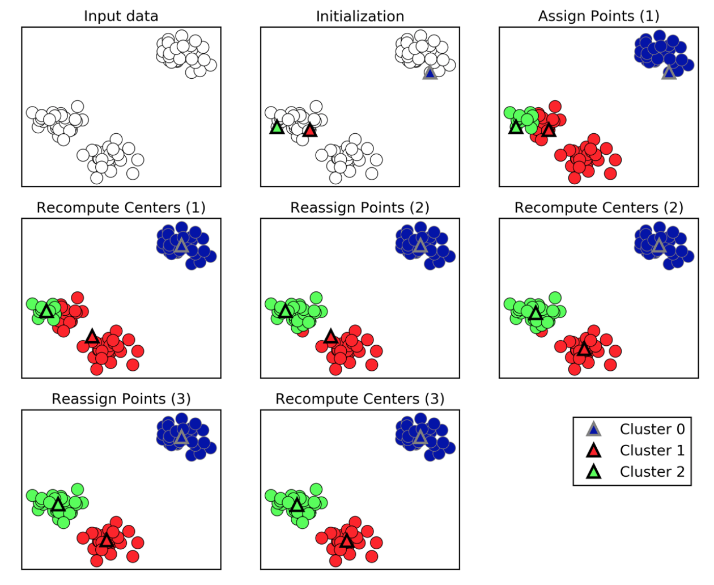
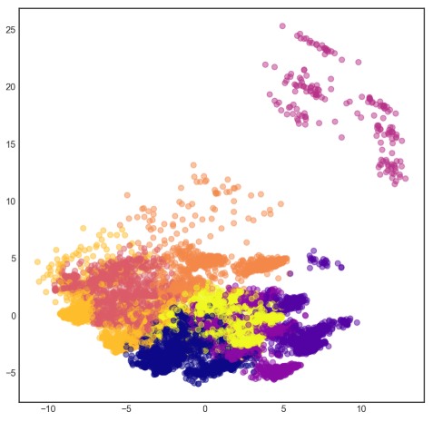

Unsupervised Learning
=====================
No labeled responses, the goal is to capture interesting structure or information.

Applications include:
  * Visualise structure of a complex dataset
  * Density estimations to predict probabilities of events
  * Compress and summarise the data
  * Extract features for supervised learning
  * Discover important clusters or outliers

Transformations
---------------
Processes that extract or compute information.

Kernel Density Estimation
*************************

.. figure:: images/kerneldensity.png
    :width: 600px
    :align: center

    University of Michigan: Coursera Data Science in Python

Dimensionality Reduction
************************
  * Finds an approximate version of your dataset using fewer features
  * Used for exploring and visualizing a dataset to understand grouping or relationships
  * Often visualized using a 2-dimensional scatterplot
  * Also used for compression, finding features for supervised learning

Principal Component Analysis
^^^^^^^^^^^^^^^^^^^^^^^^^^^^^^^

PCA summarises multiple fields of data into principal components, 
usually just 2 so that it is easier to visualise in a 2-dimensional plot. 
The 1st component will show the most variance of the entire dataset,
while the 2nd shows the 2nd shows the most variance.
Because of the strong variance between data points, 
patterns tend to be teased out from a high dimension to even when there's just two dimensions.
These 2 components can serve as new features for a supervised analysis.

In short, PCA finds the best possible characteristics, 
that summarises the classes of a feature. Two excellent sites elaborate more: setosa_,
quora_.

.. _setosa: http://setosa.io/ev/principal-component-analysis/
.. _quora: https://www.quora.com/What-is-an-intuitive-explanation-for-PCA

.. code:: python

  from sklearn.preprocessing import StandardScaler
  from sklearn.decomposition import PCA
  from sklearn.datasets import load_breast_cancer

  cancer = load_breast_cancer()
  (X_cancer, y_cancer) = load_breast_cancer(return_X_y = True)

  # Before applying PCA, each feature should be centered (zero mean) and with unit variance
  X_normalized = StandardScaler().fit(X_cancer).transform(X_cancer)  

  pca = PCA(n_components = 2).fit(X_normalized)

  X_pca = pca.transform(X_normalized)
  print(X_cancer.shape, X_pca.shape)
  
  # RESULTS
  (569, 30) (569, 2)

Plotting the PCA-transformed version of the breast cancer dataset. 
We can see that malignant and benign cells cluster between two groups and can apply a linear classifier
to this two dimensional representation of the dataset.

.. code:: python

  from adspy_shared_utilities import plot_labelled_scatter
  plot_labelled_scatter(X_pca, y_cancer, ['malignant', 'benign'])

  plt.xlabel('First principal component')
  plt.ylabel('Second principal component')
  plt.title('Breast Cancer Dataset PCA (n_components = 2)');

  
.. figure:: images/pca1.png
    :width: 600px
    :align: center
      
      
Plotting the magnitude of each feature value for the first two principal components.

.. code:: python

  fig = plt.figure(figsize=(8, 4))
  plt.imshow(pca.components_, interpolation = 'none', cmap = 'plasma')
  feature_names = list(cancer.feature_names)

  plt.gca().set_xticks(np.arange(-.5, len(feature_names)));
  plt.gca().set_yticks(np.arange(0.5, 2));
  plt.gca().set_xticklabels(feature_names, rotation=90, ha='left', fontsize=12);
  plt.gca().set_yticklabels(['First PC', 'Second PC'], va='bottom', fontsize=12);

  plt.colorbar(orientation='horizontal', ticks=[pca.components_.min(), 0, 
                                                pca.components_.max()], pad=0.65);

                                                
.. figure:: images/pca2.png
    :width: 600px
    :align: center

Multi-Dimensional Scaling
^^^^^^^^^^^^^^^^^^^^^^^^^^^^^^^
Multi-Dimensional Scaling (MDS) is a type of manifold learning algorithm that to visualize 
a high dimensional dataset and project it onto a lower dimensional space - 
in most cases, a two-dimensional page. PCA is weak in this aspect.

.. code:: python

  from adspy_shared_utilities import plot_labelled_scatter
  from sklearn.preprocessing import StandardScaler
  from sklearn.manifold import MDS

  # each feature should be centered (zero mean) and with unit variance
  X_fruits_normalized = StandardScaler().fit(X_fruits).transform(X_fruits)  

  mds = MDS(n_components = 2)

  X_fruits_mds = mds.fit_transform(X_fruits_normalized)

  plot_labelled_scatter(X_fruits_mds, y_fruits, ['apple', 'mandarin', 'orange', 'lemon'])
  plt.xlabel('First MDS feature')
  plt.ylabel('Second MDS feature')
  plt.title('Fruit sample dataset MDS');

.. figure:: images/mds.png
    :width: 600px
    :align: center

t-SNE
^^^^^^
t-Distributed Stochastic Neighbor Embedding (t-SNE) is a powerful manifold learning algorithm. It finds a two-dimensional representation of your data, 
such that the distances between points in the 2D scatterplot match as closely as possible the distances 
between the same points in the original high dimensional dataset. In particular, 
t-SNE gives much more weight to preserving information about distances between points that are neighbors. 

More information here_.

.. _here: https://distill.pub/2016/misread-tsne

.. code:: python

  from sklearn.manifold import TSNE

  tsne = TSNE(random_state = 0)

  X_tsne = tsne.fit_transform(X_fruits_normalized)

  plot_labelled_scatter(X_tsne, y_fruits, 
      ['apple', 'mandarin', 'orange', 'lemon'])
  plt.xlabel('First t-SNE feature')
  plt.ylabel('Second t-SNE feature')
  plt.title('Fruits dataset t-SNE');

.. figure:: images/tsne.png
    :width: 600px
    :align: center
    
    You can see how some dimensionality reduction methods may be less successful on some datasets. 
    Here, it doesn't work as well at finding structure in the small fruits dataset, compared to other methods like MDS.
    
Clustering
----------
Find groups in data & assign every point in the dataset to one of the groups.

K-Means
**************************
Need to specify K number of clusters. It is also important to scale the features before applying K-means.

One aspect of k means is that different random starting points for the cluster centers often result in very different clustering solutions. 
So typically, the k-means algorithm is run in scikit-learn with ten different random initializations 
and the solution occurring the most number of times is chosen. 

    Introduction to Machine Learning with Python

**Methodology**
  1. Specify number of clusters (3)
  2. 3 random data points are randomly selected as cluster centers
  3. Each data point is assigned to the cluster center it is cloest to
  4. Cluster centers are updated to the mean of the assigned points
  5. Steps 3-4 are repeated, till cluster centers remain unchanged

.. figure:: images/kmeans2.png
    :width: 600px
    :align: center
    
    University of Michigan: Coursera Data Science in Python

**Example 1**

.. code:: python

  from sklearn.datasets import make_blobs
  from sklearn.cluster import KMeans
  from adspy_shared_utilities import plot_labelled_scatter
  from sklearn.preprocessing import MinMaxScaler

  fruits = pd.read_table('fruit_data_with_colors.txt')
  X_fruits = fruits[['mass','width','height', 'color_score']].as_matrix()
  y_fruits = fruits[['fruit_label']] - 1

  X_fruits_normalized = MinMaxScaler().fit(X_fruits).transform(X_fruits)  

  kmeans = KMeans(n_clusters = 4, random_state = 0)
  kmeans.fit(X_fruits)

  plot_labelled_scatter(X_fruits_normalized, kmeans.labels_, 
                        ['Cluster 1', 'Cluster 2', 'Cluster 3', 'Cluster 4'])

**Example 2**

.. code:: python 

  #### IMPORT MODULES ####
  import pandas as pd
  from sklearn import preprocessing
  from sklearn.cross_validation import train_test_split
  from sklearn.cluster import KMeans
  from sklearn.datasets import load_iris
  

  #### NORMALIZATION ####
  # standardise the means to 0 and standard error to 1
  for i in df.columns[:-2]: # df.columns[:-1] = dataframe for all features, minus target
      df[i] = preprocessing.scale(df[i].astype('float64'))

  df.describe()
  
  
  
  #### TRAIN-TEST SPLIT ####
  train_feature, test_feature = train_test_split(feature, random_state=123, test_size=0.2)

  print train_feature.shape
  print test_feature.shape
  (120, 4)
  (30, 4)

  #### A LOOK AT THE MODEL ####
  >>> KMeans(n_clusters=2)
  KMeans(copy_x=True, init='k-means++', max_iter=300, n_clusters=2, n_init=10,
      n_jobs=1, precompute_distances='auto', random_state=None, tol=0.0001,
      verbose=0)
  
  
  
  #### ELBOW CHART TO DETERMINE OPTIMUM K ####
  from scipy.spatial.distance import cdist
  import numpy as np
  clusters=range(1,10)
  # to store average distance values for each cluster from 1-9
  meandist=[]

  # k-means cluster analysis for 9 clusters                                                           
  for k in clusters:
      # prepare the model
      model=KMeans(n_clusters=k)
      # fit the model
      model.fit(train_feature)
      # test the model
      clusassign=model.predict(train_feature)
      # gives average distance values for each cluster solution
          # cdist calculates distance of each two points from centriod
          # get the min distance (where point is placed in clsuter)
          # get average distance by summing & dividing by total number of samples
      meandist.append(sum(np.min(cdist(train_feature, model.cluster_centers_, 'euclidean'), axis=1)) 
      / train_feature.shape[0])
      
      
  import matplotlib.pylab as plt
  import seaborn as sns
  %matplotlib inline
  """Plot average distance from observations from the cluster centroid
  to use the Elbow Method to identify number of clusters to choose"""

  plt.plot(clusters, meandist)
  plt.xlabel('Number of clusters')
  plt.ylabel('Average distance')
  plt.title('Selecting k with the Elbow Method')

  # look a bend in the elbow that kind of shows where 
  # the average distance value might be leveling off such that adding more clusters 
  # doesn't decrease the average distance as much
  
.. image:: images/elbowchart.png
  :scale: 40 %

.. code:: python
  
  #### VIEW CLUSTER USING PCA ####
  # Interpret 3 cluster solution
  model3=KMeans(n_clusters=3)
  model3.fit(train_feature)
  clusassign=model3.predict(train_feature)
  # plot clusters

  # Use Canonical Discriminate Analysis to reduce the dimensions (into 2)
  # Creates a smaller no. of variables, with canonical variables ordered by proportion of variable accounted
  # i.e., 1st canonical variable is most importance & so on

  from sklearn.decomposition import PCA
  pca_2 = PCA(2) #return first two canonical variables
  plot_columns = pca_2.fit_transform(train_feature)
  # plot 1st canonical v in x axis, 2nd variable on y axis
  # color code variables based on cluster assignments (i.e., predicted targets)
  plt.scatter(x=plot_columns[:,0], y=plot_columns[:,1], c=model3.labels_)
  plt.xlabel('Canonical variable 1')
  plt.ylabel('Canonical variable 2')
  plt.title('Scatterplot of Canonical Variables for 3 Clusters')
  plt.show()
  

  

Agglomerative Clustering
************************

Agglomerative Clustering is a method of clustering technique used to build clusters from bottom up.

.. figure:: images/aggocluster.png
    :width: 600px
    :align: center
    
    University of Michigan: Coursera Data Science in Python

Methods of linking clusters together.
    
.. figure:: images/aggocluster2.png
    :width: 600px
    :align: center
    
    University of Michigan: Coursera Data Science in Python
        
        
.. code:: python  
  
  from sklearn.datasets import make_blobs
  from sklearn.cluster import AgglomerativeClustering
  from adspy_shared_utilities import plot_labelled_scatter

  X, y = make_blobs(random_state = 10)

  cls = AgglomerativeClustering(n_clusters = 3)
  cls_assignment = cls.fit_predict(X)

  plot_labelled_scatter(X, cls_assignment, 
          ['Cluster 1', 'Cluster 2', 'Cluster 3'])
          
.. figure:: images/aggocluster3.png
    :width: 600px
    :align: center

One of the benfits of this clustering is that a hierarchy can be built.

.. code:: python

  X, y = make_blobs(random_state = 10, n_samples = 10)
  plot_labelled_scatter(X, y, 
          ['Cluster 1', 'Cluster 2', 'Cluster 3'])
  print(X)

  [[  5.69192445  -9.47641249]
   [  1.70789903   6.00435173]
   [  0.23621041  -3.11909976]
   [  2.90159483   5.42121526]
   [  5.85943906  -8.38192364]
   [  6.04774884 -10.30504657]
   [ -2.00758803  -7.24743939]
   [  1.45467725  -6.58387198]
   [  1.53636249   5.11121453]
   [  5.4307043   -9.75956122]]
   
   # BUILD DENDROGRAM
   from scipy.cluster.hierarchy import ward, dendrogram
   plt.figure()
   dendrogram(ward(X))
   plt.show()

.. figure:: images/aggocluster4.png
    :width: 600px
    :align: center
        
DBSCAN
*******
Density-Based Spatial Clustering of Applications with Noise (DBSCAN). 
Need to scale/normalise data. DBSCAN works by identifying crowded regions
referred to as dense regions.

Key parameters are ``eps`` and ``min_samples``. 
If there are at least min_samples many data points within a distance of eps
to a given data point, that point will be classified as a core sample.
Core samples that are closer to each other than the distance eps are put into
the same cluster by DBSCAN.

**Methodology**
  1. Pick an arbitrary point to start
  2. Find all points with distance *eps* or less from that point
  3. If points are more than *min_samples* within distance of *esp*, point is labelled as a core sample, and assigned a new cluster label
  4. Then all neighbours within *eps* of the point are visited
  5. If they are core samples their neighbours are visited in turn and so on
  6. The cluster thus grows till there are no more core samples within distance *eps* of the cluster
  7. Then, another point that has not been visited is picked, and step 1-6 is repeated
  8. 3 kinds of points are generated in the end, core points, boundary points, and noise
  9. Boundary points are core clusters but not within distance of *esp*

.. figure:: images/dbscan.png
    :width: 600px
    :align: center
    
    University of Michigan: Coursera Data Science in Python

.. code:: python

  from sklearn.cluster import DBSCAN
  from sklearn.datasets import make_blobs

  X, y = make_blobs(random_state = 9, n_samples = 25)

  dbscan = DBSCAN(eps = 2, min_samples = 2)

  cls = dbscan.fit_predict(X)
  print("Cluster membership values:\n{}".format(cls))
  >>> Cluster membership values:
      [ 0  1  0  2  0  0  0  2  2 -1  1  2  0  0 -1  0  0  1 -1  1  1  2  2  2  1]
      # -1 indicates noise or outliers

  plot_labelled_scatter(X, cls + 1, 
          ['Noise', 'Cluster 0', 'Cluster 1', 'Cluster 2'])
          
          
.. figure:: images/dbscan2.png
    :width: 600px
    :align: center